# Ansible и Consul

Отчёт по двум частям: удалённое конфигурирование узлов через Ansible и построение Service Discovery на Consul.

У каждой части свой стенд на Vagrant и VirtualBox.

| Часть 1 | Адрес | Роль | | Часть 2 | Адрес | Роль |
|---|---|---|---|---|---|---|
| `manager` | .56.10 | Ansible | | `manager` | .56.19 | Ansible, сборка JAR |
| `node01` | .56.11 | микросервисы в Docker | | `consul-server` | .56.20 | сервер Consul |
| `node02` | .56.12 | Apache и PostgreSQL | | `api` | .56.21 | hotel-service |
| | | | | `db` | .56.22 | PostgreSQL |

Адреса второй части начинаются с `.19`, чтобы стенды можно было держать одновременно.

---

## Часть 1. Удалённое конфигурирование через Ansible

### Подготовка стенда

Перед первым запуском на Linux требуется разрешить конфликт виртуализации: VirtualBox и KVM оба требуют эксклюзивного доступа к аппаратной виртуализации процессора и одновременно не работают. Модули KVM выгружаются, после чего VirtualBox стартует.

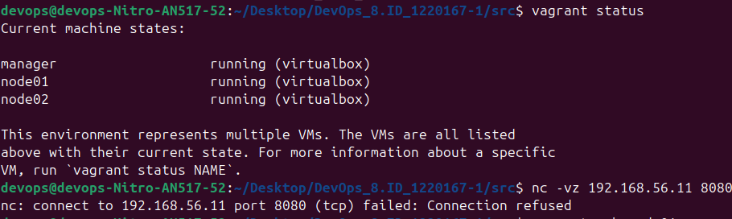
*`vagrant status` и проверка доступности порта*

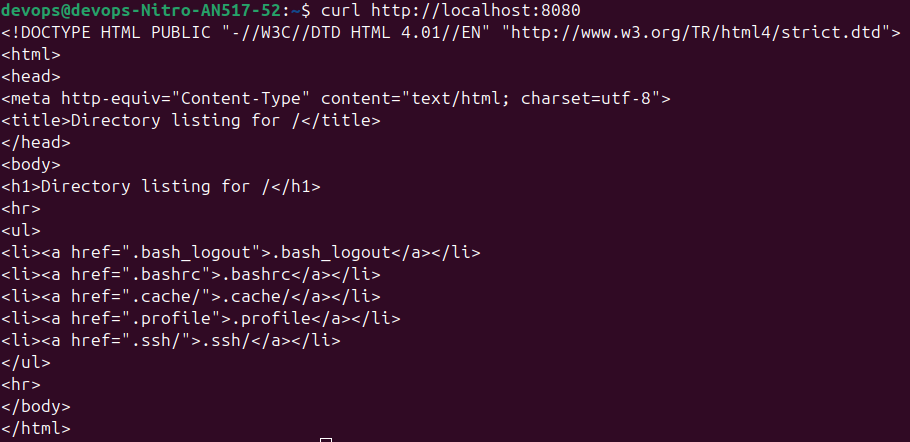
*Ответ по проброшенному порту*

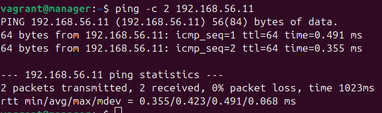
*`ping` до node01*

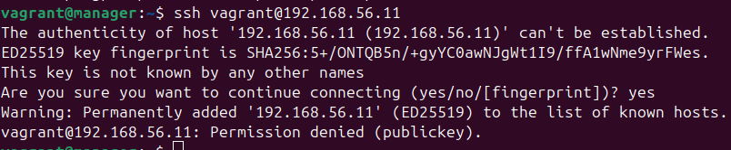
*Вход на узел по SSH*

### Доступ по ключу

Ansible работает поверх обычного SSH и никакого агента на управляемых узлах не требует. Нужен лишь беспарольный вход с управляющей машины, поэтому на `manager` генерируется ключ, а его публичная часть раскладывается по узлам.

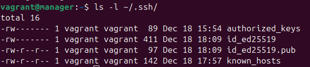
*Ключевая пара создана*

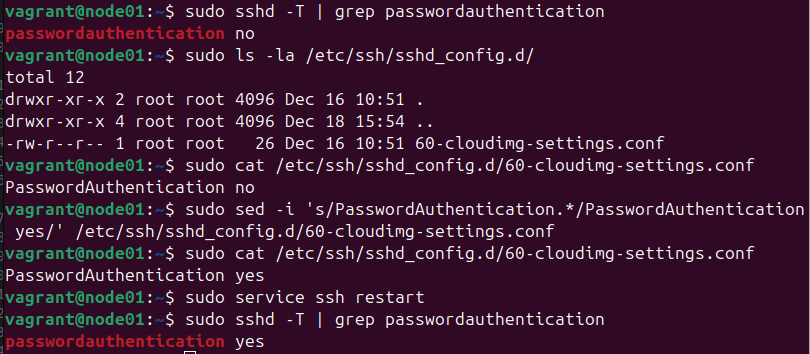
*Настройка сервера SSH на узле*

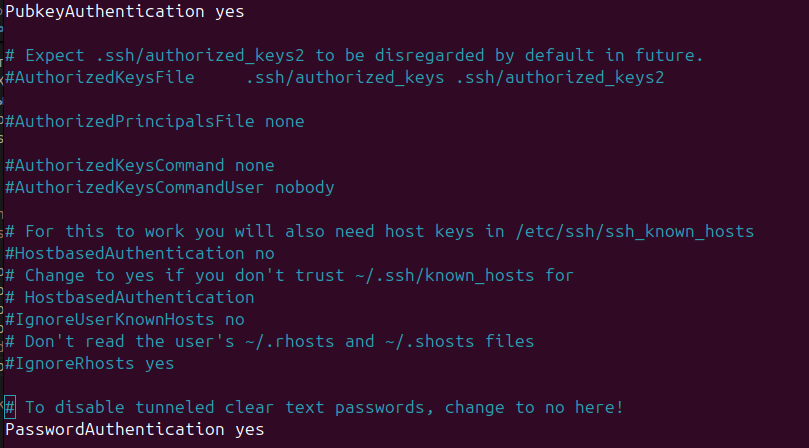
*Раскомментированные параметры*

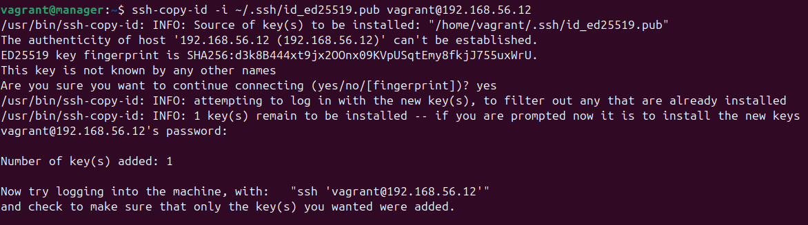
*Проверка применённой конфигурации*

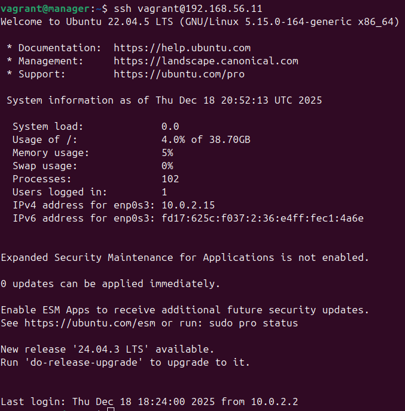
*Вход по ключу работает*

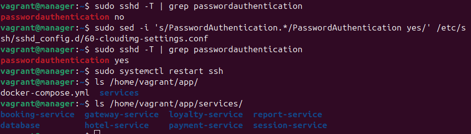
*Каталог приложения на месте*

### Инвентарь и первая проверка

Список управляемых узлов описывается в [ansible01/inventory](./ansible01/inventory). Ключ SSH задаётся один раз в секции `[all:vars]` — доступ на обе машины идёт под одним пользователем.

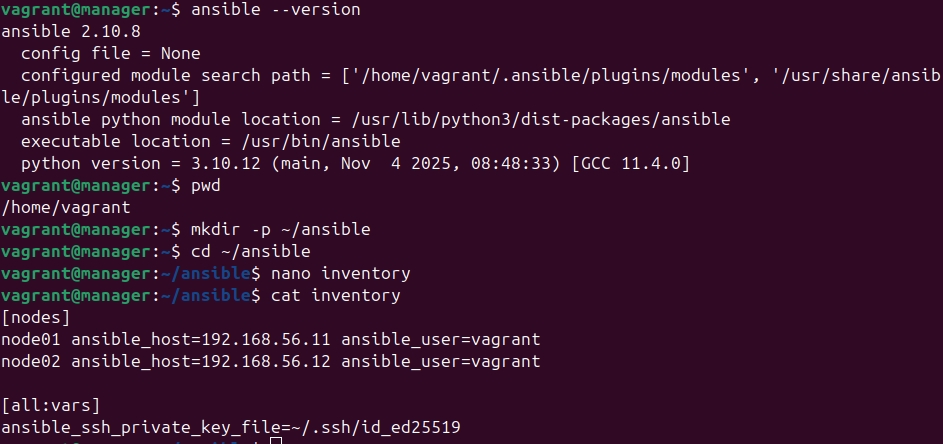
*Файл инвентаря*

```bash
ansible all -i inventory -m ping
```

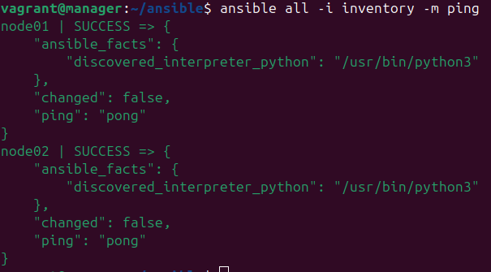
*Обе машины отвечают*

Модуль `ping` здесь не сетевой: он проверяет, что Ansible может войти по SSH и запустить Python на целевой машине. Отсутствие Python на узле даёт ошибку именно на этом шаге, а не в середине развёртывания.

### Первая версия развёртывания

Развёртывание микросервисов на `node01` сначала описано одним плоским плейбуком — [ansible01/deploy_node01.yaml](./ansible01/deploy_node01.yaml). Он устанавливает Docker, копирует описание приложения с управляющей машины и поднимает контейнеры.

```bash
scp -r deploy_node01.yaml vagrant@192.168.56.10:/home/vagrant/ansible
ansible-playbook -i inventory deploy_node01.yaml
```

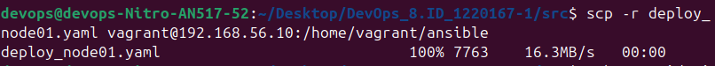
*Плейбук на управляющей машине*

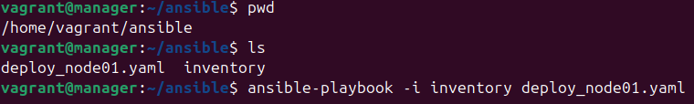
*Выполнение плейбука*

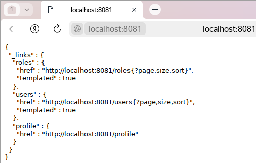
*session-service отвечает*

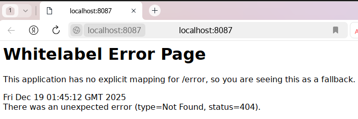
*gateway-service отвечает*

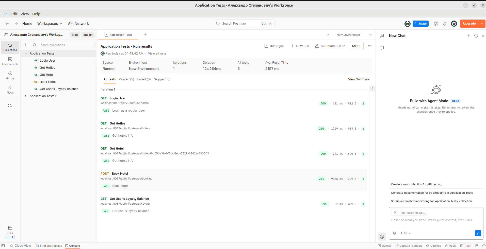
*Тесты приложения проходят*

### Переход на роли

Плоский плейбук решает задачу, но плохо переиспользуется: значения вроде каталога развёртывания и адреса репозитория Docker вписаны в него же. Содержимое переносится в роль `application`, точкой входа становится [ansible01/site.yml](./ansible01/site.yml), а значения уходят в `roles/application/defaults/main.yml` — теперь их можно переопределить, не трогая задачи.

Исходный плейбук оставлен рядом как история решения.

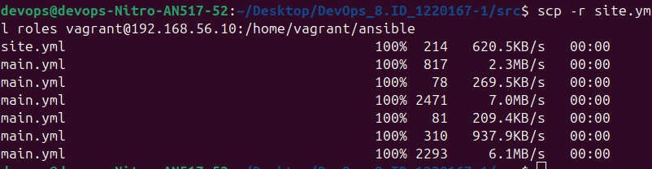
*Структура с ролями*

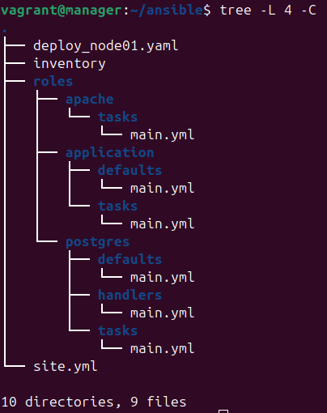
*Выполнение site.yml*

### Apache и PostgreSQL на node02

Второй узел получает две роли. В [роли postgres](./ansible01/roles/postgres/tasks/main.yml) существен порядок задач, и он зафиксирован комментарием прямо в файле.

Пароль пользователя `postgres` задаётся **до** правки `pg_hba.conf`. Пока действует peer-аутентификация через Unix-сокет, Ansible подключается к базе без пароля. Если сначала переключить метод на `md5`, следующая задача уже не сможет войти — пароля ещё нет, а беспарольный вход уже закрыт.

Перезапуск базы вынесен в `handlers`: он срабатывает по `notify`, один раз и после всех задач, которые могли поменять конфигурацию.

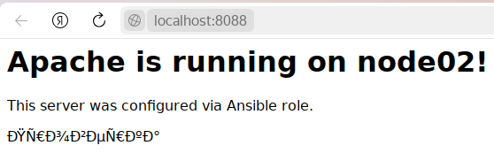
*Своя страница отдаётся с node02*

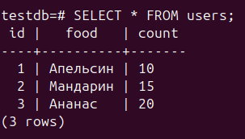
*Таблица создана, данные на месте*

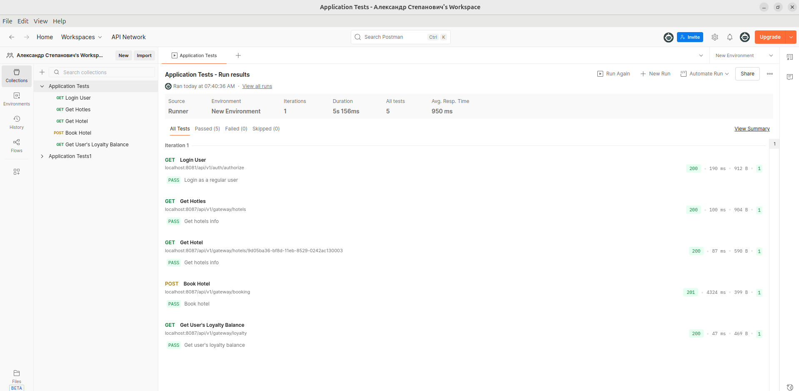
*Тесты приложения*

---

## Часть 2. Service Discovery через Consul

### Стенд

Четыре машины описаны в [ansible02/Vagrantfile](./ansible02/Vagrantfile). Наружу проброшены два порта: `8500` с сервера Consul для веб-интерфейса и `8082` с `api` для обращений к сервису.

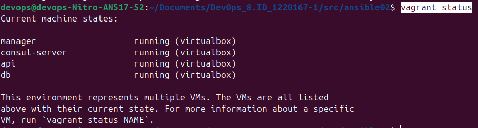
*Четыре машины подняты*

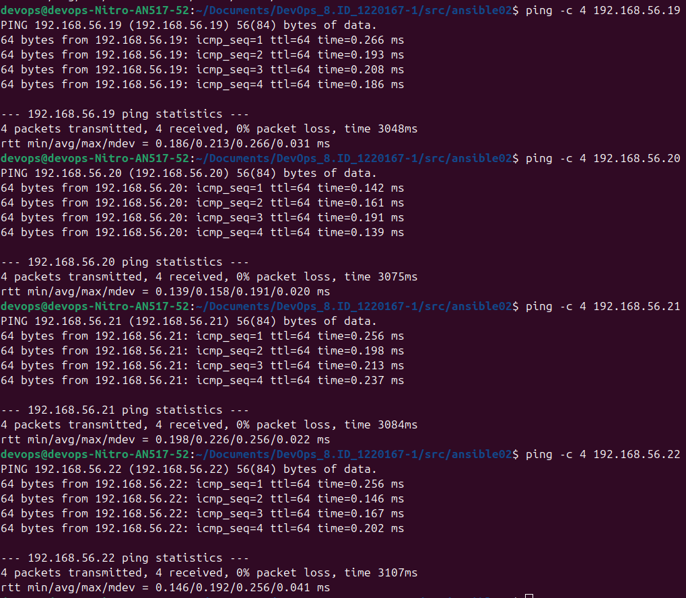
*Связь между машинами*

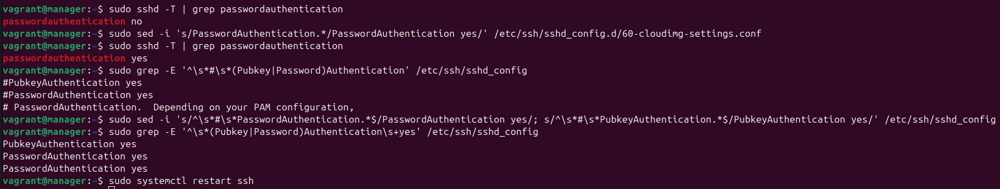
*Конфигурация SSH*

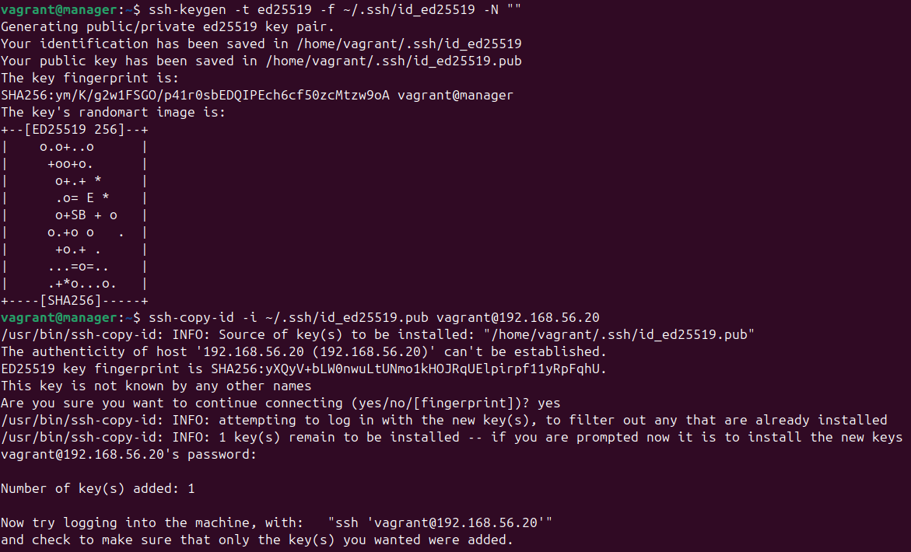
*Генерация и передача ключа*

Инвентарь [ansible02/inventory.yml](./ansible02/inventory.yml) записан в YAML, а не в INI как в первой части: хостов больше, у групп появляются переменные, и вложенная структура читается лучше плоского списка.

### Подготовка: бинарники на управляющей машине

Consul и Envoy не ставятся из репозиториев Ubuntu, поэтому их дистрибутивы скачиваются заранее и кладутся на управляющую машину. В репозиторий они не входят — весят слишком много.

```bash
wget https://releases.hashicorp.com/consul/1.20.2/consul_1.20.2_linux_amd64.zip
wget https://github.com/envoyproxy/envoy/releases/download/v1.36.4/envoy-1.36.4-linux-x86_64
mv consul_1.20.2_linux_amd64.zip consul.zip
mv envoy-1.36.4-linux-x86_64 envoy
```

Файлы и рабочие каталоги загружаются на `manager`:

```bash
vagrant upload envoy    /usr/local/bin/envoy          manager
vagrant upload consul.zip /tmp/consul.zip             manager
vagrant upload ../ansible02 /home/vagrant/ansible02   manager
vagrant upload ../consul01  /home/vagrant/consul01    manager
vagrant upload ../services/hotel-service /home/vagrant/services/hotel-service manager
```

Обратить внимание на последние три строки: `ansible02` и `consul01` кладутся **рядом**, соседними каталогами. Роли ссылаются на конфигурации Consul относительным путём `../../../consul01/...`, который Ansible разрешает от каталога роли, и при другой раскладке файлы не найдутся. По этой же причине в опубликованной версии обе папки лежат в корне проекта соседями.

Отсутствие подготовленных файлов роли обнаруживают сами — до того, как что-то менять на узлах:

```yaml
- name: Fail if Consul ZIP missing
  assert:
    that: consul_zip.stat.exists
    fail_msg: "Consul ZIP not found on manager at /tmp/consul.zip"
```

Проверка выполняется через `delegate_to: localhost` с `run_once: true` — файл ищется на управляющей машине один раз, а не на каждом целевом узле.

### Роли

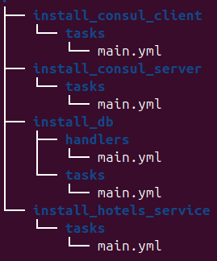
*Четыре роли части 2*

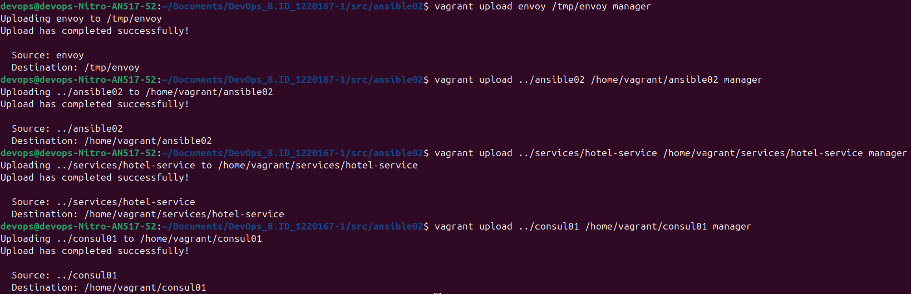
*Файлы на управляющей машине*

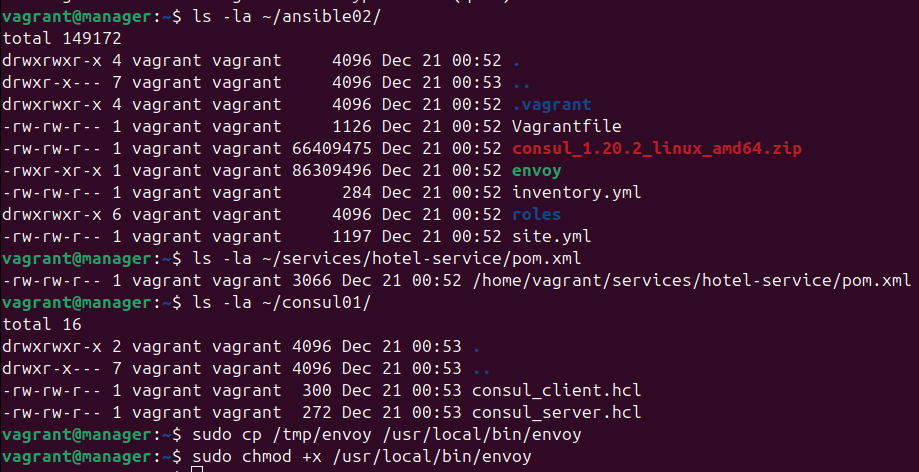
*Файлы разложены по узлам*

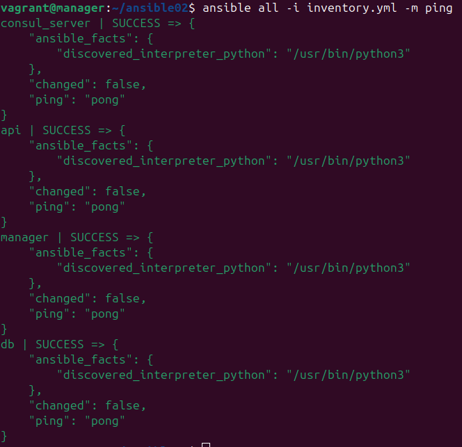
*Ansible видит все машины*

Точка входа [ansible02/site.yml](./ansible02/site.yml) состоит из пяти play, и порядок принципиален:

| № | Что | Почему здесь |
|---|---|---|
| 1 | сборка JAR на `manager` | артефакт нужен пятому шагу; JDK и Maven ставятся только на управляющую машину |
| 2 | сервер Consul | клиенты при старте ищут его по `retry_join` |
| 3 | клиенты Consul на `api` и `db` | роль одна, оба узла сразу |
| 4 | PostgreSQL на `db` | регистрируется в Consul как сервис `postgres` |
| 5 | hotel-service на `api` | находит базу через Consul |

Перестановка второго и третьего шагов оставила бы клиентов без сервера: они стартовали бы, повторяли попытки и не регистрировались.

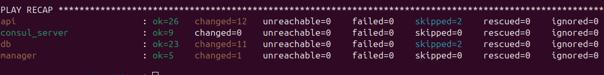
*Итог прогона*

### Как устроен Service Discovery

Consul реализует паттерн, при котором сервисы не знают адресов друг друга. Каждый регистрируется в общем реестре, а обращается не к соседу напрямую, а к локальному прокси-серверу Envoy. Прокси спрашивает реестр, где сейчас находится нужный сервис, и доставляет туда трафик.

Конфигурации сервера и клиента лежат в [consul01/](./consul01). Три решения там стоит пояснить.

**`bind_addr` и `advertise_addr` различаются намеренно.** Первый говорит, на каких интерфейсах слушать, второй — какой адрес сообщать соседям. У машины Vagrant два интерфейса, и без явного `advertise_addr` Consul может объявить NAT-овский адрес, по которому до него не достучаться.

**Адрес клиента задан шаблоном, а не константой.** В [consul_client.hcl](./consul01/consul_client.hcl) стоит выражение go-sockaddr, выбирающее адрес из сети стенда. Благодаря этому один файл подходит обоим узлам: фиксированное значение потребовало бы отдельной конфигурации на каждый, а взять первый попавшийся интерфейс нельзя.

**`retry_join`, а не `join`.** Клиент повторяет попытки, пока сервер не появится, и порядок запуска машин перестаёт иметь значение.

Регистрации сервисов описаны отдельными файлами. В [hotel.json](./consul01/hotel.json) существен блок `upstreams`:

```json
"upstreams": [
  { "destination_name": "postgres", "local_bind_port": 5432 }
]
```

Это означает: sidecar-прокси открывает на узле `api` локальный порт 5432, а `hotel-service` обращается к базе как к локальной. Адреса узла `db` в конфигурации приложения нет вовсе — переезд базы на другую машину не потребует её правки.

Что это даёт, видно в роли [install_hotels_service](./ansible02/roles/install_hotels_service/tasks/main.yml). Она создаёт файл окружения для сервиса, и там записано:

```
POSTGRES_HOST=127.0.0.1
POSTGRES_PORT=5432
```

Никакого PostgreSQL на узле `api` нет. Порт 5432 открывает sidecar-прокси, а база работает на `db` по адресу `192.168.56.22`. Приложение об этом не знает и знать не должно: для него база локальная. Адрес `192.168.56.22` в его конфигурации не встречается ни разу.

Юнит systemd закрепляет зависимость явно — `Requires=consul-envoy@hotel.service`: сервис не стартует, пока не поднят его прокси, иначе первые же обращения к базе ушли бы в никуда.

У [postgres.json](./consul01/postgres.json) блока `upstreams` нет: база ни к кому не обращается сама, только принимает соединения. Таймаут её проверки короче — 1 секунда против 3 у сервиса приложения: база отвечает на TCP-соединение сразу, и долгое ожидание лишь задержало бы обнаружение отказа.

Обе проверки — типа `tcp` на собственный порт. Consul опрашивает их раз в 10 секунд и убирает сервис из выдачи, если тот перестал принимать соединения.

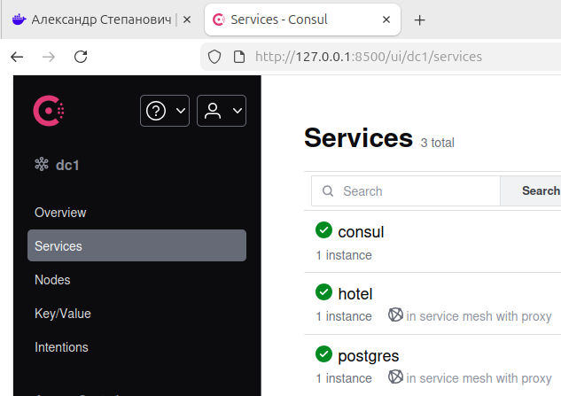
*Зарегистрированные сервисы*

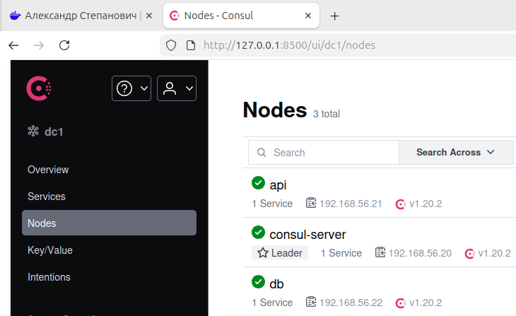
*Состояние проверок*

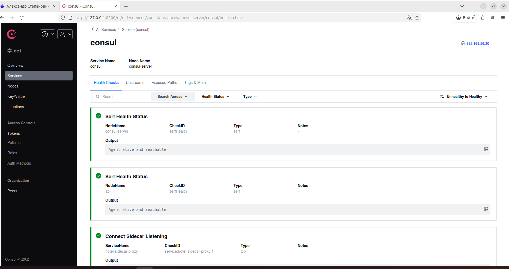
*Топология связей*

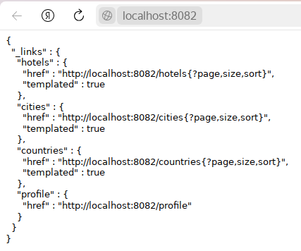
*Узлы кластера*

---

## Проверка CRUD через API

Обращения идут к `hotel-service` на `api`, который обращается к базе через service mesh.

**Создание** — запрос проходит целиком, от API до базы:

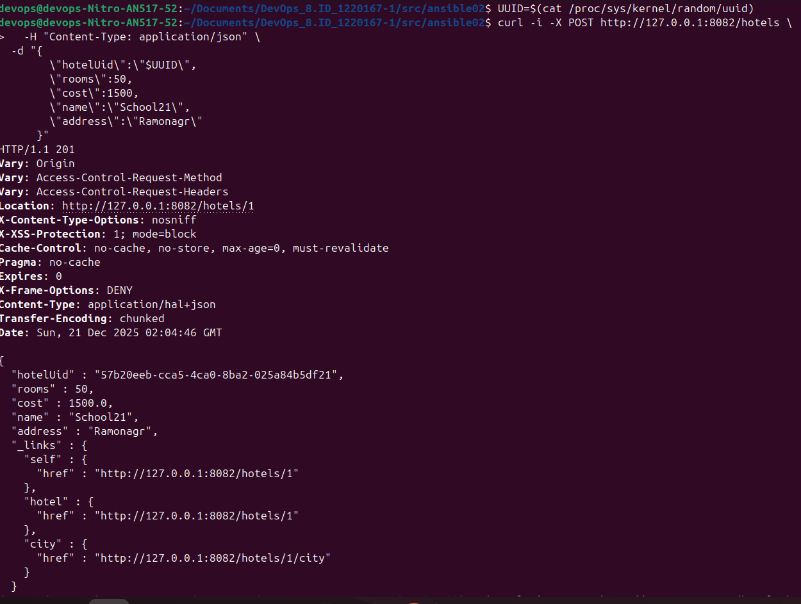
*HTTP 201, запись создана*

**Чтение**:

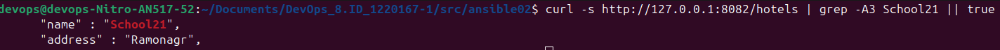
*Запись возвращается*

**Обновление** — ответ HTTP 500:

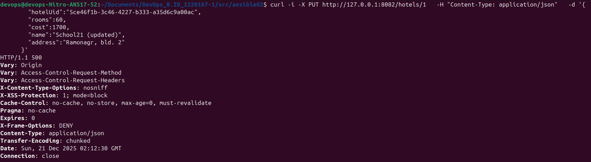
*Заголовки ответа*

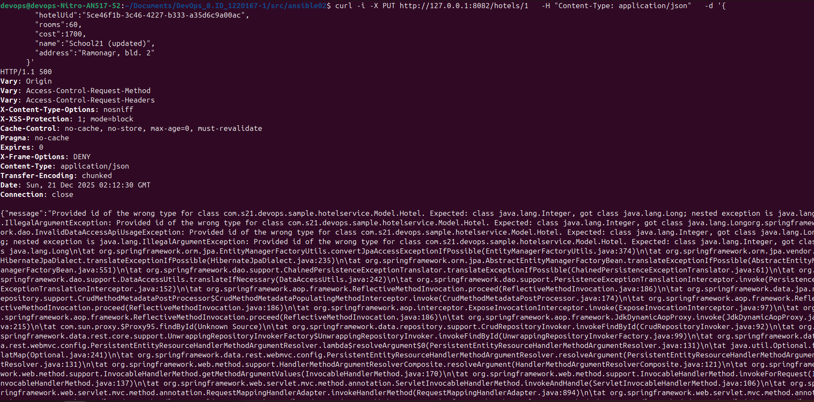
*Исключение в теле ответа*

**Удаление** — та же ошибка:

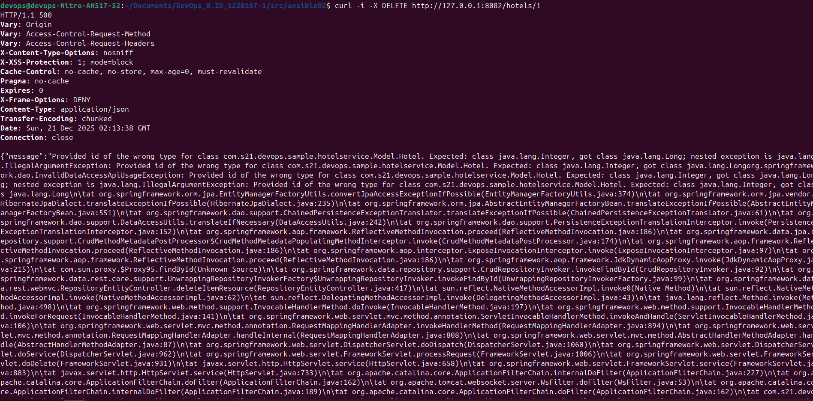
*HTTP 500 на DELETE*

В обоих случаях сервис возвращает одно и то же исключение:

```
Provided id of the wrong type for class com.s21.devops.sample.hotelservice.Model.Hotel.
Expected: class java.lang.Integer, got class java.lang.Long
```

Ошибка приходит из самого `hotel-service` — сервиса из поставки курса — и относится к несоответствию типа идентификатора в его модели данных. К настройке инфраструктуры она отношения не имеет: запрос доходит до сервиса, сервис доходит до базы через прокси, ответ возвращается. Не работает конкретно обработка идентификатора в двух методах из четырёх.

Повторное создание и чтение это подтверждают — они проходят после неудавшихся обновления и удаления:

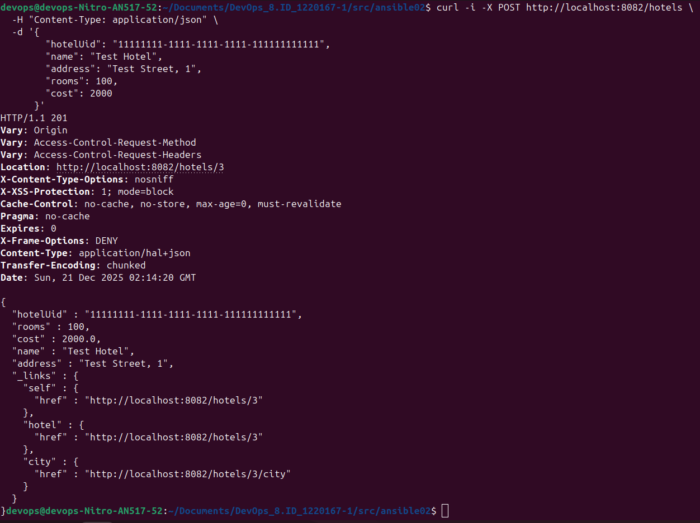
*Новая запись создана, HTTP 201*

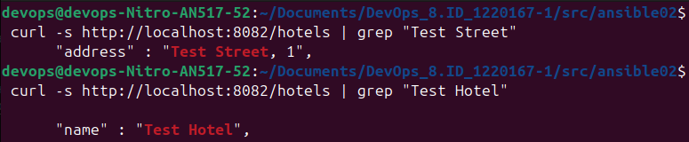
*Созданные значения находятся в выдаче*

---

## Проверка конфигураций

Файлы проверены штатными инструментами Ansible и Consul, а не только чтением.

| Проверка | Результат |
|---|---|
| `ansible-playbook --syntax-check` × 3 | все плейбуки разбираются |
| `consul validate` сервер | конфигурация верна |
| `consul validate` клиент + регистрации сервисов | конфигурация верна |
| разбор JSON | оба файла регистраций корректны |

Проверка нашла одну проблему. В [deploy_node01.yaml](./ansible01/deploy_node01.yaml) у двух задач стоял параметр `warn: false` — он отключал подсказку Ansible о том, что для команды есть отдельный модуль. Параметр удалён из модуля `command` в ansible-core 2.14, и на свежих версиях задача завершается ошибкой:

```
Unsupported parameters for (command) module: warn
```

Синтаксическая проверка этого не показывает — она не сверяет аргументы модулей с их текущими схемами. Обнаруживается только запуском. В опубликованной версии параметр убран, роль `application` его никогда не содержала.

Отдельно отмечено предупреждение: модуль `apt_repository` объявлен устаревшим и будет удалён в ansible-core 2.25 в пользу `deb822_repository`. На работоспособность сейчас не влияет.

---

## Итоги

Обе части отрабатывают. Узлы конфигурируются с управляющей машины одной командой, приложение разворачивается на одном узле, Apache и PostgreSQL — на другом. Во второй части сервисы регистрируются в Consul, видны в его интерфейсе и общаются через service mesh; операции чтения и создания через API работают, обновление и удаление упираются в дефект самого сервиса из поставки курса.

Основное различие между частями — не в наборе инструментов, а в том, где хранится знание об адресах. В первой части оно распределено по конфигурациям: сервис знает адрес базы, прокси знает адрес сервиса, и каждый переезд требует согласованной правки в нескольких местах. Во второй части этого знания нет ни у кого, кроме реестра, а сервисы обращаются к локальным портам. Цена — дополнительный слой из агента и sidecar-прокси на каждом узле; выигрыш — то, что переезд перестаёт быть событием.

Второе наблюдение — о порядке. И в роли `postgres`, и в `site.yml` второй части порядок шагов определяет работоспособность: пароль задаётся до смены метода аутентификации, сервер реестра поднимается раньше клиентов, база — раньше сервиса, который её ищет. Ansible описывает желаемое состояние, но приводит систему к нему последовательно, и последовательность приходится продумывать самому.

Третье — о границах статических проверок. `--syntax-check` разбирает структуру плейбука, но не сверяет аргументы задач с текущими схемами модулей. Устаревший параметр проходит проверку и роняет выполнение — увидеть это можно только запуском.
