# Docker: от готового образа к собственной сборке

Отчёт по шести частям задания: работа с образом из реестра, операции с контейнером, мини веб-сервер на FastCGI, собственный образ, проверка его через Dockle и разнесение на два контейнера через Docker Compose.

Окружение — Ubuntu 24.04, Docker установлен из официального репозитория.

---

## Часть 1. Готовый докер

Установка Docker выполнена по официальной инструкции: добавление GPG-ключа, подключение репозитория, установка пакетов.

```bash
sudo install -m 0755 -d /etc/apt/keyrings
sudo curl -fsSL https://download.docker.com/linux/ubuntu/gpg -o /etc/apt/keyrings/docker.asc
sudo chmod a+r /etc/apt/keyrings/docker.asc

echo \
  "deb [arch=$(dpkg --print-architecture) signed-by=/etc/apt/keyrings/docker.asc] https://download.docker.com/linux/ubuntu \
  $(. /etc/os-release && echo "${UBUNTU_CODENAME:-$VERSION_CODENAME}") stable" | \
  sudo tee /etc/apt/sources.list.d/docker.list > /dev/null

sudo apt-get update
sudo apt-get install docker-ce docker-ce-cli containerd.io docker-buildx-plugin docker-compose-plugin
```

Проверка установки — запуск тестового образа `hello-world`.

Официальный образ nginx загружается из реестра:

```bash
docker pull nginx
```

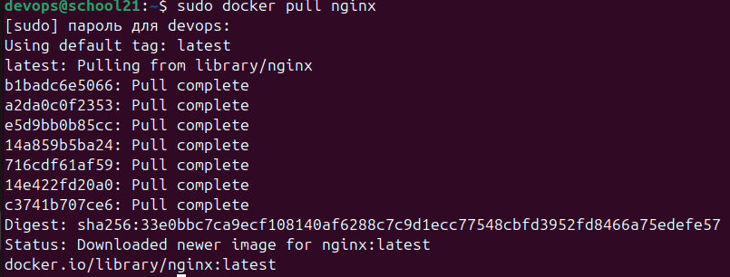
*Загрузка образа*

```bash
docker images
```

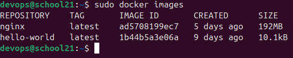
*Образ появился в локальном списке*

```bash
docker run -d nginx
docker ps
```

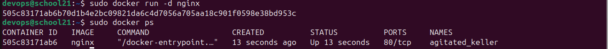
*Контейнер запущен в фоновом режиме*

Метаданные контейнера смотрятся через `inspect`:

```bash
docker inspect 505c83171ab6
```

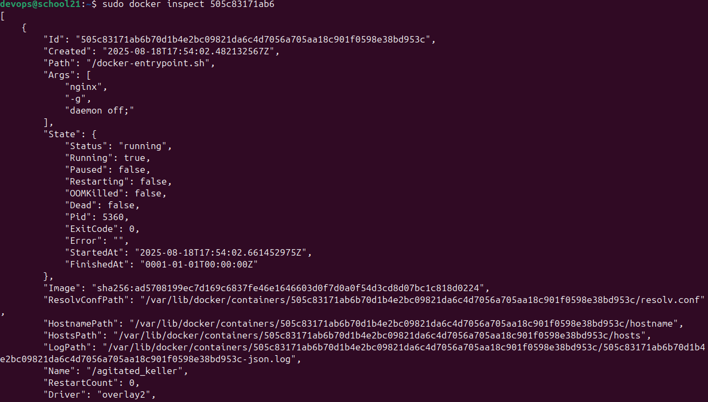
*Вывод `docker inspect`*

Требуемые задание значения:

```
IPAddress: 172.17.0.2
Ports:     80/tcp: null
SizeRW:    1095
```

Полный вывод команды — в [01/inspect.txt](./01/inspect.txt), 220 строк. Обращает на себя внимание `Ports: null`: контейнер запущен без публикации портов, поэтому его 80-й порт снаружи недоступен, хотя внутри сети Docker адрес у контейнера есть.

```bash
docker stop 505c83171ab6
docker ps
```

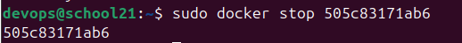
*Остановка контейнера*

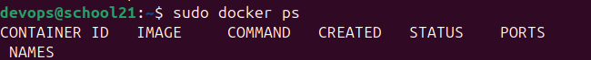
*Список запущенных контейнеров пуст*

Повторный запуск с публикацией портов — теперь 80 и 443 контейнера отображены на такие же порты машины:

```bash
docker run -d -p 80:80 -p 443:443 nginx
```

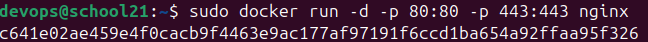
*Запуск с публикацией портов*

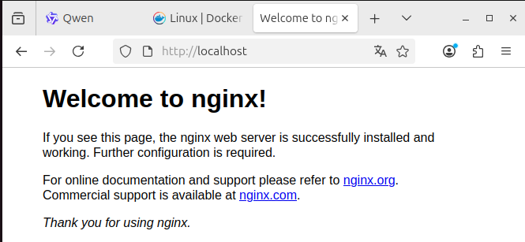
*Стартовая страница nginx открывается по адресу localhost:80*

```bash
docker restart b66e07ce9271
docker ps
```

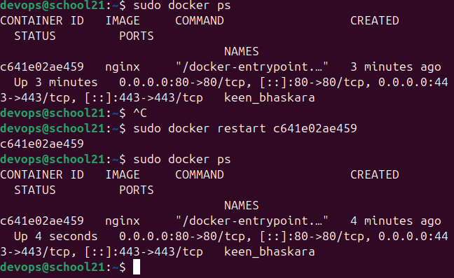
*Перезапуск контейнера*

---

## Часть 2. Операции с контейнером

```bash
docker run -d nginx
docker ps
```

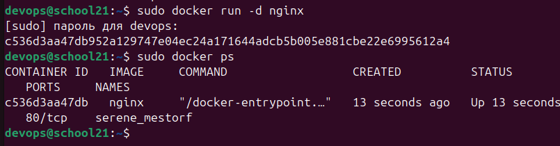
*Запуск контейнера и получение его идентификатора*

Чтение конфигурации изнутри работающего контейнера:

```bash
docker exec c536d3aa47db cat /etc/nginx/nginx.conf
```

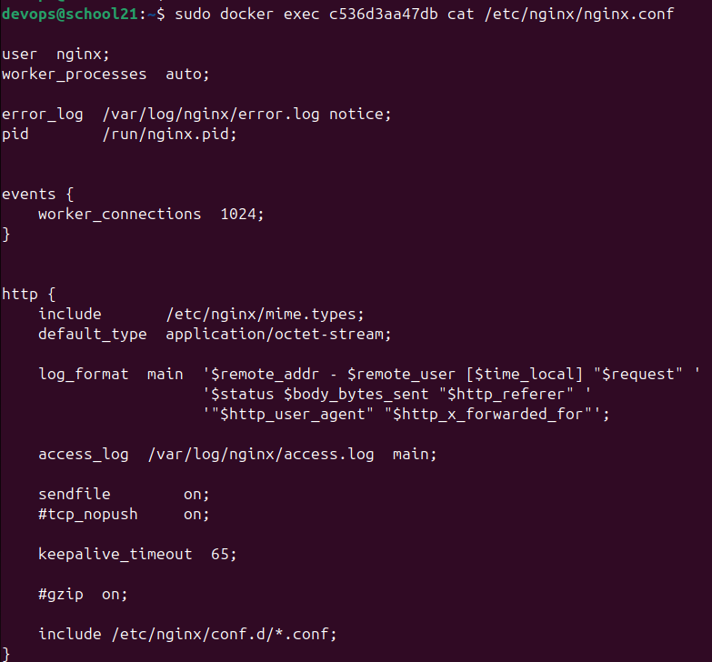
*Конфигурация nginx по умолчанию*

Далее готовится собственный файл конфигурации с включённой страницей статуса.

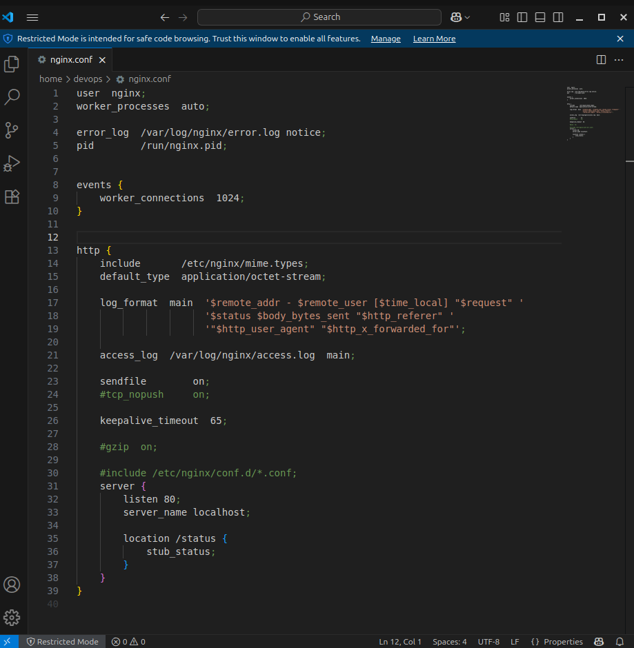
*Подготовленный файл конфигурации*

Файл копируется внутрь контейнера, после чего nginx перечитывает конфигурацию без остановки:

```bash
docker cp nginx.conf c641e02ae459:/etc/nginx/nginx.conf
docker exec c641e02ae459 nginx -s reload
```

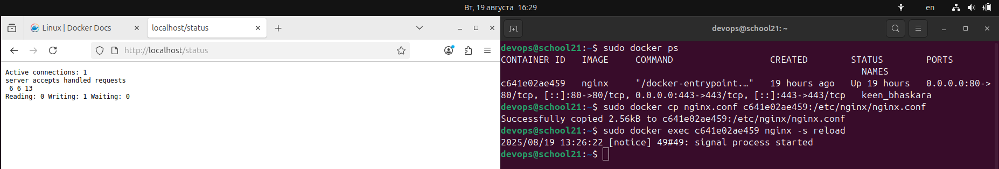
*Страница статуса отвечает после перезагрузки конфигурации*

Экспорт файловой системы контейнера в архив и остановка:

```bash
docker export c641e02ae459 > container.tar
docker stop c641e02ae459
```

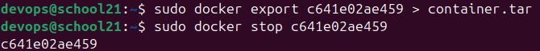
*Экспорт контейнера*

Удаление образа и контейнера:

```bash
docker rmi -f nginx
docker rm c641e02ae459
```

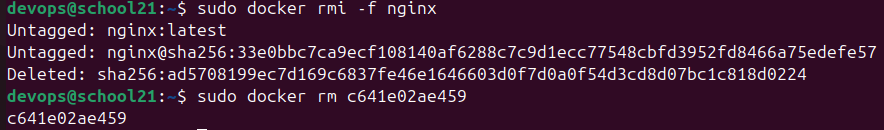
*Удаление образа и контейнера*

Восстановление из архива:

```bash
docker import container.tar nginx
```

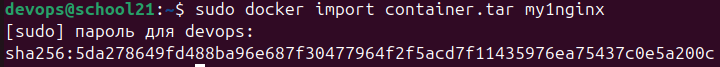
*Импорт архива обратно в образ*

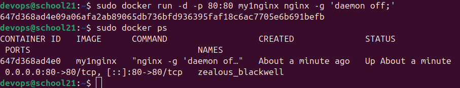
*Запуск восстановленного образа*

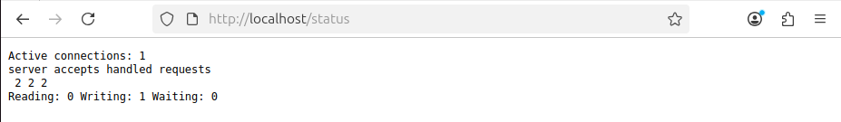
*Внесённые ранее изменения сохранились*

Существенная деталь: `export` сохраняет только файловую систему, без истории слоёв и без метаданных запуска. Поэтому импортированный образ теряет `ENTRYPOINT` и `CMD` исходного, и команду запуска приходится задавать явно.

---

## Часть 3. Мини веб-сервер

nginx не выполняет программы сам — он передаёт запрос постороннему процессу по протоколу FastCGI и возвращает клиенту его ответ. Такой процесс и требуется написать.


*Установка компилятора и библиотек*

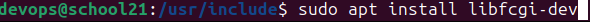

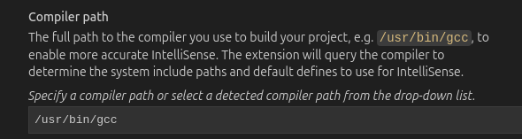

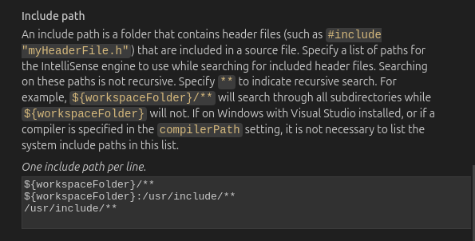
*Подготовка окружения завершена*

Исходный текст приложения — [03/server.c](./03/server.c):

```c
#include <fcgi_stdio.h>
#include <stdlib.h>

int main(void) {
    while (FCGI_Accept() >= 0) {
        printf("Content-Type: text/html\r\n\r\n"
        "<html><body>\n"
        "<h1>Hello World!</h1>\n"
        "</body></html>\n");
    }
    return 0;
}
```

Цикл здесь принципиален. Обычная программа CGI запускается заново на каждый запрос и платит за это временем старта процесса. FastCGI поднимает процесс один раз: `FCGI_Accept()` блокируется до прихода следующего запроса и возвращает отрицательное значение, только когда соединение закрыто окончательно.

Пустая строка после `Content-Type` — требование протокола: она отделяет заголовки от тела ответа.

```bash
gcc -o server server.c -lfcgi
```

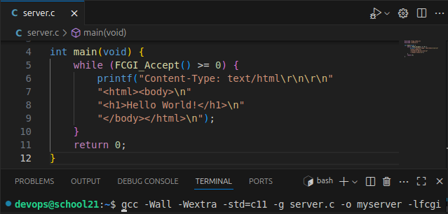
*Сборка приложения*

```bash
spawn-fcgi -p 8080 -n ./server
```

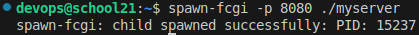
*Приложение слушает порт 8080*

Конфигурация nginx — [03/nginx/nginx.conf](./03/nginx/nginx.conf):

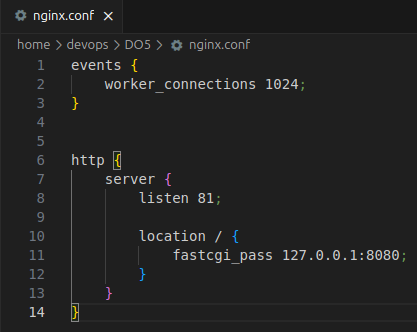
*Файл конфигурации*

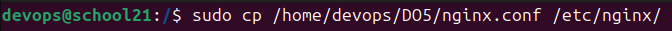
*Конфигурация размещена*

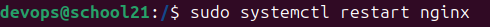
*Перезапуск nginx*

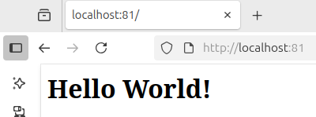
*Приложение отвечает через nginx*

---

## Часть 4. Свой докер

Собранная на предыдущем шаге схема переносится в образ без изменений в коде и конфигурации — меняется только способ доставки. Файл [04/dockerfile](./04/dockerfile):

```dockerfile
FROM nginx:latest

RUN apt-get update && apt-get install -y \
    build-essential \
    libfcgi-dev \
    spawn-fcgi

COPY server.c /app/server.c
COPY ./nginx/nginx.conf /etc/nginx/nginx.conf

RUN gcc -o /app/server /app/server.c -lfcgi

ENTRYPOINT ["sh", "-c", "spawn-fcgi -p 8080 -n /app/server & nginx -g \"daemon off;\""]
```

Порядок процессов в `ENTRYPOINT` определяет, сколько проживёт контейнер. Приложение уходит в фон, nginx остаётся на переднем плане: контейнер работает ровно столько, сколько работает процесс с идентификатором 1. Если бы на переднем плане оказалось приложение, остановка nginx осталась бы незамеченной. Флаг `daemon off` не даёт nginx уйти в фон — иначе процесс завершился бы сразу после старта и контейнер остановился бы вместе с ним.

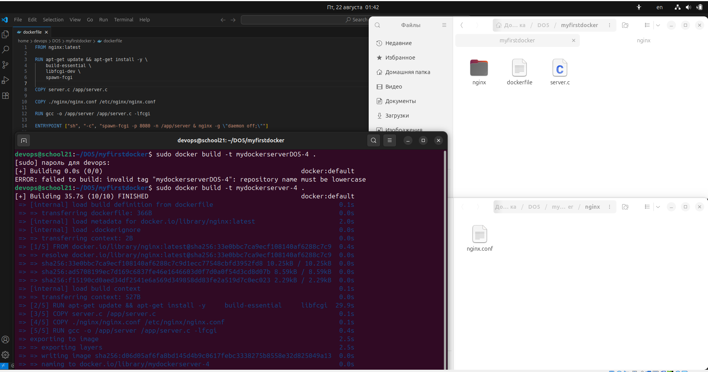
*Сборка образа*

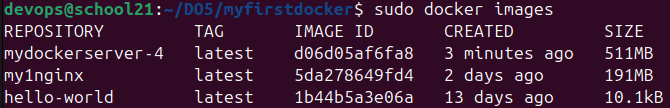
*Образ появился в списке*

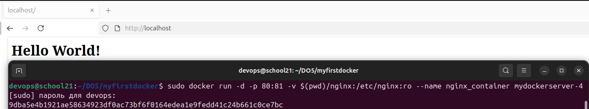
*Контейнер запущен, страница отвечает*

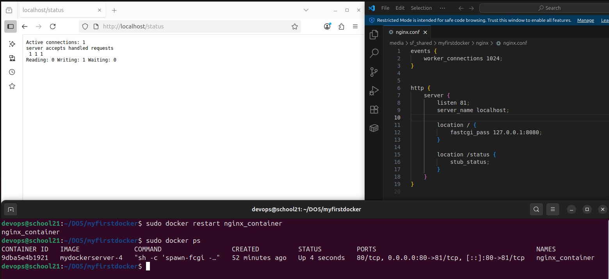
*Страница статуса nginx*

---

## Часть 5. Проверка образа через Dockle

Dockle — статический анализатор образов: он разбирает слои и сверяет их с набором практик безопасности. На образе части 4 он выдаёт две ошибки и два предупреждения.

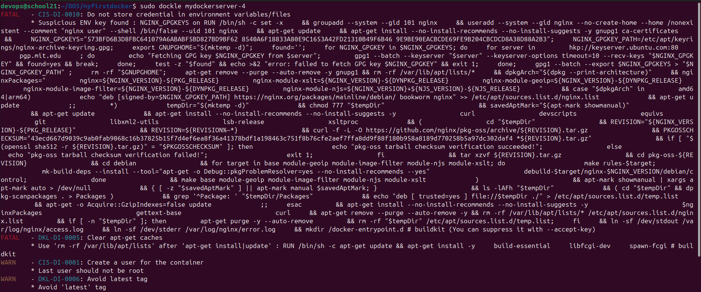
*Результат первой проверки*

Исправления в [05/dockerfile](./05/dockerfile):

| Замечание | Причина | Что сделано |
|---|---|---|
| `DKL-DI-0006` Avoid latest tag | тег `latest` указывает каждый раз на разное содержимое, сборка перестаёт быть воспроизводимой | `FROM nginx:1.24.0` |
| `DKL-DI-0005` Clear apt-get caches | кеш пакетов остаётся в слоях и занимает место | `rm -rf /var/lib/apt/lists/*` |
| `CIS-DI-0001` Create a user | работа от root даёт процессу больше прав, чем ему нужно | `useradd sc21d05`, `chown`, `USER` |
| `CIS-DI-0010` Do not store credential in environment | переменная `NGINX_GPGKEY` приходит из базового образа | флаги `-ak NGINX_GPGKEY -i CIS-DI-0010` |

Очистка кеша обязана происходить **в том же слое**, что и установка. Отдельной инструкцией она ничего не даёт: слои неизменяемы, и удаление в следующем слое лишь скрывает файлы, оставляя их в предыдущем.

Замечание о переменной окружения снимается флагами, а не правкой: `NGINX_GPGKEY` задан в базовом образе nginx и собственных учётных данных не содержит.

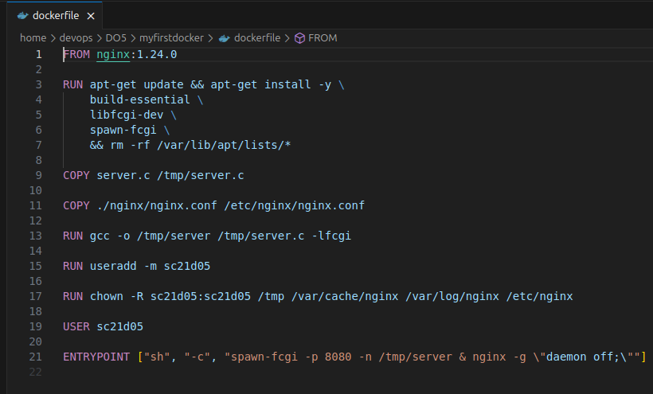
*Ошибки и предупреждения устранены*

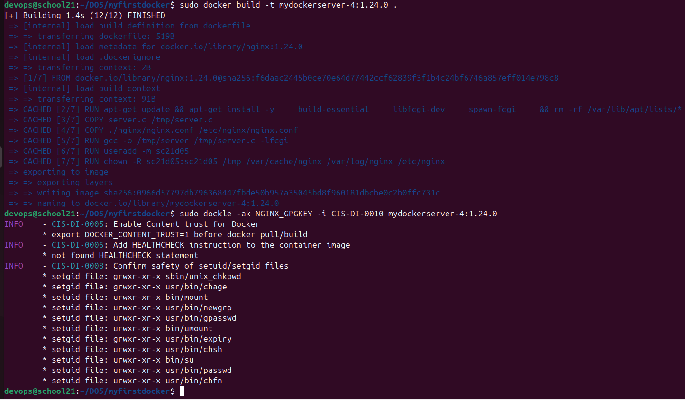
*Проверка с исключением замечания о ключе*

### Чего не показала статическая проверка

Образ проходит Dockle, но запущенный из него контейнер немедленно останавливается:

```
[emerg] open() "/var/run/nginx.pid" failed (13: Permission denied)
Exited (1)
```

Причина — в самом переходе на непривилегированного пользователя. Права выданы четырём каталогам:

```dockerfile
RUN chown -R sc21d05:sc21d05 /tmp /var/cache/nginx /var/log/nginx /etc/nginx
```

Но nginx собран с параметром `--pid-path=/var/run/nginx.pid`, а `/var/run` в этот список не входит и принадлежит root. Записать туда идентификатор процесса пользователь `sc21d05` не может, и запуск обрывается на первой же операции.

Dockle такую ситуацию не обнаруживает и не должен: он разбирает слои образа и контейнер не запускает. Зелёный отчёт анализатора означает «в образе нет известных признаков плохой практики», а не «образ работоспособен».

Решение — перенести pid-файл туда, где у пользователя есть права. Одна строка в [05/nginx/nginx.conf](./05/nginx/nginx.conf):

```nginx
pid /tmp/nginx.pid;
```

После этого контейнер поднимается и работает от `sc21d05`, а не от root.

---

## Часть 6. Базовый Docker Compose

Схема разделяется: приложение и принимающий трафик nginx разъезжаются по разным контейнерам. Файл [06/docker-compose.yml](./06/docker-compose.yml):

```yaml
services:
  app:
    build: .
    networks:
      - internal-network

  nginx-proxy:
    image: nginx:1.24.0
    ports:
      - "80:8080"
    depends_on:
      - app
    networks:
      - internal-network
    volumes:
      - ./nginx/nginx.conf:/etc/nginx/nginx.conf

networks:
  internal-network:
    driver: bridge
```

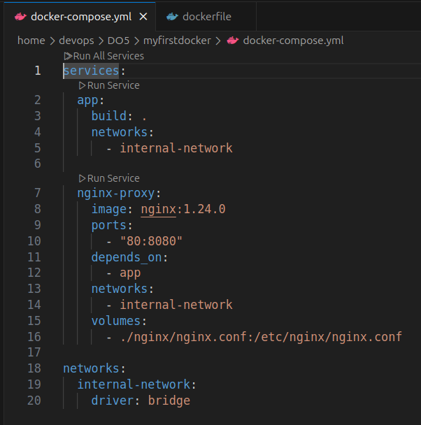
*Файл описания связки*

Разделение требует изменений в трёх местах сразу, и пропуск любого из них даёт связку, которая собирается, запускается и не работает.

**В [06/dockerfile](./06/dockerfile)** — адрес прослушивания приложения:

```dockerfile
ENTRYPOINT ["sh", "-c", "spawn-fcgi -p 81 -a 0.0.0.0 -n /tmp/server & nginx -g \"daemon off;\""]
```

Без `-a 0.0.0.0` приложение слушает только петлевой интерфейс, и запрос из соседнего контейнера до него не доходит.

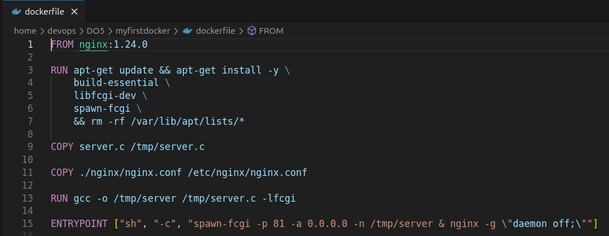
*Правка образа приложения*

**В [06/nginx/nginx.conf](./06/nginx/nginx.conf)** — адрес назначения:

```nginx
fastcgi_pass app:81;
```

Имя `app` — это имя сервиса из compose-файла; встроенный DNS Docker резолвит его в адрес соседнего контейнера.

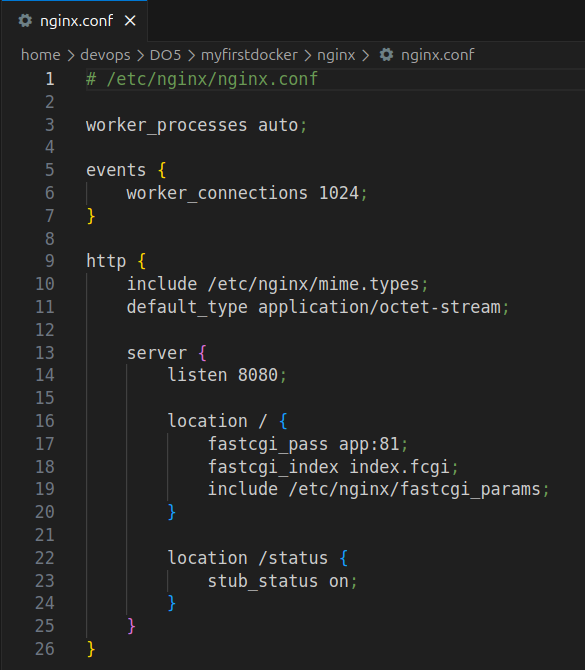
*Правка конфигурации nginx*

**В compose-файле** — публикация портов. Наружу выведен только `nginx-proxy`; порт приложения не публикуется, внутри сети контейнеры видят друг друга по именам сервисов. Обращаться к приложению снаружи незачем — в этом и смысл разделения.

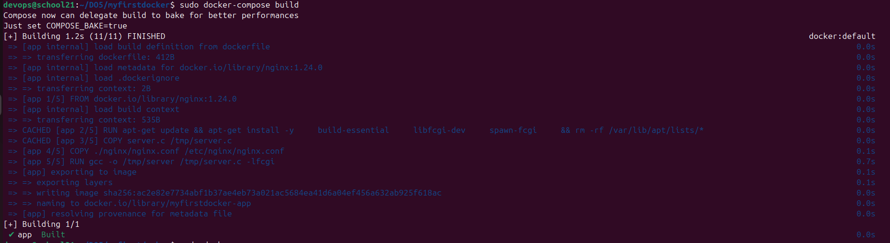
*Сборка связки*

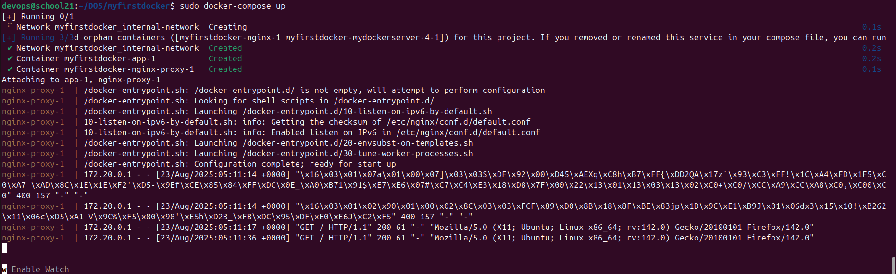
*Оба контейнера запущены*

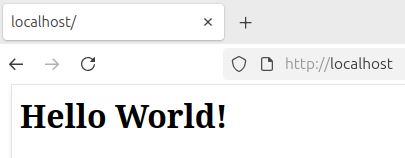
*Приложение отвечает через прокси*

Отличие от части 5, отмеченное отдельно: в этой версии `useradd` и `USER` отсутствуют, образ снова работает от root. Закалка, сделанная на предыдущем шаге, в финальную версию не перенесена. В опубликованных файлах это оставлено как в сданной работе.

---

## Проверка

Все части с кодом проверены сборкой и запуском, а не только чтением.

| Что | Результат |
|---|---|
| `03/server.c` | компилируется с `-lfcgi` |
| образ части 4 | собирается, отдаёт `Hello World!`, работает от root |
| образ части 5 | **в исходном виде не стартовал**; после переноса pid-файла работает от `sc21d05` |
| связка части 6 | оба контейнера поднимаются, страница и `/status` отвечают через прокси |

Отдельно проверено имя `dockerfile` строчными буквами: и `docker build`, и `docker compose build` такой файл находят, несмотря на то что compose объявляет в своей конфигурации `Dockerfile` с заглавной.

---

## Итоги

Работа проходит путь от готового образа до собственной связки из двух контейнеров, и на каждом шаге меняется только упаковка — исходный текст приложения остаётся тем же, что и в части 3.

Наиболее содержательный результат относится к границе применимости инструментов проверки. Dockle делает ровно то, что умеет: разбирает слои образа и сверяет их с набором известных практик. Он не запускает контейнер и в принципе не может заметить, что выданных пользователю прав не хватает для старта. Образ, прошедший проверку, оказался неработоспособным — и обнаружилось это только запуском.

Второе наблюдение — о стоимости разделения на контейнеры. Со стороны переход выглядит как перенос нескольких строк из `dockerfile` в `docker-compose.yml`. На деле он требует согласованных изменений в трёх файлах: интерфейс прослушивания у приложения, адрес назначения в конфигурации nginx и публикация портов в описании связки. Каждое из трёх по отдельности выглядит мелочью, а вместе они и составляют разницу между «контейнеры запустились» и «связка работает».
