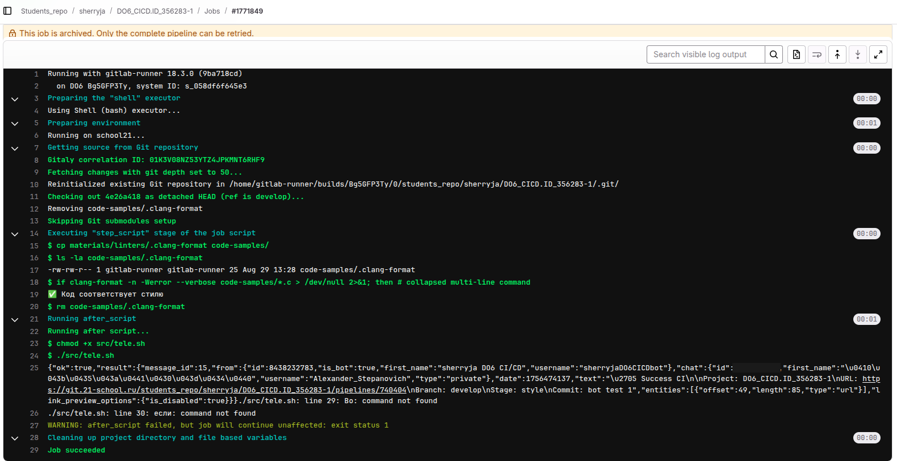
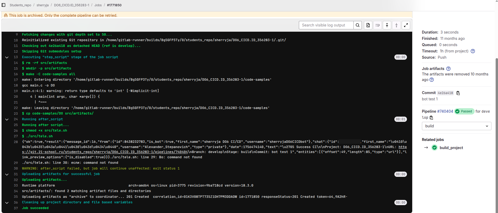
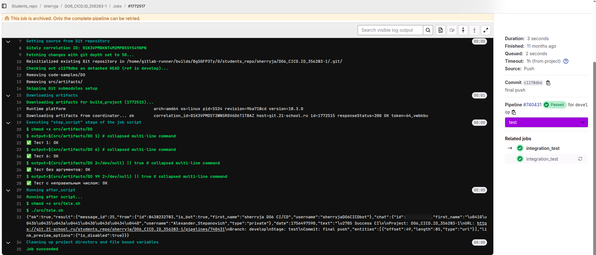
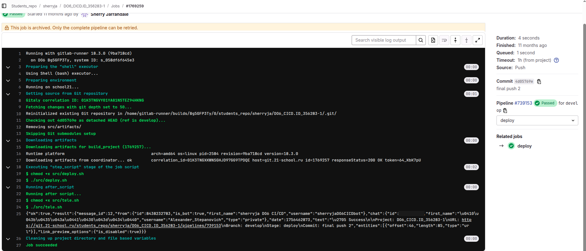
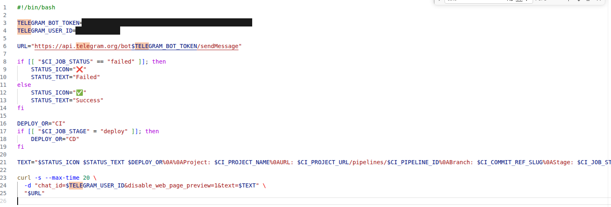

# Отчёт: конвейер CI/CD в GitLab

Конвейер собирает консольную программу на C, проверяет её форматирование, прогоняет интеграционные тесты и по отдельной команде доставляет бинарник на удалённый сервер. О результате каждой стадии приходит сообщение в Telegram.

---

## Условия стенда

| Параметр | Значение |
|---|---|
| GitLab | школьный, `git.21-school.ru` |
| Раннер | `gitlab-runner 18.3.0`, тег `DO6`, исполнитель **shell (bash)** |
| Ветка | `develop` |
| Целевой сервер доставки | `192.168.100.12`, пользователь `devops` |

Исполнитель — shell, а не Docker: задачи выполняются прямо на машине раннера, в одной и той же рабочей копии. Это определяет часть решений в конфигурации, к которым отчёт возвращается ниже.

> **О путях на скриншотах.** Логи сняты на сданной работе, где скрипты лежали в `src/`, а артефакты собирались в `src/artifacts/`. При переносе в портфолио уровень `src/` убран, поэтому в файлах репозитория те же пути читаются как `scripts/` и `artifacts/`. Логика не изменилась.

---

## 1. Конвейер

Конвейер описан в `.gitlab-ci.yml` и состоит из четырёх стадий:

```yaml
stages:
  - style
  - build
  - test
  - deploy
```

### 1.1. Стадия style — проверка форматирования

Правила форматирования приходят от курса и лежат в `materials/linters/.clang-format`, то есть вне каталога с кодом. `clang-format` ищет файл правил рядом с проверяемым исходником, поэтому конфигурация копируется в `code-samples/` перед проверкой и удаляется после неё:

```yaml
script:
  - cp materials/linters/.clang-format code-samples/
  - ls -la code-samples/.clang-format
  - |
    if clang-format -n -Werror --verbose code-samples/*.c > /dev/null 2>&1; then
      echo "✅ Код соответствует стилю"
    else
      echo "❌ Ошибки форматирования найдены!"
      clang-format -n -Werror --verbose code-samples/*.c
      exit 1
    fi
  - rm code-samples/.clang-format
```

Ключ `-n` означает «не переписывать файл, только сообщить о расхождениях», `-Werror` превращает расхождения в ненулевой код возврата. Первый вызов пишет в `/dev/null`: при успехе в логе остаётся одна строка вместо простыни, а при неудаче та же команда повторяется уже с выводом.

Удаление конфигурации в конце — не косметика. Раннер с shell-исполнителем переиспользует рабочую копию между задачами; оставленный файл всплыл бы в следующем прогоне. Это видно в логе — на этапе получения исходников GitLab сообщает `Removing code-samples/.clang-format`, вычищая остатки предыдущего запуска.

<br>
*Стадия style: конфигурация линтера копируется, проверка проходит, файл удаляется*

### 1.2. Стадия build — сборка

```yaml
script:
  - rm -rf artifacts
  - mkdir -p artifacts
  - make -C code-samples all
  - cp code-samples/DO artifacts/
artifacts:
  paths:
    - artifacts/
  expire_in: 30 days
```

Каталог артефактов пересоздаётся по той же причине, что и удаляется конфигурация линтера: без явной очистки в выгрузку попал бы бинарник от предыдущей сборки.

Собранный файл объявлен артефактом и передаётся дальше по конвейеру. Это принципиально: следующие стадии должны работать ровно с тем бинарником, который получился здесь, а не собирать его заново.

<br>
*Стадия build: сборка через Makefile, выгрузка артефакта*

### 1.3. Стадия test — интеграционные тесты

Четыре проверки: два корректных номера и два ошибочных ввода.

| Ввод | Ожидаемый вывод |
|---|---|
| `DO 1` | `Learning to Linux` |
| `DO 6` | `Learning to CI/CD` |
| `DO` без аргумента | `Bad number of arguments!` |
| `DO 99` | `Bad number!` |

Стадия начинается с `chmod +x artifacts/DO`: право на выполнение не переживает выгрузку и загрузку артефактов.

Проверки ошибочного ввода обёрнуты в `|| true`:

```yaml
- |
  output=$(artifacts/DO 2>/dev/null) || true
  expected="Bad number of arguments!"
```

Программа в этих случаях завершается с ненулевым кодом, и без обёртки задача упала бы на самой подстановке, не дойдя до сравнения вывода. То есть корректное поведение программы выглядело бы как провал теста.

Зависимости объявлены явно:

```yaml
needs:
  - style_code
  - build_project
```

`needs` превращает конвейер из очереди стадий в граф: задача стартует, как только готовы обе перечисленные, не дожидаясь остальных.

<br>
*Стадия test: четыре проверки на бинарнике, скачанном из артефактов сборки*

### 1.4. Стадия deploy — доставка

```yaml
deploy:
  stage: deploy
  script:
    - chmod +x scripts/deploy.sh
    - ./scripts/deploy.sh
  when: manual
  allow_failure: false
```

Содержимое `deploy.sh` — одна команда:

```bash
scp artifacts/DO devops@192.168.100.12:/usr/local/bin
```

Пароль не запрашивается: открытый ключ пользователя, под которым работает раннер, заранее добавлен в `authorized_keys` на целевой машине.

`when: manual` означает, что стадия не запускается сама — в интерфейсе появляется кнопка. Зелёный конвейер служит основанием для выкладки, но решение о ней принимает человек.

<br>
*Стадия deploy: артефакт скачивается из сборки и уходит на сервер*

---

## 2. Уведомления в Telegram

### 2.1. Подготовка

Бот заведён через `@BotFather`, идентификатор чата получен через `@my_id_bot`. Оба значения задаются в Settings → CI/CD → Variables с типом Masked:

| Переменная | Что содержит |
|---|---|
| `TELEGRAM_BOT_TOKEN` | токен бота от `@BotFather` |
| `TELEGRAM_USER_ID` | `chat_id` получателя |

### 2.2. Скрипт

`scripts/tele.sh` собирает текст сообщения из предопределённых переменных GitLab и отправляет его методом `sendMessage` Telegram Bot API:

```bash
TEXT="$STATUS_ICON $STATUS_TEXT $DEPLOY_OR%0A%0AProject: $CI_PROJECT_NAME%0AURL: \
$CI_PROJECT_URL/pipelines/$CI_PIPELINE_ID%0ABranch: $CI_COMMIT_REF_SLUG%0AStage: \
$CI_JOB_STAGE%0ACommit: $CI_COMMIT_MESSAGE"

curl -s --max-time 20 \
  -d "chat_id=$TELEGRAM_USER_ID&disable_web_page_preview=1&text=$TEXT" \
  "$URL"
```

Перенос строки в тексте сообщения передаётся как `%0A`: содержимое уходит в теле POST-запроса, где действует процентное кодирование.

<br>
*Скрипт уведомлений; токен и chat_id на снимке закрашены*

### 2.3. Почему вызов стоит в `after_script`

Скрипт подключён к каждой стадии через `after_script`, а не через `script`:

```yaml
after_script:
  - chmod +x scripts/tele.sh
  - ./scripts/tele.sh
```

Причина в том, ради чего уведомления и заводятся. Блок `script` при падении задачи обрывается на упавшей команде — сообщение об ошибке не ушло бы именно тогда, когда оно нужнее всего. `after_script` выполняется независимо от исхода.

Статус завершившейся задачи берётся из `CI_JOB_STATUS`. Эта переменная существует только в `after_script`: узнать собственный результат изнутри `script` задача не может, потому что на момент его выполнения результата ещё нет.

---

## 3. Что нашлось при разборе логов

Оба конвейера на скриншотах завершились успешно. Тем не менее в логах видны две вещи, которые стоит проговорить.

### 3.1. Предупреждение компилятора проходит мимо проверки стиля

Стадия `style` сообщает `✅ Код соответствует стилю`. Стадия `build` при этом выводит:

```
gcc main.c -o DO
main.c:4:1: warning: return type defaults to 'int' [-Wimplicit-int]
    4 | main(int argc, char *argv[]) {
      | ^~~~
```

Функция `main` в исходнике объявлена без типа возврата. `clang-format` этого не замечает и не должен: он проверяет форматирование — отступы, переносы, расстановку скобок, — а не корректность кода. Пройденная проверка стиля не говорит ничего о том, что скажет компилятор.

Сам исходник входит в поставку задания и не правился. Вывод из наблюдения относится к устройству конвейера: линтер форматирования и компилятор закрывают разные классы проблем, и стадия стиля не заменяет чтения предупреждений сборки. Полноценно закрыл бы этот разрыв флаг `-Werror` в сборке — тогда предупреждение роняло бы стадию `build`.

### 3.2. Уведомление падало, а задача оставалась зелёной

Скриншоты сняты с трёх разных прогонов — они шли в таком порядке:

| Прогон | Коммит | Стадия на скриншоте | `after_script` |
|---|---|---|---|
| `#739153` | `4d05769e` «final push 2» | deploy | чисто |
| `#740404` | `4e26a418` «bot test 1» | style, build | **ошибка** |
| `#740431` | `c1178dbe` «final push» | test | чисто |

В прогоне `#740404` лог заканчивается так:

```
$ ./src/tele.sh
{"ok":true,"result":{"message_id":16, ... }}
./src/tele.sh: line 29: Bo: command not found
./src/tele.sh: line 30: если: command not found
WARNING: after_script failed, but job will continue unaffected: exit status 1
Job succeeded
```

В той версии скрипта строки 29 и 30 были обычным текстом без символа комментария — bash попытался выполнить их как команды. Само уведомление при этом ушло: ответ API начинается с `"ok":true`, сообщение доставлено. Провалился только код возврата скрипта.

Задача осталась зелёной, и это не случайность: GitLab не роняет задачу из-за `after_script`, а ограничивается предупреждением в логе. Поведение разумное — недоступность мессенджера не должна валить сборку, — но у него есть обратная сторона: ошибка в скрипте уведомлений может жить в конвейере неограниченно долго, не привлекая внимания.

В финальной версии скрипта лишних строк нет, прогон `#740431` завершается без предупреждений.

---

## 4. Что изменено при публикации

| Изменение | Причина |
|---|---|
| Токен бота и `chat_id` вынесены в переменные CI/CD | В сданной работе оба значения были записаны в `tele.sh` открытым текстом. Токен отозван |
| На скриншоте `part5` закрашены токен и `chat_id` | Тот же снимок исходника до правки |
| Пути `src/tele.sh`, `src/deploy.sh`, `src/artifacts/` заменены на `scripts/` и `artifacts/` | Уровень `src/` при переносе в портфолио убран; без правки конфигурация ссылалась бы на несуществующие каталоги |
| Добавлена проверка наличия переменных перед отправкой | Без токена скрипт теперь пропускает уведомление и выходит с нулём, а не пытается обратиться к API |

Логика конвейера не менялась: те же четыре стадии, те же проверки, те же зависимости.

---

## Итог

Конвейер работает целиком — от проверки форматирования до доставки на сервер, с уведомлением на каждом шаге. Разбор логов оказался полезнее самой сборки: в успешном прогоне обнаружились и предупреждение компилятора, не видимое проверке стиля, и молча падавший скрипт уведомлений.

Зелёный конвейер сообщает ровно одно: ни одна из настроенных проверок не сработала. Что именно проверяется и что при этом остаётся незамеченным — определяется тем, как конвейер собран.
