# Непрерывная доставка в Kubernetes: чарт Helm и одноразовый кластер в раннере

Отчёт о том, как приложение из семи микросервисов Spring Boot переехало
на доставку чартом Helm через GitHub Actions, и что при этом сломалось.

Разделов девять. Первые три — про чарт и стенд, следующие три — про конвейер,
последние три — про секреты, про изменение, доказавшее работоспособность
доставки, и про упавшие прогоны. Последний раздел не убран намеренно:
конвейер, зелёный с первого раза, ничего не доказывает.

---

## 1. Что разворачивается и где

Приложение — система бронирования отелей: семь сервисов Spring Boot,
PostgreSQL и RabbitMQ. Сервисы связаны цепочкой: `gateway` ходит в остальные
шесть, `booking` — в `payment`, `hotel` и `loyalty`, статистика уезжает через
очередь в `report`.

```
                    ┌───────────┐
   клиент ─────────▶│  ingress  │
                    └─────┬─────┘
              ┌───────────┴───────────┐
              ▼                       ▼
      ┌───────────────┐       ┌───────────────┐
      │ session-service│       │ gateway-service│
      │     :8081      │       │     :8087      │
      └───────┬────────┘       └───────┬────────┘
              │                        │
              │            ┌───────────┼───────────┬───────────┐
              │            ▼           ▼           ▼           ▼
              │      ┌─────────┐ ┌─────────┐ ┌─────────┐ ┌─────────┐
              │      │ hotel   │ │ booking │ │ loyalty │ │ report  │
              │      │  :8082  │ │  :8083  │ │  :8085  │ │  :8086  │
              │      └────┬────┘ └────┬────┘ └────┬────┘ └────┬────┘
              │           │           │           │           │
              │           │      ┌────▼────┐      │           │
              │           │      │ payment │      │           │
              │           │      │  :8084  │      │           │
              │           │      └────┬────┘      │           │
              └───────────┴───────────┴───────────┴───────┐   │
                                                          ▼   ▼
                                                   ┌──────────────┐
                                                   │  PostgreSQL  │
                                                   │  RabbitMQ    │
                                                   └──────────────┘
```

Площадок две, и они отличаются не настройками, а назначением.

**Стенд** — две виртуальные машины Vagrant с k3s, по 3 ГБ на узел. Здесь
приложение живёт долго: можно посмотреть, как ведёт себя релиз через час,
снять потребление памяти, подобрать пробы. Отладка проб через пуши в GitHub
стоила бы пятнадцать минут за итерацию, локально — две.

**Одноразовый кластер k3d прямо в раннере** GitHub Actions. Живёт минуты,
создаётся и удаляется каждым прогоном. Здесь проверяется то, что уже
отлажено на стенде.

Одно осознанное различие между площадками стоит назвать сразу: на стенде
у ingress-nginx **включён** admission webhook, в раннере — выключен. Вебхук
принимает соединения на пару секунд позже, чем под становится Ready, и
установка чарта с объектом Ingress, поданная сразу, падает с
`failed calling webhook`. На долгоживущем стенде это лечится ожиданием и
вебхук приносит пользу; в одноразовом кластере проверять чужие Ingress
нечем и незачем.

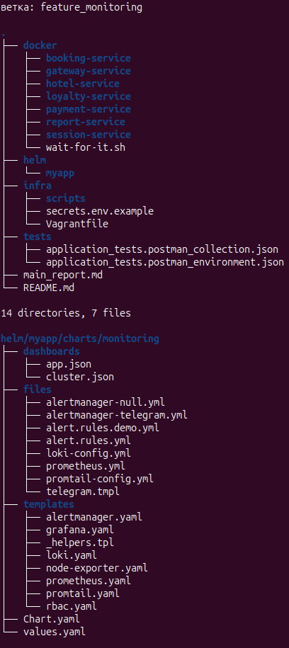

---

## 2. Девять дефектов чарта

Чарт достался в состоянии «ставится, если знать порядок действий». Ниже —
всё, что пришлось починить, с фрагментами до и после. Порядок примерно
по убыванию вреда.

### 2.1. Deployment'ы ссылались на Secret, которого чарт не создавал

Восемь из девяти Deployment'ов брали переменные из `svc-secrets`, а шаблона
`Secret` в чарте не было. Установка в чистый namespace давала девять подов
в `CrashLoopBackOff` — при формально успешной команде.

Появился `templates/secret.yaml`, и каждый обязательный ключ объявлен через
`required`:

```yaml
stringData:
  POSTGRES_PASSWORD: {{ required "secret.data.POSTGRES_PASSWORD не задан — передайте --set-string или -f" .Values.secret.data.POSTGRES_PASSWORD | quote }}
  PRIVATE_KEY: {{ required "secret.data.PRIVATE_KEY не задан — нужен PKCS#8 DER в base64 одной строкой, см. infra/secrets.env.example" .Values.secret.data.PRIVATE_KEY | trim | quote }}
```

`required` тут важнее самого шаблона: без обязательных значений установка
падает **на рендере**, за секунду и с внятным текстом, а не через две минуты
девятью подами в CrashLoop. В конвейер добавлена обратная проверка — рендер
без секретов обязан упасть:

```bash
if helm template t "$CHART_DIR" -n "$NAMESPACE" >/dev/null 2>&1; then
  echo "::error::чарт отрендерился без обязательных секретов — required потерян"
  exit 1
fi
```

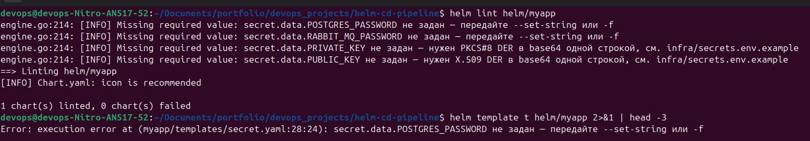

`| trim` не косметика: `--set-file` тянет файл вместе с завершающим переводом
строки, а строгий декодер Base64 в Java на нём падает.

### 2.2. `maxUnavailable: 1` обесценивал `helm --wait`

Самая дорогая находка, потому что она делала зелёным то, что зелёным не было.

Helm при `--wait` считает Deployment готовым по условию

```
readyReplicas >= replicas - maxUnavailable
```

При `replicas: 1` и `maxUnavailable: 1` правая часть равна нулю. Условие
выполняется мгновенно, ждать нечего. Установка отчитывалась `deployed`
за 46 секунд, когда **восемь подов из девяти были 0/1**.

```yaml
rollingUpdate:
  maxUnavailable: {{ $svc.maxUnavailable | default 0 }}
  maxSurge: {{ $svc.maxSurge | default 1 }}
```

С нулём правая часть равна единице, и ожидание становится настоящим.
Побочный эффект приятный: обновление идёт без простоя — новый под
поднимается раньше, чем гасится старый.

Ловушка в том, что настраивать пробы при этом можно было сколько угодно:
ожидание отключала стратегия обновления, а не отсутствие проб.

### 2.3. Ни у одного из девяти контейнеров не было `resources`

Планировщик не знал, сколько памяти нужно поду, и раскладывал их вслепую.
Добавлен хелпер и общий блок значений по умолчанию:

```
{{- define "myapp.resources" -}}
{{- toYaml (default .root.Values.defaultResources .svc.resources) -}}
{{- end -}}
```

Числа не выдуманы, а сняты `kubectl top pods` на обеих площадках. Полная
таблица лежит комментарием в `values.yaml`; главное из неё:

| сервис | стенд, покой | стенд, пик | раннер |
|---|---|---|---|
| booking | 250 Ми | 277 Ми | 242 Ми |
| session | 183 Ми | 183 Ми | 206 Ми |
| gateway | 98 Ми | 98 Ми | 120 Ми |
| **итого** | **1383 Ми** | **1419 Ми** | ~1,54 ГБ |

Под нагрузкой меняется только `booking` — единственный, кто выполняет
транзакцию бронирования. Request 256 Ми выбран по нему: на покое он
занимает 250 Ми, то есть request попадает почти ровно в его полку.

### 2.4. Проб не было вовсе

Под считался `Running` за 20–35 секунд до того, как Spring заканчивал старт.
Разрыв закрывался скриптом, который искал в логах строку
`Started ...Application in`.

Добавлена тройка проб, причём именно `startupProbe`, а не
`initialDelaySeconds`. Единая задержка тут не работает ни в одну сторону:
`session` открывает порт за ~25 секунд, а `gateway` — после семи
последовательных `wait-for-it`, то есть в худшем случае через 4–5 минут.
Пока `startupProbe` не прошёл, readiness и liveness не выполняются вообще,
и бюджет старта задаётся на сервис:

```yaml
    # Самый долгий старт в наборе: цепочка wait-for-it у gateway — семь хопов
    # по 40 секунд, и только потом стартует JVM. 90 × 5 с = 7,5 минуты запаса.
    startupFailureThreshold: 90
```

Скрипт `checksvc.sh` остался, но роль у него сменилась: он больше не
подменяет пробы, а показывает, за сколько поднялся каждый сервис.

### 2.5. `valueFrom` был захардкожен, а пустые значения терялись

Шаблон умел только `configMapKeyRef` и отбрасывал значения условием
`{{- if .value }}`, из-за чего строки `"0"`, `"false"` и `""` исчезали молча:

```yaml
{{- if .value }}
value: {{ .value | quote }}
{{- end }}
valueFrom:
  configMapKeyRef:
    name: {{ .valueFrom.name }}
```

Стало:

```yaml
{{- if hasKey . "value" }}
value: {{ .value | quote }}
{{- end }}
{{- with .valueFrom }}
valueFrom:
  {{- toYaml . | nindent 16 }}
{{- end }}
```

`hasKey` отличает «значение не задано» от «задано пустым», а `toYaml`
пропускает любой источник — `secretKeyRef`, `fieldRef` и прочие.

### 2.6. `init.sql` противоречил секрету

Скрипт инициализации содержал `\c postgres` и `OWNER postgres`, тогда как
`POSTGRES_USER` приходит из секрета и может быть любым. Переписан на список:

```
{{- range .Values.postgres.databases }}
CREATE DATABASE {{ . }};
{{- end }}
```

Список баз лежит в `values.yaml`, а ConfigMap собирается через
`tpl (.Files.Get ...)`.

### 2.7. RabbitMQ работал на учётных данных по умолчанию

В values присутствовала переменная `RABBITMQ_ALLOW_REMOTE_GUEST_ACCESS`.
Это переменная образа Bitnami — официальный образ RabbitMQ её игнорирует,
поэтому брокер поднимался с `guest/guest`, а сервисы ходили в него с теми же
данными, независимо от того, что лежало в секрете. Переменная удалена,
брокер получил `RABBITMQ_DEFAULT_USER` и `RABBITMQ_DEFAULT_PASS` через
`secretKeyRef`.

### 2.8. Открытый приватный ключ лежал в шести `application.properties`

Ключ подписи JWT был вписан в исходники в открытом виде. Восстановлены
параметризованные версии, и теперь в образе лежит

```properties
privateKey=${PRIVATE_KEY}
```

Проверяется это не на глаз, а распаковкой собранного образа:

```bash
unzip -p app.jar BOOT-INF/classes/application.properties | grep privateKey
```

### 2.9. Ротация секрета молча не происходила

Найдено уже при диагностике упавшей доставки. У шаблона пода не было
контрольной суммы секрета, поэтому `helm upgrade` с новой парой ключей
отрабатывал успешно и **не менял ничего**: переменные из `secretKeyRef`
подставляются в момент создания пода, а раз шаблон пода не изменился,
Deployment не перекатывается.

```yaml
checksum/secret: {{ printf "%s|%s|%s|%s|%s"
    ($.Values.secret.data.POSTGRES_PASSWORD | default "" | sha256sum)
    ...
  | sha256sum }}
```

Сумма считается по значениям, а не по отрендеренному `Secret`: аннотации
видны в `kubectl describe pod` любому, у кого есть доступ к неймспейсу.
Хешируется каждое значение по отдельности — иначе перестановка двух значений
оставила бы сумму прежней.

Дефект того же рода, что и 2.2: команда отрабатывает успешно, а заявленного
действия не производит.

---

## 3. Проверка на стенде

Стенд поднимается одной командой:

```bash
cd infra && vagrant up --provider=libvirt
```

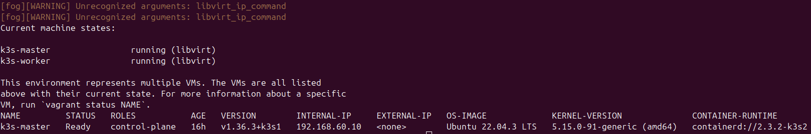

Триггер `after :up` на последней ноде сам вызывает `deploy-app.sh`. Триггер
привязан именно к последней, а не к мастеру: `trigger.after :up`
срабатывает сразу после создания своей машины, то есть до того, как второй
узел вообще существует, и скрипт встал бы в ожидание, блокируя его создание.

Здесь же нашлись две дыры в воспроизводимости, невидимые тому, кто писал
скрипты, и фатальные для того, кто копирует репозиторий.

**Kubeconfig негде было взять.** k3s создаёт его внутри мастера, а
`deploy-app.sh` работает с хоста. Раньше файл клали руками, поэтому дыра
не проявлялась: `vagrant up` отрабатывал, а триггер падал на проверке
существования файла. Теперь скрипт забирает конфиг сам:

```bash
( cd "$INFRA_DIR" && vagrant ssh-config k3s-master ) > "$ssh_cfg"
scp -q -F "$ssh_cfg" k3s-master:/etc/rancher/k3s/k3s.yaml "$KUBECONFIG"
sed -i "s|https://127.0.0.1:6443|https://${MASTER_IP}:6443|" "$KUBECONFIG"
```

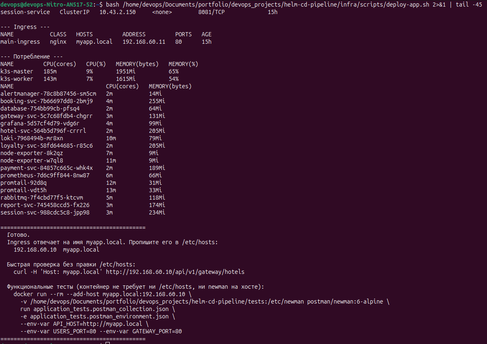

Через `vagrant ssh-config` и `scp`, а не вложенным `vagrant ssh`: вложенная
сессия vagrant внутри триггера самого vagrant — источник трудноуловимых
зависаний. Адрес сервера переписывается, потому что k3s пишет туда
`127.0.0.1` — с точки зрения узла это верно, а с хоста ведёт в никуда;
работает подмена благодаря `--tls-san` в установке k3s.

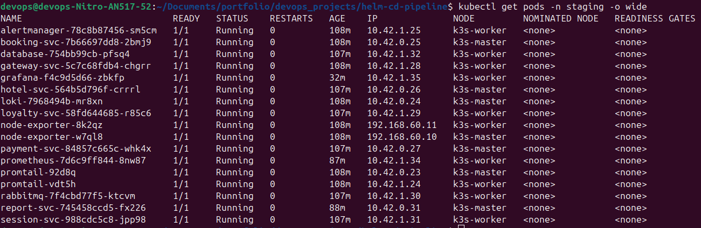

**Подсказка в конце скрипта была заведомо нерабочей.** Она предлагала
`port-forward` на `localhost:8080`, но при заданном имени Ingress контроллер
сверяет заголовок `Host` и возвращает 404 при полностью исправном
приложении. Проверено обеими ветками:

```
curl -H 'Host: myapp.local' http://192.168.60.10/... → 503 (правило совпало, бэкенд грузится)
curl                        http://192.168.60.10/... → 404 (правило не совпало)
```

Теперь имя берётся из самого кластера, а рядом печатается способ проверки
без правки `/etc/hosts` — она требует прав, которых может не быть:

```bash
docker run --rm --add-host myapp.local:192.168.60.10 \
  -v .../tests:/etc/newman postman/newman:6-alpine \
  run application_tests.postman_collection.json ...
```

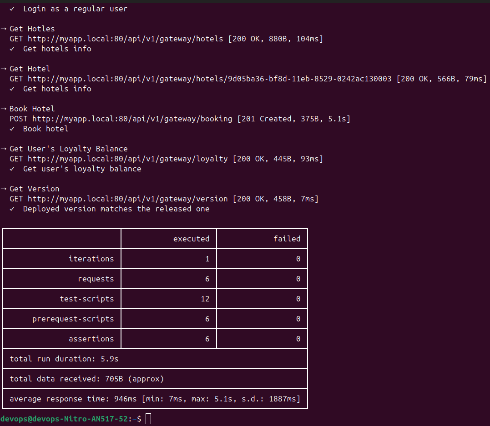

---

## 4. Одноразовый кластер в раннере

Стадия `test` поднимает k3d прямо в раннере:

```bash
k3d cluster create app \
  --agents 0 \
  --k3s-arg "--disable=traefik@server:*" \
  -p "8080:80@loadbalancer" \
  --wait --timeout 5m
```

`--agents 0` — раскладывать поды не по чему, а второй контейнер k3s съел бы
около 400 Ми и такт процессора. traefik выключен, вместо него ставится
ingress-nginx — тот же контроллер, что и на стенде.

Образы не тянутся кластером, а импортируются в него:

```bash
docker pull "sherryja/$s-service:$TAG"
k3d image import -c app $IMAGES
docker image rm $IMAGES || true
```

Причин две. Первая — детерминированность: не нужен `imagePullSecret` внутри
кластера. Вторая — лимиты: анонимный лимит Docker Hub составляет 100
загрузок за шесть часов на адрес, раннеры GitHub сидят за общими адресами,
и семь образов подряд регулярно упираются в 429. Поэтому логин в Docker Hub
в конвейере не опция, а необходимость. `docker image rm` сразу после импорта
освобождает 2,3 ГБ — из четырнадцати доступных это заметно.

**Узкое место раннера — процессор, а не память.** `ubuntu-latest` даёт
4 ядра и 16 ГБ; весь стенд с мониторингом укладывается примерно в 3,7 ГБ.
Но семь JVM стартуют одновременно на четырёх ядрах, и старт каждой
растягивается с 20–35 секунд до 60–120. Отсюда `--timeout 15m`, бюджет
`startupProbe` и `-XX:TieredStopAtLevel=1` в `values-ci.yaml`: отключение
компилятора C2 срезает старт на четверть, а пиковая производительность тут
не нужна — тест гоняет шесть запросов.

> `-noverify` для той же цели использовать нельзя: опция удалена в Java 13,
> а шесть образов из семи работают на 17.

---

## 5. Три стадии

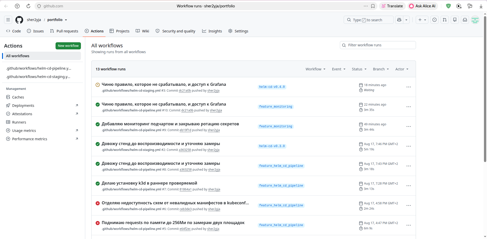

### build — статические проверки и артефакт

Java в публичном репозитории нет, поэтому «сборка» собирает то, что здесь
действительно есть, и выдаёт настоящий артефакт: упакованный чарт.

`hadolint` по семи Dockerfile → `actionlint` по своим же workflow →
`shellcheck` по скриптам → грепы на секреты → `helm lint` → обратная проверка
`required` → рендер в **двух** состояниях подчарта мониторинга →
`kubeconform -strict` → `promtool check rules` → `helm package` → артефакт.

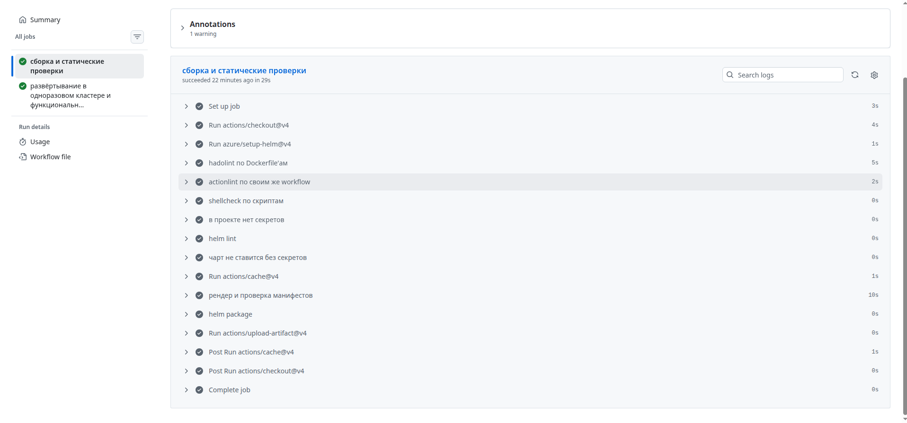

Рендерятся оба состояния намеренно: выключенный мониторинг — это то,
в котором чарт ставят по умолчанию, и сломать его условием `{{- if }}`
проще всего.

Схемы Kubernetes кэшируются между прогонами. Без кэша `kubeconform` тянет
по схеме на каждый вид объекта с чужого хоста, и сборка начинает зависеть
от его доступности — один прогон уже упал с `Valid: 11, Errors: 12`, притом
что невалидных объектов было ноль. Проверка, которая падает не от состояния
кода, обесценивает сам конвейер, поэтому недоступность схем теперь
предупреждение, а невалидный объект — по-прежнему ошибка.

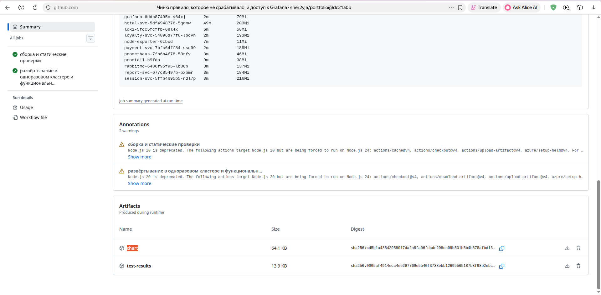

### test — живое приложение

`needs: build`, эфемерный кластер, `download-artifact`. Ставится **ровно тот
пакет, который собрала предыдущая стадия**, а не каталог из репозитория.

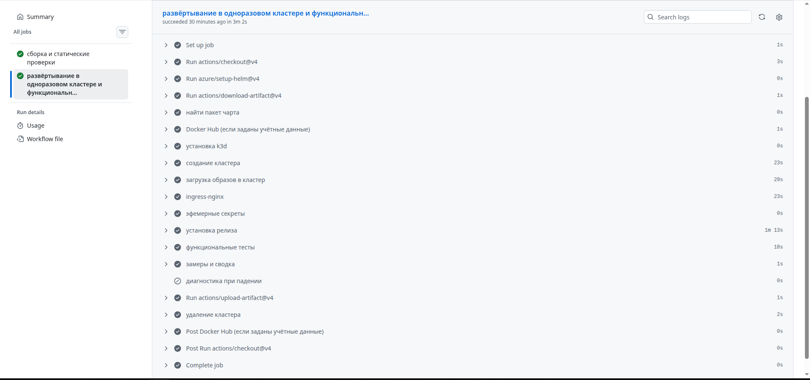

Ключи для этой стадии генерируются на месте и живут пятнадцать минут:

```bash
openssl genpkey -algorithm RSA -pkeyopt rsa_keygen_bits:2048 -out /tmp/priv.pem
openssl pkcs8 -topk8 -nocrypt -in /tmp/priv.pem -outform DER -out /tmp/priv.der
openssl base64 -A -in /tmp/priv.der > /tmp/private_key.txt
```

Затем `helm upgrade --install --wait`, `newman`, `kubectl top`, а при падении —
`describe`, события, логи всех Deployment (включая `--previous`) и
`helm get manifest` в артефакт.

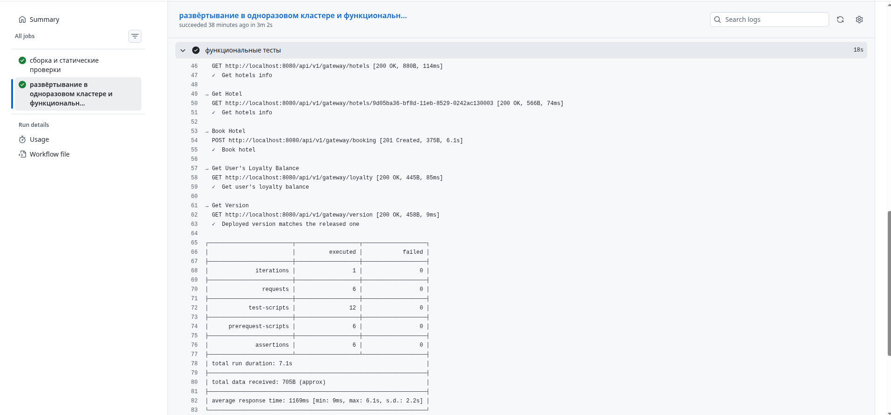

### staging — публикация и проверка выложенного

Запускается только по тегу `helm-cd-v*`. В общем репозитории префикс тега
играет ту же роль, что path-фильтр у конвейера проверок: он адресует релиз
конкретному проекту.

Ручное подтверждение здесь — не кнопка в джобе, а **защищённое окружение**:
у `helm-cd-staging` заданы обязательные проверяющие, поэтому джоба встаёт
в `Waiting` и ждёт решения человека. Оттуда же приходят и секреты, и это
содержательное отличие от стадии `test`: там ключ эфемерный и живёт минуты,
здесь постоянный и доступен только после подтверждения.

Порядок шагов: сверка тега с `version:` в `Chart.yaml` → `helm package` →
`helm push` в `oci://ghcr.io/...` → релиз на GitHub с приложенным `.tgz` →
**установка опубликованного чарта** в свежий кластер → `newman`.

Последний шаг — смысл всей стадии: проверяется не каталог в репозитории,
а именно тот артефакт, который скачает потребитель.

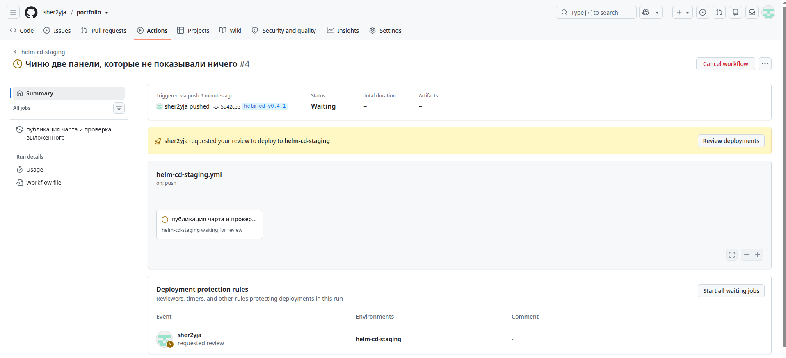

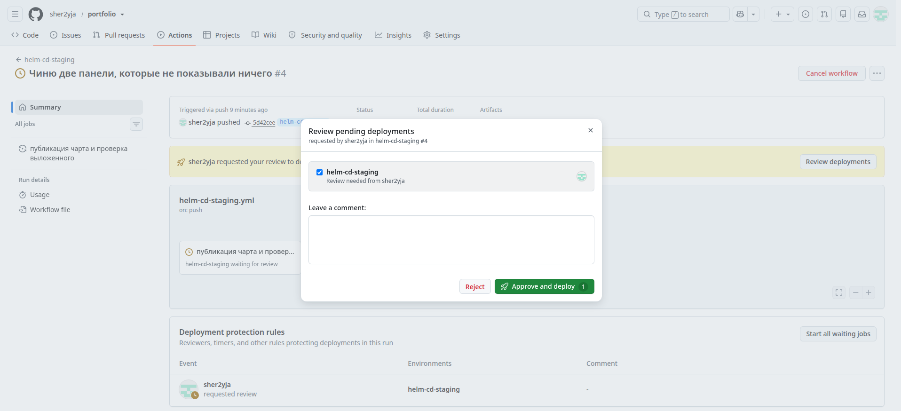

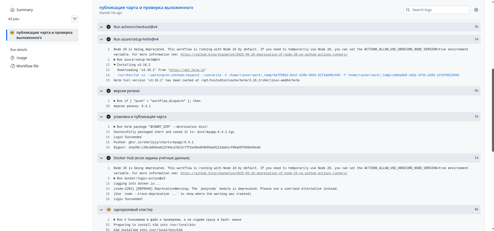

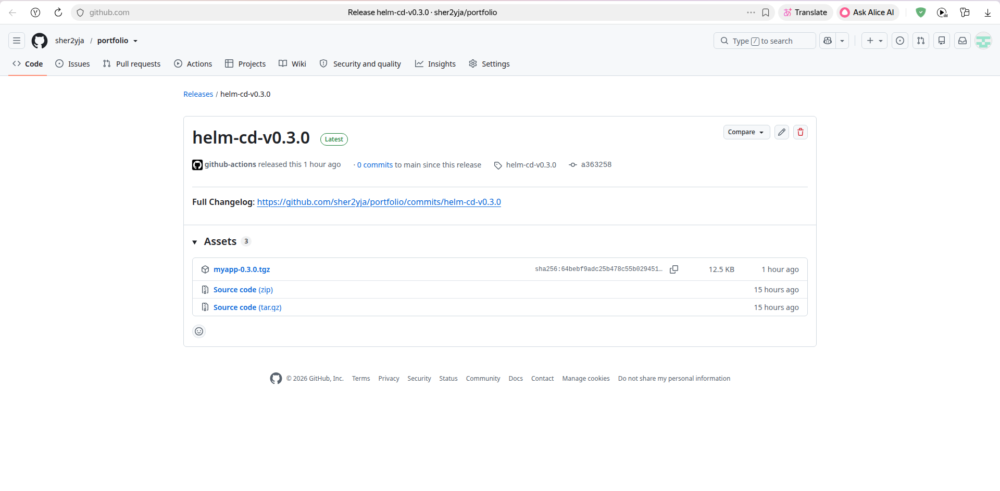

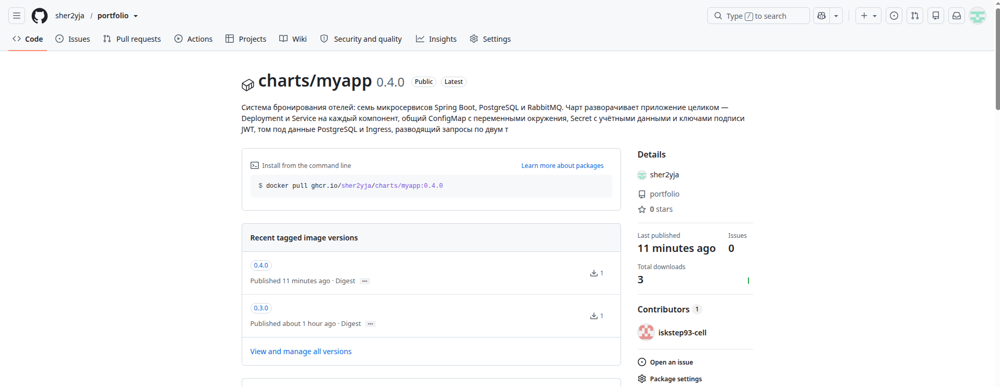

---

## 6. Секреты: одно значение, три источника

Одно и то же значение приходит в чарт тремя разными путями, и это удобный
разрез для сравнения:

| площадка | откуда | время жизни |
|---|---|---|
| стенд | файл `~/.helm-cd/`, вне репозитория | пока не перегенерируют |
| стадия `test` | генерируется в раннере, `openssl` | минуты |
| стадия `staging` | секреты защищённого окружения GitHub | до ротации |

**Формат ключа — отдельная история.** `JwtProvider` делает
`new PKCS8EncodedKeySpec(Base64.decode(privateKey))`, то есть ждёт PKCS#8
DER в base64 одной строкой, без заголовков PEM.

Очевидная команда даёт не то:

```bash
openssl genpkey -algorithm RSA -outform DER    # → PKCS#1, base64 начинается с MIIEow
openssl pkcs8 -topk8 -nocrypt ...              # → PKCS#8, начинается с MIIEvQ
```

Проверяется структурой, а не префиксом:

```bash
base64 -d ~/.helm-cd/private_key.txt | openssl asn1parse -inform DER | head -4
```

Во второй строке должно быть `SEQUENCE` с `OBJECT :rsaEncryption`, а не
`INTEGER`.

---

## 7. Изменение, которое проехало через весь конвейер

Работоспособность доставки доказывается не зелёной джобой, а ответом
приложения. Поэтому добавление мониторинга сделано **последним** и проведено
через оба конвейера целиком.

Изменение состояло из трёх частей: инструментовка приложения счётчиками
Micrometer, сборка образов `1.1.0`, подчарт `charts/monitoring`.

Проверяемый факт — шестой запрос в коллекции Postman:

```
GET /api/v1/gateway/version → {"version":"1.1.0"}
```

Ожидаемое значение не зашито в тест: оно приходит из `imageTag` в
`values.yaml`, который джоба и так читает, — источник истины остаётся один.

```bash
newman run ... --env-var "EXPECTED_VERSION=$IMAGE_TAG"
```

Этот запрос ценнее остальных пяти: он единственный отличает «доставка
доехала» от «джоба стала зелёной».

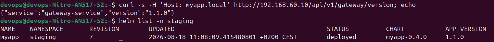

### Что пришлось переписать в мониторинге

Перенос схемы, работавшей в Docker Compose, оказался не копированием:

| было | стало | почему |
|---|---|---|
| статические цели по именам сервисов | `kubernetes_sd_configs` + отбор по аннотациям | адрес пода меняется при каждом обновлении; при `replicas>1` DNS-имя отдаёт один случайный под |
| отдельный контейнер cAdvisor | `/metrics/cadvisor` у kubelet | cAdvisor уже встроен в kubelet |
| `docker_sd_configs` в promtail | `role: pod`, путь из uid пода | рантайм containerd; ни сокета, ни `/var/lib/docker` на узле нет |
| — | стадия `cri` в конвейере разбора | containerd пишет строки в формате CRI; без разбора в Loki уезжает штамп времени как часть текста |
| правила вида `> 1` и `< 100` | пять содержательных правил | прежние истинны по построению и срабатывают всегда |
| зашитые uid источников данных | `uid: prometheus` / `uid: loki` в provisioning | 18 вхождений; без этого панели пусты при исправных источниках |

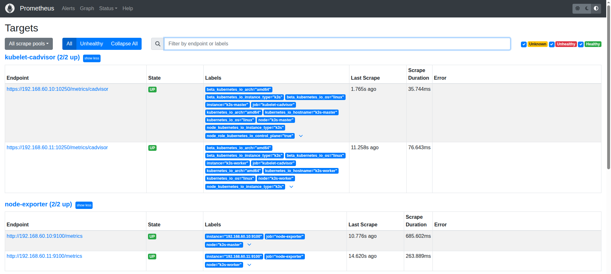

Последнее — самая частая причина, по которой дашборд, выгруженный из
работающей Grafana, не переносится в другую установку. Grafana генерирует
uid источника случайно при первом старте, а в выгруженном JSON он зашит.

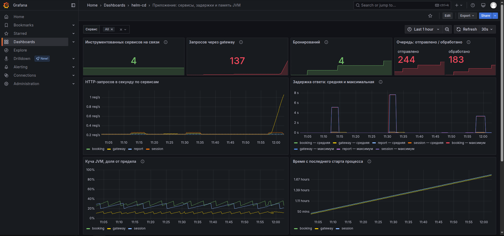

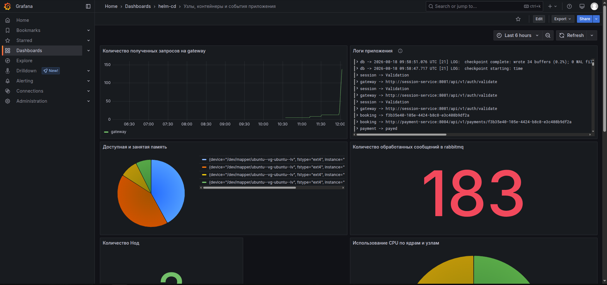

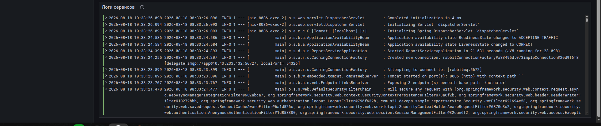

### Правило, которое не сработало

Написав правила, я проверил их отрицательным тестом: погасил `report-svc`
и стал ждать `ServiceDown`. За две минуты выдержки правило не сработало,
за четыре — тоже.

Причина оказалась в самом выражении:

```promql
up{job="spring-services"} == 0
```

`up` существует только для целей, которые Prometheus **нашёл**. Когда под
удаляется, из service discovery исчезает и цель, и ряда `up` для неё больше
нет — сравнивать не с чем. Правило ловит «под жив, приложение не отвечает»,
и это важный случай, но не единственный и даже не самый очевидный.

Добавлено второе правило. Списка сервисов в нём нет намеренно: он
противоречил бы принципу отбора по аннотациям, ради которого статические
цели и убирались. Вместо списка — сравнение с недавним прошлым:

```promql
count(up{job="spring-services"})
  <
max_over_time(count(up{job="spring-services"})[1h:1m])
```

Пять минут выдержки — чтобы правило молчало во время обновления, когда
старый под уже погашен, а новый ещё не зарегистрирован.

Вывод из этого эпизода общий с остальным отчётом: правило оповещения,
которое ни разу не проверяли отрицательным тестом, — это не мониторинг,
а предположение о мониторинге. Ровно поэтому в наборе есть и правило,
срабатывающее гарантированно: оно проверяет не приложение, а сам маршрут
доставки уведомлений.

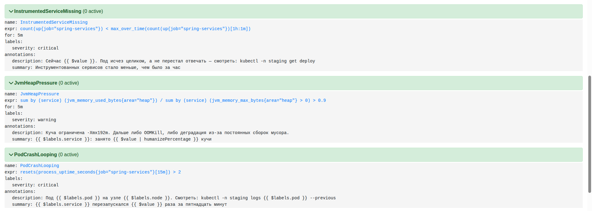

### Grafana, доступная только изнутри

Ещё один дефект того же семейства, найденный попыткой открыть Grafana
в браузере. Через `kubectl port-forward` она отвечала, через Ingress —
отдавала 404. Под при этом был `1/1 Running`, `/api/health` внутри пода
возвращал 200, в values был объявлен путь `/grafana` — и не было ни одного
признака неисправности.

Причина: путь объявлен, а правила маршрутизации к нему не написано.
Правило добавлено в **родительский** чарт, хотя по принадлежности место ему
в подчарте: подчарт не видит значений родителя иначе как через `global`,
а нужны и `className`, и `host` — оба заданы у приложения. Заводить `global`
ради одного правила значит усложнить чарт сильнее, чем эта вложенность
того стоит.

Отдельная деталь, без которой правило бесполезно: Grafana обязана знать,
что живёт по подпути. В её окружении выставлены `GF_SERVER_ROOT_URL`
и `GF_SERVER_SERVE_FROM_SUB_PATH` — иначе все ссылки внутри интерфейса
ведут в корень, и после входа пользователь попадает на пустую страницу.

### Честность метрик

В исходной версии счётчиков остались
закомментированные строки вида `bookingsCounter.increment(19)` — начальное
смещение, «чтобы на графике было не пусто». Они не перенесены: метрика,
которую подкрутили, перестаёт быть измерением. По той же причине
единственное правило, срабатывающее всегда, вынесено в отдельный файл,
названо `DemoAlertAlwaysFiring`, помечено меткой `demo="true"` и снабжено
выключателем — им проверяется маршрут доставки уведомлений, а не состояние
приложения.

Ещё одна ловушка, стоившая бы всех проб: для путей
`/actuator/health/liveness` и `/actuator/health/readiness` нужен ключ

```properties
management.health.probes.enabled=true
```

**без** префикса `endpoint` — в `management.endpoint.health.probes.enabled`
он переехал только в Spring Boot 2.6, а здесь версии 2.3.3–2.5.0. Без него
оба пути отдают 404, и поды не проходят `startupProbe` при полностью
исправном приложении.

---

## 8. Замеры

Стенд, два узла по 3 ГБ, после прогона функциональных тестов:

```
NAME         CPU(cores)   CPU(%)   MEMORY(bytes)   MEMORY(%)
k3s-master   465m         23%      1696Mi          57%
k3s-worker   985m         49%      1491Mi          50%
```

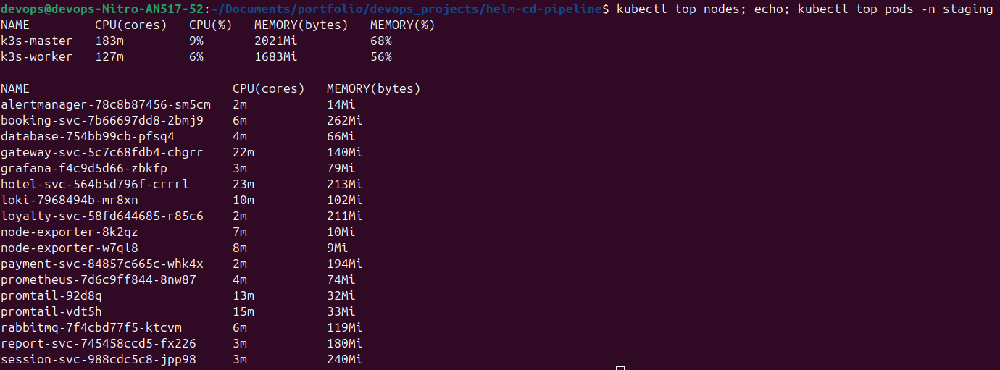

Третий гигабайт на узел добавлен по расчёту, а не на глаз: приложение
занимает 1383 Ми, стек мониторинга добавляет около 650 Ми, а Ubuntu с k3s
съедают 600–800 Ми на узел. В двух гигабайтах это помещалось впритык
и без запаса на одновременный старт семи JVM; отдельно мешали одиночные
компоненты мониторинга — их requests должны лечь на **один** из двух узлов
поверх уже разложенного приложения, и при неудачной раскладке Prometheus
встал бы в `Pending` вместо того, чтобы переехать.

Время: кластер k3d создаётся за 26 секунд, ingress-nginx поднимается за 33,
установка чарта с ожиданием — около минуты на стенде и до трёх минут
в раннере. Функциональные тесты занимают 5,8 секунды в раннере и 15,2 на
стенде: разница целиком приходится на запрос бронирования, который проходит
через четыре сервиса и очередь, и на стенде эти хопы идут между двумя
виртуальными машинами, а не внутри одного узла.

---

## 9. Разбор упавших прогонов

Раздел оставлен намеренно. Конвейер, зелёный с первого раза, читается как
ненастоящий, а каждое из падений ниже стоило отдельного разбирательства.

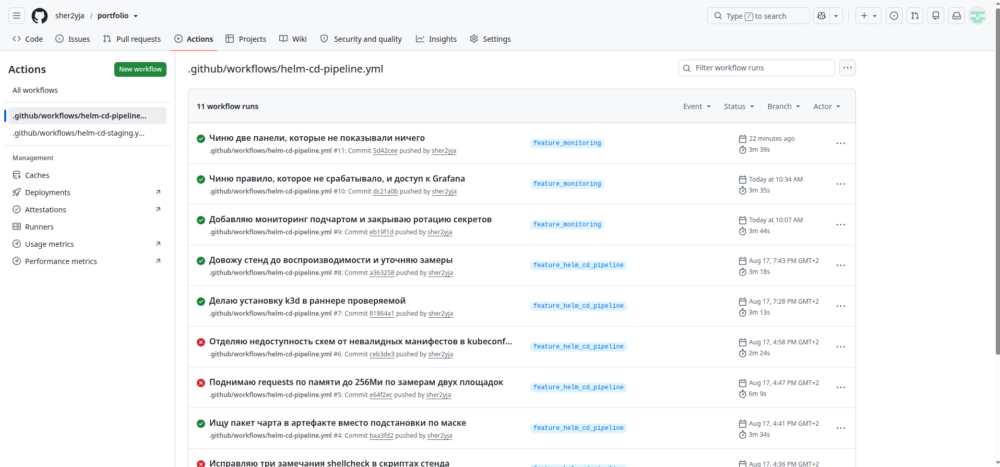

### Прогон падал за нулевое время без объяснений

GitHub сообщал `workflow file issue` без указания места. YAML при этом
валиден, и ни `yaml.safe_load`, ни глаз ошибку не находят.

Причина — контекст `secrets` недопустим в `if`:

```yaml
if: ${{ secrets.DOCKERHUB_USERNAME != '' }}   # так нельзя
```

Лечится пробросом в `env` на уровне джобы:

```yaml
env:
  DOCKERHUB_USERNAME: ${{ secrets.DOCKERHUB_USERNAME }}
...
    if: env.DOCKERHUB_USERNAME != ''
```

Нашёл `actionlint`, который знает таблицу доступности контекстов. После
этого он же добавлен в стадию build — чтобы такие ошибки ловились до пуша.

### `Error: repo dist not found`

Первое подозрение падало на секрет с именем пользователя Docker Hub, но лог
показывал, что в `docker/login-action` значение пришло — оно было
замаскировано звёздочками, то есть существовало.

Настоящая причина: `actions/download-artifact` распаковывает во **вложенный**
каталог, и маска `dist/myapp-*.tgz` не раскрылась. Helm получил нераскрытую
маску, счёл её ссылкой на репозиторий и честно сообщил, что репозитория
`dist` не знает. Лечится поиском и явной проверкой:

```bash
CHART_PKG=$(find artifact -name 'myapp-*.tgz' -type f | head -1)
[ -n "$CHART_PKG" ] || { echo "::error::пакет чарта не найден в артефакте"; exit 1; }
```

### `Valid: 11, Invalid: 0, Errors: 12`

Двенадцать схем не скачались во время перебоя на стороне хостинга схем.
Ноль невалидных объектов, но стадия красная. Добавлен кэш, ретраи и разбор
сводки: `Invalid` роняет сборку, `Errors` только предупреждает.

### `k3d: command not found` при зелёном шаге установки

Самое поучительное. Шаг установки k3d был зелёным, следующий шаг падал
на отсутствующей команде.

Причина в том, как GitHub запускает `run`: по умолчанию это
`/usr/bin/bash -e`, **без** `pipefail`. В конструкции

```bash
curl -sfL https://.../install.sh | TAG=v5.7.4 bash
```

неудача `curl` теряется: bash получает пустой ввод, успешно его выполняет
и возвращает ноль. Шаг зелёный, не установив ничего.

Закрыто целиком, а не в одном месте:

```yaml
defaults:
  run:
    shell: bash          # разворачивается в bash --noprofile --norc -eo pipefail
```

```bash
curl -sfL -o /tmp/k3d-install.sh https://.../install.sh   # в файл, а не в конвейер
[ -s /tmp/k3d-install.sh ] || { echo "::error::установщик не скачался"; exit 1; }
TAG=v5.7.4 bash /tmp/k3d-install.sh
command -v k3d >/dev/null || { echo "::error::k3d не появился в PATH"; exit 1; }
```

Отдельно стоит отметить последнюю строку: отработавший установщик и
работающий бинарник — не одно и то же.

### Доставка: все пять проверок упали, начиная с логина

Установка прошла, чарт опубликовался, девять подов поднялись — и newman
получил 401, 500, 500, 403, 403.

В логе gateway нашлось `java.security.InvalidKeyException: IOException`.
Ключ не разбирался. Дальше нужно было понять, битые ли сами ключи или
испорчено то, что хранится в GitHub, — а прочитать секрет обратно нельзя.

Развилка разрешилась экспериментом: на стенд поставили **ровно те ключи,
которые ушли в секреты**, и получили 5/5. Значит, файлы исправны, а
испорчено хранимое значение. Симптом характерный: строгий декодер Base64
в Java отвергает переводы строк внутри строки, и длинное значение при
вставке в веб-форму вполне могло перенестись.

Лечение — переустановка секретов командой из файла, минуя ручную вставку:

```bash
gh secret set APP_PRIVATE_KEY --env helm-cd-staging < ~/.helm-cd/private_key.txt
```

Повторный прогон прошёл без единой правки кода. Побочным результатом этого
разбирательства стал дефект 2.9: подмена ключей через `helm upgrade`
не перезапустила поды.

---

## Вывод

Общее у самых дорогих находок — не сложность, а способ проявления. Ни
`maxUnavailable: 1`, ни `curl | bash` без `pipefail`, ни отсутствие
контрольной суммы секрета не давали ошибок. Все три давали **успешный
результат вместо выполненного действия**: команда возвращала ноль, статус
был зелёным, а заявленного не происходило.

Такие дефекты не находятся чтением логов — в логах всё хорошо. Они находятся
только проверкой того, что должно было измениться: сколько подов реально
готовы, лежит ли бинарник в `PATH`, поменялось ли содержимое пода после
ротации секрета. Шестой запрос коллекции, сверяющий версию у работающего
приложения, добавлен ровно по этой причине — он проверяет результат,
а не отчёт о нём.
