# Отчёт: развёртывание приложения через Kustomize и Helm

Разбор прогона с командами и их выводом. Обзор проекта, схема стенда и принятые
решения — в [README.md](./README.md).

Приложение из 7 микросервисов разворачивается в кластер k3s двумя способами:
через Kustomize (base + overlay) и через собственный Helm-чарт. Обе части
выполнены на одном и том же стенде, поэтому результаты сопоставимы напрямую.

---

## Часть 1. Доставка через Kustomize

### 1. Стенд: три VM с кластером k3s
### 2. Исходные манифесты приложения

Кластер поднимается тремя виртуальными машинами через Vagrant с провайдером libvirt: `master` (192.168.33.10), `worker1` (192.168.33.11), `worker2` (192.168.33.12), по 2 vCPU и 2 ГБ памяти каждая.

<strong>Содержимое <a href="./Vagrantfile">Vagrantfile</a></strong>

**Развёртывание полностью автоматизировано**: триггер `node.trigger.after :up` внутри ветки `master` запускает с хоста скрипт [scripts/deploy-app.sh](./scripts/deploy-app.sh), поэтому одной команды `vagrant up --provider=libvirt` достаточно для получения развёрнутого кластера с работающим приложением.

Что делает [scripts/deploy-app.sh](./scripts/deploy-app.sh) (6 шагов):

1. ждёт, пока все 3 ноды станут `Ready`;
2. ставит **ingress-nginx** (k3s запускается с `--disable=traefik`, поэтому контроллер нужен свой);
3. ставит **cert-manager** (без него в кластере нет CRD `ClusterIssuer`/`Certificate`);
4. применяет манифесты кластера строго в порядке зависимостей:
   ```
   kubectl apply -f k3s/manifests/namespace.yaml
   kubectl apply -f k3s/pv.yaml
   kubectl apply -f k3s/pvc.yaml
   kubectl apply -f k3s/manifests/configmap.yaml
   kubectl apply -f k3s/manifests/secrets.yaml
   kubectl apply -f k3s/manifests/services.yaml
   kubectl apply -f k3s/issuer.yaml
   kubectl apply -f k3s/manifests/deployments.yaml
   kubectl apply -f k3s/certificate.yaml
   kubectl apply -f k3s/ingress.yaml
   ```
5. ждёт готовности подов в namespace `basic-kuber`;
6. вывод статуса кластера.

Триггер объявлен **внутри** ветки `if name == "master"` намеренно: глобальный `config.trigger.after :up` в мульти-машинном окружении срабатывает для каждой из 3 ВМ, и скрипт запускался бы трижды подряд.

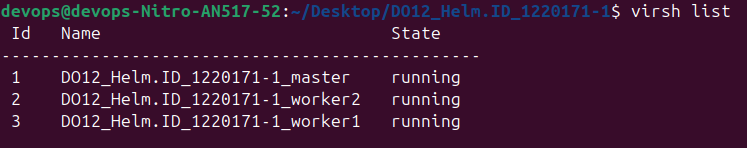<br>
*1 - Запущенные виртуальные машины*<br>

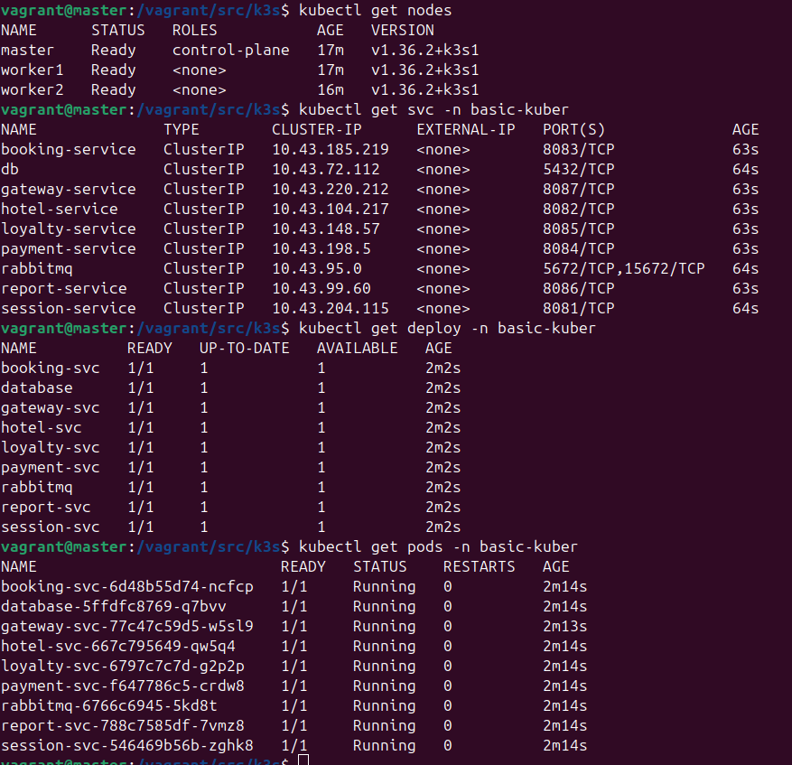<br>
*2 - Развернутый кластер: 3 ноды Ready, 9 Service, 9 Deployment, 9 подов Running*<br>

Корректность развёртывания подтверждена прогоном функциональных тестов.

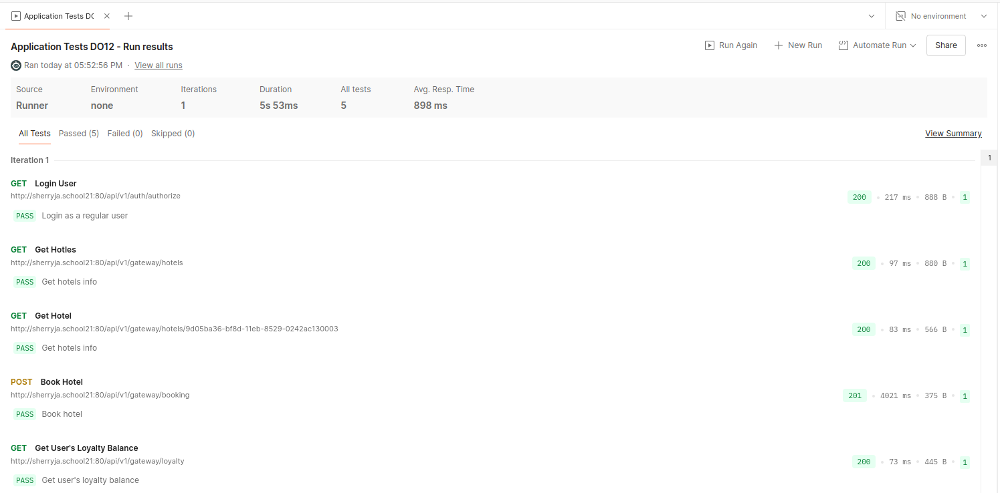<br>
*3 - Тесты Postman*<br>

### 3. Установка Kustomize

```
curl -s "https://raw.githubusercontent.com/kubernetes-sigs/kustomize/master/hack/install_kustomize.sh" | bash
sudo mv kustomize /usr/local/bin/
```

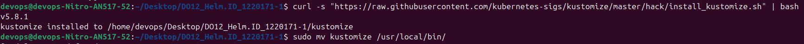<br>
*4 - Установленный kustomize v5.8.1*<br>

### 4. Структура проекта: base и overlays/production

В отличие от Helm с его `helm create`, у Kustomize **нет команды, создающей скелет проекта**. Единственная близкая по смыслу команда — `kustomize create --autodetect` — генерирует только один `kustomization.yaml` в текущей папке и заполняет в нём `resources:` по найденным рядом файлам, причём в алфавитном порядке; структуру `base/` + `overlays/production/` она не создаёт. Поэтому скелет заведён вручную: созданы каталоги, манифесты перенесены из `k3s/` (`services.yaml` - `base/service.yaml`, `deployments.yaml` - `base/deployment.yaml`, `configmap.yaml` - `overlays/production/configMap.yaml`, `secrets.yaml` - `overlays/production/secret.yaml`).

Порядок в `resources:` базового `kustomization.yaml` выставлен по зависимостям (namespace - PV - PVC - Service - Deployment - issuer - certificate - ingress), а не по алфавиту, как сделал бы автогенератор.

```
.
├── base/
│   ├── certificate.yaml
│   ├── deployment.yaml
│   ├── ingress.yaml
│   ├── issuer.yaml
│   ├── kustomization.yaml
│   ├── namespace.yaml
│   ├── pvc.yaml
│   ├── pv.yaml
│   └── service.yaml
├── kustomization.yaml
└── overlays/
    └── production/
        ├── configMap.yaml
        ├── replicas-patch.yaml
        └── secret.yaml
```

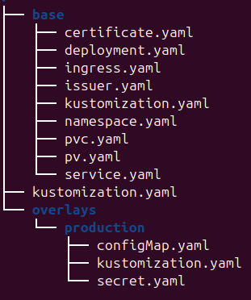<br>
*5 - Скелет проекта*<br>

### 5. Наполнение base и overlays/production

В `base/` лежат сервисы и развёртывания (плюс namespace, PV, PVC, issuer, certificate, ingress), в `overlays/production/` — конкретные ConfigMap и Secret, как того требует условие задания. Deployment'ы в `base` ссылаются на них по имени через `envFrom`, а Kustomize связывает объекты в одну сборку независимо от того, в каком слое они объявлены.

<details>
<summary><strong>Базовая конфигурация kustomization (<a href="./base/kustomization.yaml">base/kustomization.yaml</a>)</strong></summary>

```yaml
apiVersion: kustomize.config.k8s.io/v1beta1
kind: Kustomization

resources:
  - namespace.yaml
  - pv.yaml
  - pvc.yaml
  - service.yaml
  - deployment.yaml
  - issuer.yaml
  - certificate.yaml
  - ingress.yaml
```
</details>

<details>
<summary><strong>Оверлейная конфигурация kustomization (<a href="./overlays/production/kustomization.yaml">overlays/production/kustomization.yaml</a>)</strong></summary>

```yaml
apiVersion: kustomize.config.k8s.io/v1beta1
kind: Kustomization

resources:
  - ../../base
  - configMap.yaml
  - secret.yaml

patches:
  - path: replicas-patch.yaml
    target:
      kind: Deployment
      name: gateway-svc
```
</details>

<details>
<summary><strong>Содержимое <a href="./kustomization.yaml">kustomization.yaml</a> (точка входа верхнего уровня)</strong></summary>

```yaml
apiVersion: kustomize.config.k8s.io/v1beta1
kind: Kustomization

resources:
  - overlays/production
```
</details>

<details>
<summary><strong>Фрагмент <a href="./base/deployment.yaml">base/deployment.yaml</a> — database и session (остальные 7 сервисов аналогичны)</strong></summary>

```yaml
# db
apiVersion: apps/v1
kind: Deployment
metadata:
  name: database
  namespace: basic-kuber
spec:
  replicas: 1
  strategy:
    type: Recreate
  selector:
    matchLabels:
      svc: db
  template:
    metadata:
      labels:
        svc: db
    spec:
      nodeSelector:
        kubernetes.io/hostname: worker1
      containers:
      - name: postgres
        image: postgres:15.1-alpine
        ports:
        - containerPort: 5432
        volumeMounts: # Примонтировали виртуальный диск virtual-db-disk внутрь контейнера в папку /docker-entrypoint-initdb.d/
        - name: virtual-db-disk
          mountPath: /docker-entrypoint-initdb.d/
        - name: postgres-storage
          mountPath: /var/lib/postgresql/data
        envFrom:
        - secretRef:
            name: svc-secrets
      volumes: # Создали виртуальный диск на машине с названием virtual-db-disk и содержимым из конфигмапа database-script
      - name: virtual-db-disk
        configMap:
          name: database-script
      - name: postgres-storage
        persistentVolumeClaim:
          claimName: postgres-pvc

---

# session
apiVersion: apps/v1
kind: Deployment
metadata:
  name: session-svc
  namespace: basic-kuber
spec:
  replicas: 1
  # strategy:
  #   type: Recreate
  strategy:
    type: RollingUpdate
    rollingUpdate:
      maxUnavailable: 1
      maxSurge: 1
  selector:
    matchLabels:
      svc: session
  template:
    metadata:
      labels:
        svc: session
    spec:
      containers:
      - name: session-svc
        image: sherryja/session-service:3.0
        ports:
        - containerPort: 8081
        env:
        - name: POSTGRES_DB
          valueFrom:
            configMapKeyRef:
              name: environments
              key: POSTGRES_DB_SESSION
        envFrom:
        - configMapRef:
            name: environments
        - secretRef:
            name: svc-secrets
```

Полностью — [base/deployment.yaml](./base/deployment.yaml) (9 Deployment, 360 строк).
</details>

<details>
<summary><strong>Фрагмент <a href="./base/service.yaml">base/service.yaml</a> — db, rabbitmq и session (остальные 6 сервисов аналогичны)</strong></summary>

```yaml
# db
apiVersion: v1
kind: Service
metadata:
  name: db
  namespace: basic-kuber
spec:
  selector:
    svc: db
  ports:
  - protocol: TCP
    port: 5432
    targetPort: 5432

---

# rabbitmq
apiVersion: v1
kind: Service
metadata:
  name: rabbitmq
  namespace: basic-kuber
spec:
  selector:
    svc: rabbit
  ports:
  - name: data-exchange
    protocol: TCP
    port: 5672
    targetPort: 5672
  - name: web
    protocol: TCP
    port: 15672
    targetPort: 15672

---

# session
apiVersion: v1
kind: Service
metadata:
  name: session-service
  namespace: basic-kuber
spec:
  selector:
    svc: session
  ports:
  - protocol: TCP
    port: 8081
    targetPort: 8081
```

Полностью — [base/service.yaml](./base/service.yaml) (9 Service, 146 строк).
</details>

Два решения, которые стоит пояснить:

- **ConfigMap и Secret вынесены в `overlays/production`, а не в `base`** — прямо по условию задания («в base — сервисы и развертывания, в production — конкретные секреты и конфигурационные значения»).
- **Namespace прописан явно в каждом манифесте**, глобальный `namespace:`-трансформер Kustomize не используется. Иначе он проставил бы `metadata.namespace` в том числе на cluster-scoped ресурсы — `PersistentVolume` и `ClusterIssuer` из стороннего CRD `cert-manager.io/v1`.

### 6. Патч реплик gateway-svc через strategic merge

<details>
<summary><strong>Содержимое <a href="./overlays/production/replicas-patch.yaml">replicas-patch.yaml</a></strong></summary>

```yaml
apiVersion: apps/v1
kind: Deployment
metadata:
  name: gateway-svc
  namespace: basic-kuber
spec:
  replicas: 3
```
</details>

Патч подключён адресно — через `target: {kind: Deployment, name: gateway-svc}` в [kustomization.yaml](./overlays/production/kustomization.yaml) оверлея, поэтому он гарантированно применяется только к `gateway-svc` и не заденет остальные 8 Deployment'ов.

### 7. Сборка итогового манифеста

```bash
kustomize build overlays/production | grep -c '^kind:'
```

Сборка даёт **27 объектов**: 9 Deployment + 9 Service + 2 ConfigMap + Secret + Namespace + PV + PVC + ClusterIssuer + Certificate + Ingress. Сам результат в репозиторий не кладётся — он воспроизводится командой `kustomize build overlays/production`.

Затем применил всю структуру командой `kubectl apply -k .`:

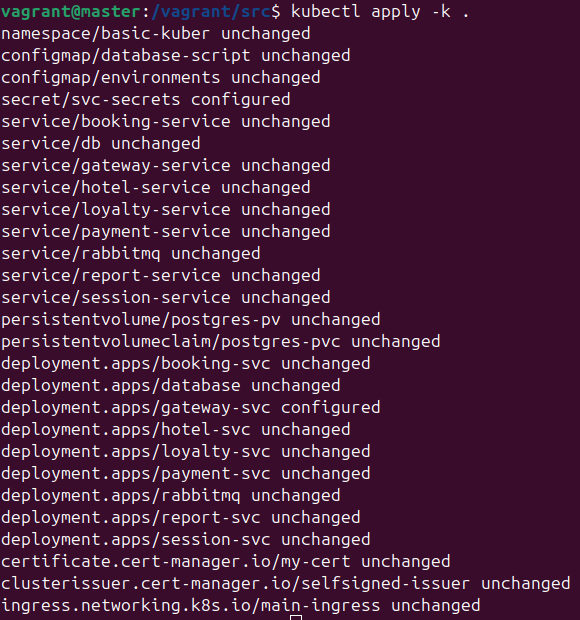<br>
*6 - Вывод команды kubectl apply -k .*<br>

В выводе видно ровно то, что и ожидалось: почти всё `unchanged` (так как Kustomize-сборка совпадает с оригинальными манифестами, которые уже применил `deploy-app.sh`), а единственное реальное изменение — **`deployment.apps/gateway-svc configured`**, то есть сработал [replicas-patch.yaml](./overlays/production/replicas-patch.yaml).

Строка `secret/svc-secrets configured` — не изменение: секрет объявлен через `stringData`, а это поле write-only (API-сервер кодирует его в `data` и отбрасывает), поэтому `kubectl` не видит его в живом объекте и печатает `configured` при каждом `apply`.

Проверка состояния кластера — `kubectl get all -n basic-kuber`:

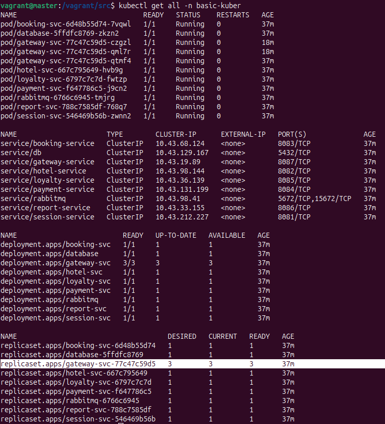<br>
*7 - Проверка состояния кластера: gateway-svc 3/3, три пода gateway*<br>

### 8. Функциональные тесты

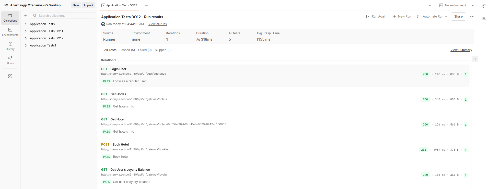<br>
*8 - Результаты тестов Postman*<br>

---

## Часть 2. Доставка через Helm

### 1. Стенд: три VM с кластером k3s
### 2. Исходные манифесты приложения
### 3. Установка Helm и подключение к кластеру

```
curl https://raw.githubusercontent.com/helm/helm/main/scripts/get-helm-3 | bash

helm version
```

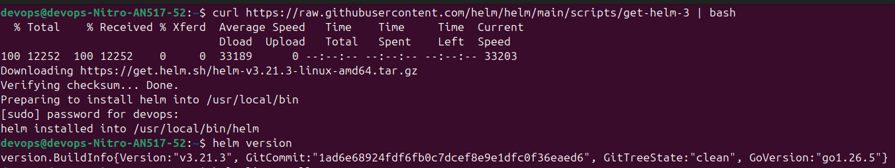<br>
*1 - Установленный helm v3.21.3*<br>

Отдельно пришлось разобраться с **kubeconfig** — это файл с адресом API-сервера, TLS-сертификатами и токеном доступа, без него `helm`/`kubectl` не знают, к какому кластеру подключаться. K3s создаёт его на мастере в `/home/vagrant/.kube/config`, но с адресом сервера `127.0.0.1` — он верен только внутри ВМ, с хоста так подключиться нельзя. Поэтому конфиг забирается по SSH в отдельный файл (общий `~/.kube/config` на хосте указывает на кластер другого проекта, перезаписывать его нельзя), и адрес правится на реальный IP мастера:

```bash
ssh -i .vagrant/machines/master/libvirt/private_key \
    -o StrictHostKeyChecking=no vagrant@192.168.33.10 \
    "cat /home/vagrant/.kube/config" > ~/.kube/do12-config
sed -i 's#127.0.0.1#192.168.33.10#' ~/.kube/do12-config

export KUBECONFIG=~/.kube/do12-config
```

Проверка подключения:

```
helm list --all-namespaces
```

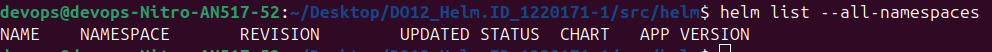<br>
*2 - Проверка подключения: пустая таблица релизов без ошибки cluster unreachable*<br>

Так как релизов еще не было, таблица ожидаемо пустая, но главное что не ошибка `cluster unreachable`.

### 4. Скелет чарта через helm create

В директории `helm/` выполнена команда `helm create myapp`.

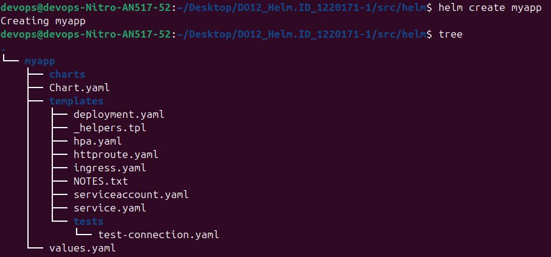<br>
*3 - Структура заготовки, созданной helm create*<br>

Заготовка `helm create` рассчитана на одно nginx-приложение, поэтому лишние шаблоны удалены: `ingress.yaml`, `hpa.yaml`, `httproute.yaml`, `serviceaccount.yaml` и `tests/test-connection.yaml`. Они ссылались на ключи `values.yaml` того самого nginx-плейсхолдера, для задачи не нужны (требуются только Deployment и Service) и после смены схемы `values.yaml` ломали бы `helm lint` и `helm template`. Из [_helpers.tpl](./helm/myapp/templates/_helpers.tpl) по той же причине убраны неиспользуемые хелперы `myapp.fullname` и `myapp.serviceAccountName`.

### 5. values.yaml и шаблоны Deployment/Service

Итоговая структура чарта:

```text
helm/myapp/
├── charts/                 # пусто, зависимостей нет
├── Chart.yaml
├── templates/
│   ├── deployment.yaml     # {{- range .Values.services }} — все 9 Deployment
│   ├── service.yaml        # {{- range .Values.services }} — все 9 Service
│   ├── _helpers.tpl
│   └── NOTES.txt
└── values.yaml
```

Главная идея: `values.yaml` хранит не сами манифесты, а **параметры** (образ, порты, реплики, strategy, env/envFrom, volumes, nodeSelector) для каждого из 9 workload'ов в виде карты `services:`; шаблоны читают эту карту через `{{- range $key, $svc := .Values.services }}` и генерируют из неё объекты Kubernetes. Данные и их представление разделены, и **один шаблон заменяет девять копий** — вместо 360 строк [base/deployment.yaml](./base/deployment.yaml) получилось 86 строк шаблона.

Ещё две особенности:

- **Namespace нигде не зашит в чарт** — везде `{{ .Release.Namespace }}`, значение приходит из флага `--namespace` при установке. Это осознанное отличие от `base/`, где `namespace: basic-kuber` прописан текстом: чарт должен ставиться в произвольный namespace, а Kustomize-набор привязан к конкретному.
- **Чарт описывает только Deployment и Service.** ConfigMap/Secret/PV/PVC/Ingress/Certificate/ClusterIssuer в чарт не переносились: они уже есть в кластере от базового деплоя, релиз ставится в тот же namespace и просто ими пользуется.

<details>
<summary><strong>Содержимое <a href="./helm/myapp/values.yaml">values.yaml</a></strong></summary>

```yaml
# Default values for myapp.
# Каждый ключ services.<name> описывает один Deployment+Service, перенесённые
# 1:1 из base/deployment.yaml и base/service.yaml 
services:
  database:
    deploymentName: database
    containerName: postgres
    serviceName: db
    labelValue: db
    image: postgres:15.1-alpine
    replicas: 1
    strategy: Recreate
    ports:
      - containerPort: 5432
    nodeSelector:
      kubernetes.io/hostname: worker1
    envFrom:
      secret: svc-secrets
    volumes:
      - name: virtual-db-disk
        mountPath: /docker-entrypoint-initdb.d/
        configMap: database-script
      - name: postgres-storage
        mountPath: /var/lib/postgresql/data
        pvc: postgres-pvc

  rabbitmq:
    deploymentName: rabbitmq
    serviceName: rabbitmq
    labelValue: rabbit
    image: rabbitmq:3-management-alpine
    replicas: 1
    strategy: RollingUpdate
    ports:
      - name: data-exchange
        containerPort: 5672
      - name: web
        containerPort: 15672
    env:
      - name: RABBITMQ_ALLOW_REMOTE_GUEST_ACCESS
        value: "true"

  session:
    deploymentName: session-svc
    serviceName: session-service
    labelValue: session
    image: sherryja/session-service:3.0
    replicas: 1
    strategy: RollingUpdate
    ports:
      - containerPort: 8081
    envFrom:
      configMap: environments
      secret: svc-secrets
    env:
      - name: POSTGRES_DB
        valueFrom:
          configMapKeyRef:
            name: environments
            key: POSTGRES_DB_SESSION

  hotel:
    deploymentName: hotel-svc
    serviceName: hotel-service
    labelValue: hotel
    image: sherryja/hotel-service:3.0
    replicas: 1
    strategy: RollingUpdate
    ports:
      - containerPort: 8082
    envFrom:
      configMap: environments
      secret: svc-secrets
    env:
      - name: POSTGRES_DB
        valueFrom:
          configMapKeyRef:
            name: environments
            key: POSTGRES_DB_HOTEL

  payment:
    deploymentName: payment-svc
    serviceName: payment-service
    labelValue: payment
    image: sherryja/payment-service:3.0
    replicas: 1
    strategy: RollingUpdate
    ports:
      - containerPort: 8084
    envFrom:
      configMap: environments
      secret: svc-secrets
    env:
      - name: POSTGRES_DB
        valueFrom:
          configMapKeyRef:
            name: environments
            key: POSTGRES_DB_PAYMENT

  report:
    deploymentName: report-svc
    serviceName: report-service
    labelValue: report
    image: sherryja/report-service:3.0
    replicas: 1
    strategy: RollingUpdate
    ports:
      - containerPort: 8086
    envFrom:
      configMap: environments
      secret: svc-secrets
    env:
      - name: POSTGRES_DB
        valueFrom:
          configMapKeyRef:
            name: environments
            key: POSTGRES_DB_REPORT

  loyalty:
    deploymentName: loyalty-svc
    serviceName: loyalty-service
    labelValue: loyalty
    image: sherryja/loyalty-service:3.0
    replicas: 1
    strategy: RollingUpdate
    ports:
      - containerPort: 8085
    envFrom:
      configMap: environments
      secret: svc-secrets
    env:
      - name: POSTGRES_DB
        valueFrom:
          configMapKeyRef:
            name: environments
            key: POSTGRES_DB_LOYALTY

  booking:
    deploymentName: booking-svc
    serviceName: booking-service
    labelValue: booking
    image: sherryja/booking-service:3.0
    replicas: 1
    strategy: RollingUpdate
    ports:
      - containerPort: 8083
    envFrom:
      configMap: environments
      secret: svc-secrets
    env:
      - name: POSTGRES_DB
        valueFrom:
          configMapKeyRef:
            name: environments
            key: POSTGRES_DB_BOOKING

  gateway:
    deploymentName: gateway-svc
    serviceName: gateway-service
    labelValue: gateway
    image: sherryja/gateway-service:3.0
    # Было 1, поднято до 5 через `helm upgrade` — задание 9 (см. REPORT.md §7.9).
    replicas: 5
    strategy: RollingUpdate
    ports:
      - containerPort: 8087
    envFrom:
      configMap: environments
```
</details>

<details>
<summary><strong>Содержимое <a href="./helm/myapp/templates/deployment.yaml">templates/deployment.yaml</a></strong></summary>

```yaml
{{- range $key, $svc := .Values.services }}
---
apiVersion: apps/v1
kind: Deployment
metadata:
  name: {{ $svc.deploymentName }}
  namespace: {{ $.Release.Namespace }}
  labels:
    svc: {{ $svc.labelValue }}
    {{- include "myapp.labels" $ | nindent 4 }}
spec:
  replicas: {{ $svc.replicas }}
  strategy:
    type: {{ $svc.strategy }}
    {{- if eq $svc.strategy "RollingUpdate" }}
    rollingUpdate:
      maxUnavailable: 1
      maxSurge: 1
    {{- end }}
  selector:
    matchLabels:
      svc: {{ $svc.labelValue }}
  template:
    metadata:
      labels:
        svc: {{ $svc.labelValue }}
    spec:
      {{- with $svc.nodeSelector }}
      nodeSelector:
        {{- toYaml . | nindent 8 }}
      {{- end }}
      containers:
        - name: {{ $svc.containerName | default $svc.deploymentName }}
          image: {{ $svc.image }}
          ports:
            {{- range $svc.ports }}
            - containerPort: {{ .containerPort }}
            {{- end }}
          {{- if $svc.env }}
          env:
            {{- range $svc.env }}
            - name: {{ .name }}
              {{- if .value }}
              value: {{ .value | quote }}
              {{- end }}
              {{- if .valueFrom }}
              valueFrom:
                configMapKeyRef:
                  name: {{ .valueFrom.configMapKeyRef.name }}
                  key: {{ .valueFrom.configMapKeyRef.key }}
              {{- end }}
            {{- end }}
          {{- end }}
          {{- with $svc.envFrom }}
          envFrom:
            {{- if .configMap }}
            - configMapRef:
                name: {{ .configMap }}
            {{- end }}
            {{- if .secret }}
            - secretRef:
                name: {{ .secret }}
            {{- end }}
          {{- end }}
          {{- if $svc.volumes }}
          volumeMounts:
            {{- range $svc.volumes }}
            - name: {{ .name }}
              mountPath: {{ .mountPath }}
            {{- end }}
          {{- end }}
      {{- if $svc.volumes }}
      volumes:
        {{- range $svc.volumes }}
        - name: {{ .name }}
          {{- if .configMap }}
          configMap:
            name: {{ .configMap }}
          {{- end }}
          {{- if .pvc }}
          persistentVolumeClaim:
            claimName: {{ .pvc }}
          {{- end }}
        {{- end }}
      {{- end }}
{{- end }}
```
</details>

<details>
<summary><strong>Содержимое <a href="./helm/myapp/templates/service.yaml">templates/service.yaml</a></strong></summary>

```yaml
{{- range $key, $svc := .Values.services }}
---
apiVersion: v1
kind: Service
metadata:
  name: {{ $svc.serviceName }}
  namespace: {{ $.Release.Namespace }}
  labels:
    svc: {{ $svc.labelValue }}
    {{- include "myapp.labels" $ | nindent 4 }}
spec:
  selector:
    svc: {{ $svc.labelValue }}
  ports:
    {{- range $svc.ports }}
    {{- if .name }}
    - name: {{ .name }}
      protocol: TCP
      port: {{ .containerPort }}
      targetPort: {{ .containerPort }}
    {{- else }}
    - protocol: TCP
      port: {{ .containerPort }}
      targetPort: {{ .containerPort }}
    {{- end }}
    {{- end }}
{{- end }}
```
</details>

<details>
<summary><strong>Содержимое <a href="./helm/myapp/templates/_helpers.tpl">templates/_helpers.tpl</a></strong></summary>

```yaml
{{/*
Expand the name of the chart.
*/}}
{{- define "myapp.name" -}}
{{- default .Chart.Name .Values.nameOverride | trunc 63 | trimSuffix "-" }}
{{- end }}

{{/*
Create chart name and version as used by the chart label.
*/}}
{{- define "myapp.chart" -}}
{{- printf "%s-%s" .Chart.Name .Chart.Version | replace "+" "_" | trunc 63 | trimSuffix "-" }}
{{- end }}

{{/*
Common labels
*/}}
{{- define "myapp.labels" -}}
helm.sh/chart: {{ include "myapp.chart" . }}
{{ include "myapp.selectorLabels" . }}
{{- if .Chart.AppVersion }}
app.kubernetes.io/version: {{ .Chart.AppVersion | quote }}
{{- end }}
app.kubernetes.io/managed-by: {{ .Release.Service }}
{{- end }}

{{/*
Selector labels
*/}}
{{- define "myapp.selectorLabels" -}}
app.kubernetes.io/name: {{ include "myapp.name" . }}
app.kubernetes.io/instance: {{ .Release.Name }}
{{- end }}
```
</details>

<details>
<summary><strong>Содержимое <a href="./helm/myapp/templates/NOTES.txt">templates/NOTES.txt</a></strong></summary>

```
Release "{{ .Release.Name }}" deployed into namespace "{{ .Release.Namespace }}".

Check rollout status:
  kubectl get deployments,pods,svc -n {{ .Release.Namespace }}

Workloads deployed by this chart:
{{- range $key, $svc := .Values.services }}
  - {{ $svc.deploymentName }} / {{ $svc.serviceName }}
{{- end }}
```
</details>

<details>
<summary><strong>Содержимое <a href="./helm/myapp/Chart.yaml">Chart.yaml</a></strong></summary>

```yaml
apiVersion: v2
name: myapp
description: Helm-чарт системы бронирования отелей School 21 (DO12_Helm.ID_1220171-1) — 7 Spring Boot микросервисов + PostgreSQL + RabbitMQ

type: application

version: 0.1.0

appVersion: "1.16.0"
```
</details>

Отдельно про поле `containerName` у `database`: имя контейнера по умолчанию берётся из `deploymentName`, но у Postgres в исходных манифестах контейнер называется `postgres`, а Deployment — `database`. Шаблон читает это поле как `{{ $svc.containerName | default $svc.deploymentName }}`, поэтому имя совпадает с исходным манифестом; для остальных 8 сервисов поле не нужно — там имя контейнера и так равно имени Deployment.

Проверка чарта до применения к кластеру:

```bash
helm lint helm/myapp                                            # 1 chart(s) linted, 0 chart(s) failed
helm template do12 helm/myapp -n basic-kuber | grep -c '^kind:' # 18
```

18 объектов — это 9 Deployment + 9 Service. Строка `[INFO] Chart.yaml: icon is recommended` в выводе `lint` не ошибка, иконка необязательна.

### 6. Упаковка чарта в .tgz

```bash
helm package helm/myapp -d helm/
```

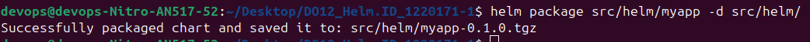<br>
*4 - Созданный .tgz архив с чартом*<br>

Имя архива складывается из `name` и `version` в [Chart.yaml](./helm/myapp/Chart.yaml) — `myapp` + `0.1.0`. Зависимостей у чарта нет: каталог `charts/` пуст, секция `dependencies:` в `Chart.yaml` не объявлена, поэтому «чарт и его зависимости» здесь сводятся к самому чарту:

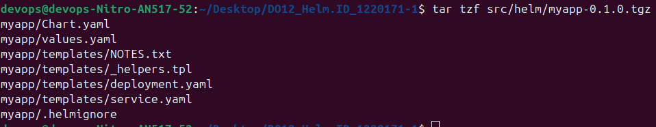<br>
*5 - Содержимое .tgz архива*<br>

### 7. Установка релиза: усыновление существующих объектов

Объекты `Deployment`/`Service` в namespace `basic-kuber` уже существуют — их создал [deploy-app.sh](./scripts/deploy-app.sh) командой `kubectl apply -f` ещё при `vagrant up`. У них нет Helm-метаданных владения, поэтому прямой `helm install` в этот namespace отклоняется с ошибкой `invalid ownership metadata` — Helm не забирает себе чужие объекты молча.

Передать их релизу можно двумя способами: удалить и поставить заново (короткий простой) либо **«усыновить»**. Выбран второй вариант — он не пересоздаёт объекты и обходится без простоя. Helm 3 считает объект своим, если на нём стоят label `app.kubernetes.io/managed-by=Helm` и аннотации `meta.helm.sh/release-name`/`meta.helm.sh/release-namespace`. Метки проставляются на все 18 объектов скриптом [scripts/helm-adopt.sh](./scripts/helm-adopt.sh):

```bash
./scripts/helm-adopt.sh
```

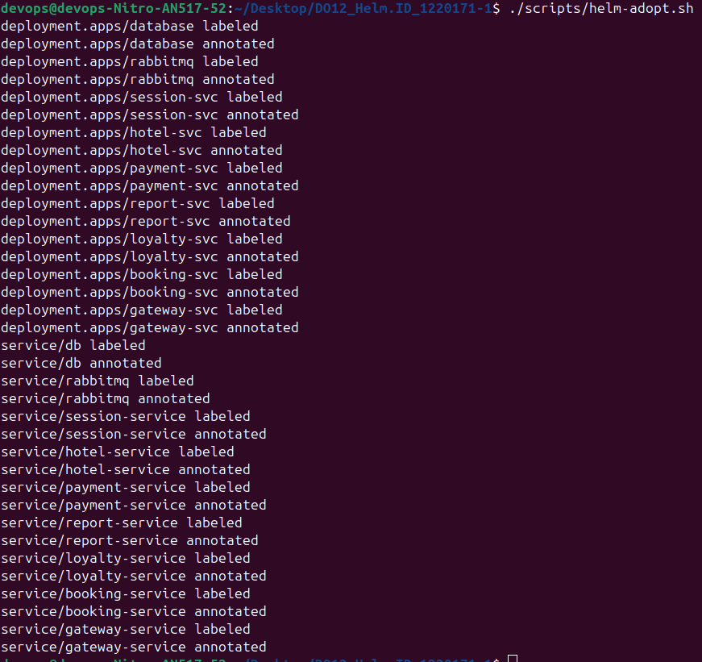<br>
*6 - Усыновление: 9 Deployment и 9 Service помечены как принадлежащие релизу do12*<br>

После этого установка проходит без ошибки владения. Релиз ставится **из архива `.tgz`**, собранного на предыдущем шаге:

```bash
helm install do12 helm/myapp-0.1.0.tgz --namespace basic-kuber
```

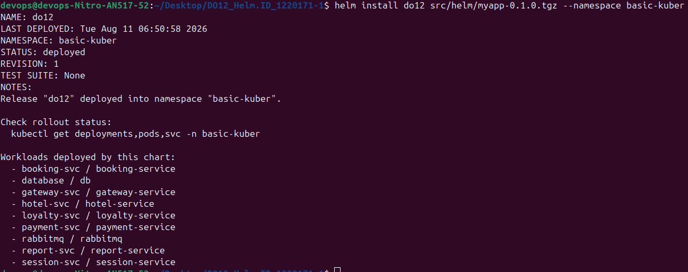<br>
*7 - helm install: STATUS deployed, REVISION 1*<br>

`do12` — имя релиза, `basic-kuber` — namespace; оба заданы флагами, а не зашиты в чарт, поэтому релиз можно поставить в любое окружение.

### 8. Проверка статуса релиза

```bash
kubectl get all -n basic-kuber
helm list -n basic-kuber
```

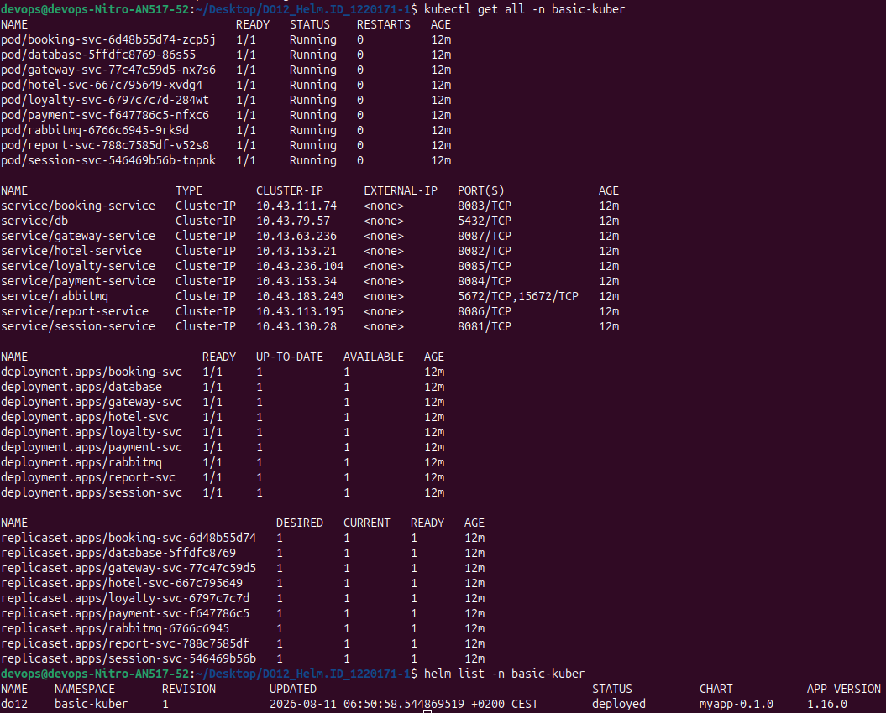<br>
*8 - kubectl get all + helm list: 9 подов Running, релиз do12 ревизии 1 в статусе deployed*<br>

Доказательство, что владелец действительно сменился:

```bash
kubectl get deploy,svc -n basic-kuber -o custom-columns=\
'KIND:.kind,NAME:.metadata.name,MANAGED-BY:.metadata.labels.app\.kubernetes\.io/managed-by,RELEASE:.metadata.annotations.meta\.helm\.sh/release-name'
```

```
KIND         NAME              MANAGED-BY   RELEASE
Deployment   booking-svc       Helm         do12
Deployment   database          Helm         do12
Deployment   gateway-svc       Helm         do12
Deployment   hotel-svc         Helm         do12
Deployment   loyalty-svc       Helm         do12
Deployment   payment-svc       Helm         do12
Deployment   rabbitmq          Helm         do12
Deployment   report-svc        Helm         do12
Deployment   session-svc       Helm         do12
Service      booking-service   Helm         do12
Service      db                Helm         do12
Service      gateway-service   Helm         do12
Service      hotel-service     Helm         do12
Service      loyalty-service   Helm         do12
Service      payment-service   Helm         do12
Service      rabbitmq          Helm         do12
Service      report-service    Helm         do12
Service      session-service   Helm         do12
```

У всех 18 объектов `MANAGED-BY=Helm` и `RELEASE=do12`. При этом ConfigMap, Secret, PVC и Certificate по `AGE` заметно старше самого релиза — они не пересоздавались, это всё те же объекты, что создал базовый деплой. В namespace появился только `secret/sh.helm.release.v1.do12.v1` — так Helm хранит состояние релиза, у Kustomize-деплоя аналога нет.

### 9. Изменение values.yaml и helm upgrade

Изменение выбрано по аналогии с частью 1: там [replicas-patch.yaml](./overlays/production/replicas-patch.yaml) поднимает `gateway-svc` с 1 до 3 реплик, здесь то же самое задаётся прямо в значениях чарта, но до **5**. Значение отличается и от исходного в чарте, и от заданного в Kustomize — так однозначно видно, что применилось именно изменение `values.yaml`.

В [helm/myapp/values.yaml](./helm/myapp/values.yaml), ключ `services.gateway`:

```diff
     image: sherryja/gateway-service:3.0
-    replicas: 1
+    replicas: 5
     strategy: RollingUpdate
```

```bash
helm upgrade do12 helm/myapp --namespace basic-kuber
helm history do12 -n basic-kuber
```

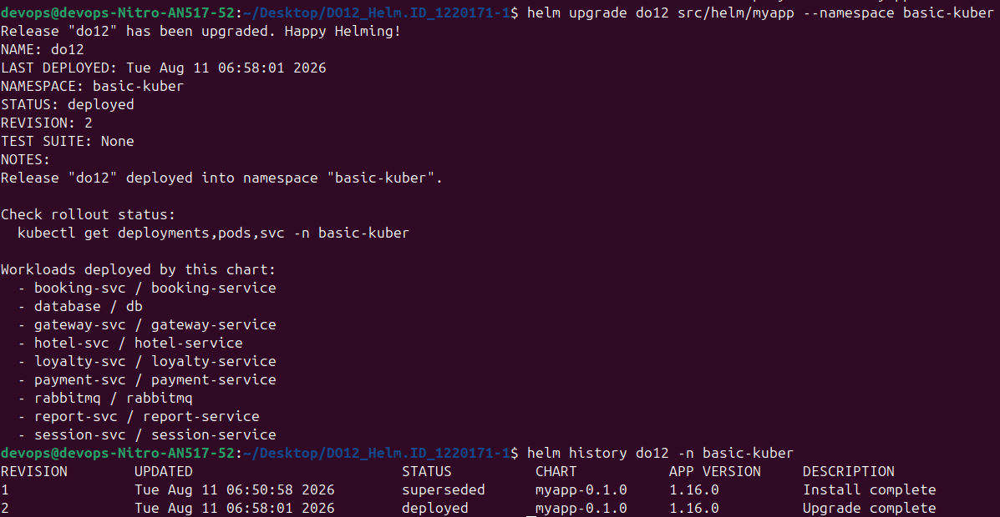<br>
*9 - helm upgrade: REVISION 2, в истории ревизия 1 помечена superseded*<br>

Helm хранит историю, а не просто перезаписывает состояние, — поэтому откат делается одной командой `helm rollback do12 1 -n basic-kuber`.

Результат применения изменения:

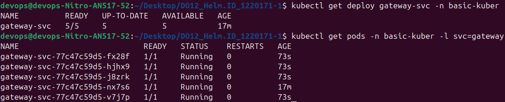<br>
*10 - gateway-svc масштабирован до 5 реплик, 5 подов Running*<br>

### 10. Функциональные тесты против Helm-релиза

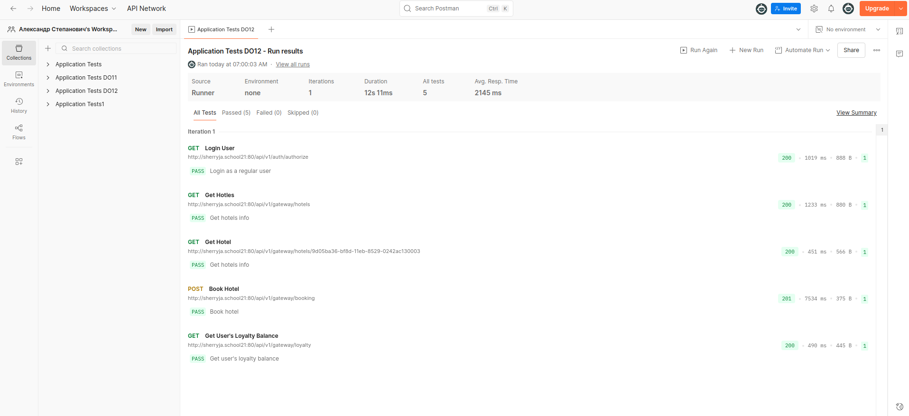<br>
*11 - Финальные тесты Postman против Helm-релиза*<br>