# Развёртывание собственного кластера k3s

Отчёт о выполнении проекта: сборка кластера Kubernetes из трёх виртуальных машин на дистрибутиве k3s, замена штатного Ingress-контроллера, выпуск wildcard-сертификата, перевод базы данных на постоянное хранилище и подключение Prometheus Operator.

---

## Стенд

| Узел | Роль | IP | Что размещено |
|---|---|---|---|
| `master` | k3s server | `192.168.56.10` | control plane, etcd |
| `worker1` | k3s agent | `192.168.56.11` | ingress-nginx |
| `worker2` | k3s agent | `192.168.56.12` | PostgreSQL, точка входа домена |

Виртуальные машины: Ubuntu 22.04 (`bento/ubuntu-22.04`), 3 ГБ памяти и 2 vCPU на каждую, провайдер VirtualBox, сеть `private_network`.

Приложение — система бронирования отелей из 7 микросервисов на Spring Boot, перенесённая из предыдущего проекта: `session`, `hotel`, `booking`, `payment`, `loyalty`, `report`, `gateway`, плюс PostgreSQL и RabbitMQ.

---

## 1. Виртуальные машины

Основа стенда — [Vagrantfile](./k3s/Vagrantfile) из предыдущего проекта: он поднимает три машины со статическими адресами и сразу запускает провижининг.

```ruby
config.vm.define "master" do |master|
  master.vm.hostname = "master"
  master.vm.network "private_network", ip: "192.168.56.10"
  master.vm.provision "shell", path: "scripts/install_k3s_master.sh"
end
```

Каждая машина получает свой скрипт установки, поэтому кластер собирается одной командой `vagrant up` и пересобирается после `vagrant destroy` без ручных шагов.

---

## 2. Установка k3s без Traefik

k3s поставляется с Traefik в качестве Ingress-контроллера по умолчанию. По условию задачи он отключается флагом `--disable traefik`, а вместо него ставится NGINX.

Установка мастера — [install_k3s_master.sh](./k3s/scripts/install_k3s_master.sh):

```bash
curl -sfL https://get.k3s.io | \
INSTALL_K3S_EXEC="server \
  --node-ip=192.168.56.10 \
  --advertise-address=192.168.56.10 \
  --cluster-cidr=10.42.0.0/16 \
  --service-cidr=10.43.0.0/16 \
  --disable traefik \
  --flannel-iface=eth1 \
  --write-kubeconfig-mode=644" \
sh -
```

Разбор флагов:

* `--cluster-cidr` и `--service-cidr` задают диапазоны адресов для подов и для ClusterIP-сервисов.
* `--flannel-iface=eth1` — **ключевой флаг для стенда на Vagrant**. У виртуальной машины два интерфейса: `eth0` — NAT для выхода в интернет, одинаковый у всех трёх машин, и `eth1` — private network со статическим адресом. Без явного указания Flannel выбирает интерфейс сам и может взять `eth0`, после чего overlay-сеть между узлами не работает: поды на разных нодах не видят друг друга, хотя `kubectl get nodes` показывает кластер здоровым.
* `--write-kubeconfig-mode=644` открывает `/etc/rancher/k3s/k3s.yaml` на чтение обычному пользователю, иначе каждая команда `kubectl` требует `sudo`.

Различие между двумя сущностями, которые легко перепутать:

* **Ingress** — объект кластера, описание правил маршрутизации: какой хост и какой путь ведут на какой сервис.
* **Ingress Controller** — под, который эти правила читает и реально обрабатывает трафик. Правила без контроллера не действуют, контроллер без правил бесполезен.

---

## 3. Подключение узлов к кластеру

Агент подключается к серверу по адресу мастера и токену узла. Токен генерируется при установке сервера и лежит на мастере в `/var/lib/rancher/k3s/server/node-token`.

Передача токена между машинами решена через общий каталог Vagrant. Мастер после установки записывает токен в `/vagrant/token`:

```bash
TOKEN=$(sudo cat /var/lib/rancher/k3s/server/node-token)
echo $TOKEN > /vagrant/token
```

Воркеры — [install_k3s_worker1.sh](./k3s/scripts/install_k3s_worker1.sh) и [install_k3s_worker2.sh](./k3s/scripts/install_k3s_worker2.sh) — ждут появления файла, а не стартуют сразу:

```bash
echo "Ждем токен...."
while [ ! -f /vagrant/token ]; do
  sleep 5
done

NODE_TOKEN=$(cat /vagrant/token)

curl -sfL https://get.k3s.io | \
K3S_URL="https://${MASTER_IP}:6443" \
K3S_TOKEN="${NODE_TOKEN}" \
INSTALL_K3S_EXEC="agent \
  --node-ip=${WORKER_IP} \
  --flannel-iface=eth1" \
sh -
```

Цикл ожидания нужен потому, что Vagrant поднимает машины последовательно, но провижининг воркера может начаться раньше, чем мастер допишет токен. Без ожидания воркер падал бы на первом же запуске, и кластер приходилось бы досоздавать вручную через `vagrant provision`.

Файл `/vagrant/token` — рабочий артефакт стенда, он создаётся при каждом развёртывании заново и **в репозиторий не выкладывается**: это действующий ключ подключения узла к кластеру.

---

## 4. Ingress Controller NGINX

Применяется официальный манифест проекта ingress-nginx:

```bash
kubectl apply -f https://raw.githubusercontent.com/kubernetes/ingress-nginx/controller-v1.10.1/deploy/static/provider/cloud/deploy.yaml
kubectl get pod -n ingress-nginx
kubectl get svc -n ingress-nginx
kubectl get nodes -o wide
```

Контроллер разворачивается на `worker1`, сервис получает тип NodePort:

* HTTP → `NodeIP:30364`
* HTTPS → `NodeIP:32675`

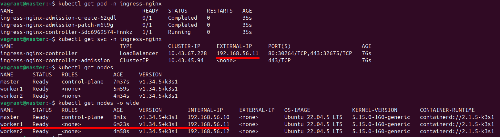

---

## 5. Домен и wildcard-сертификат

Публичного IP у стенда нет — машины живут в private network VirtualBox. Поэтому вместо реального доменного имени используется `nip.io`: сервис wildcard-DNS, который резолвит имя вида `<что-угодно>.<IP>.nip.io` в тот самый IP, зашитый в имени. Регистрация домена и настройка DNS-записей не требуются.

Точка входа стенда — `192.168.56.12`, отсюда домен `api.192.168.56.12.nip.io` и wildcard-сертификат на `*.192.168.56.12.nip.io`.

Выпуск сертификата берёт на себя **cert-manager** — контроллер, который следит за объектами `Certificate` и сам создаёт и обновляет TLS-секреты. Публичного домена нет, значит Let's Encrypt проверку пройти не сможет, и сертификат выпускается **self-signed**: браузер такому не доверяет, но шифрование канала и вся механика выпуска работают штатно.

Установка:

```bash
kubectl create namespace cert-manager
kubectl apply -f https://github.com/cert-manager/cert-manager/releases/latest/download/cert-manager.yaml
```

[issuer.yml](./k3s/issuer.yml) объявляет самоподписывающий выпускающий центр. Выбран `ClusterIssuer`, а не `Issuer`: первый действует во всём кластере, второй ограничен одним namespace.

```yaml
apiVersion: cert-manager.io/v1
kind: ClusterIssuer
metadata:
  name: selfsigned-issuer
spec:
  selfSigned: {}
```

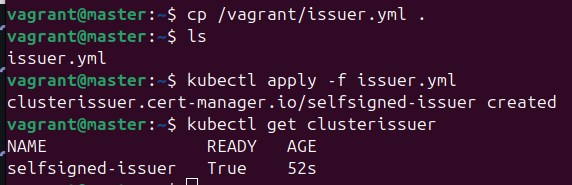

[certificate.yml](./k3s/certificate.yml) описывает сам сертификат и имя секрета, куда cert-manager положит результат:

```yaml
spec:
  secretName: wildcard-tls
  issuerRef:
    name: selfsigned-issuer
    kind: ClusterIssuer
  commonName: "*.192.168.56.12.nip.io"
  dnsNames:
  - "*.192.168.56.12.nip.io"
```

После применения объект `Certificate` переходит в `READY: True`, а в кластере появляется секрет `wildcard-tls` типа `kubernetes.io/tls` с тремя ключами — сертификат, приватный ключ и CA.

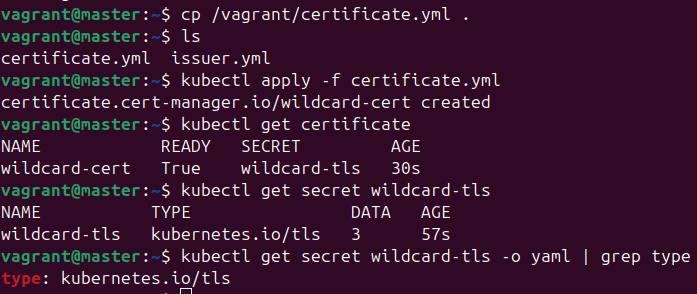

---

## 6. Ingress для домена

[ingress.yml](./k3s/ingress.yml) описывает маршрутизацию и подключает выпущенный сертификат. Маршруты разделены по двум сервисам — так же, как их вызывают функциональные тесты: авторизация идёт напрямую в `session-service`, остальное — через `gateway-service`.

```yaml
spec:
  ingressClassName: nginx
  tls:
  - hosts:
    - api.192.168.56.12.nip.io
    secretName: wildcard-tls
  rules:
  - host: api.192.168.56.12.nip.io
    http:
      paths:
      - path: /api/v1/auth
        backend:
          service: { name: session-service, port: { number: 8081 } }
      - path: /api/v1/gateway
        backend:
          service: { name: gateway-service, port: { number: 8087 } }
```

Аннотация `nginx.ingress.kubernetes.io/ssl-redirect: "true"` переводит обращения по HTTP на HTTPS.

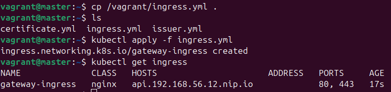

Проверка из консоли:

```bash
curl http://api.192.168.56.12.nip.io/api/v1/gateway/hotels
```

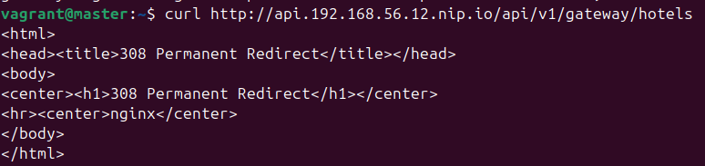

И тот же адрес в браузере:

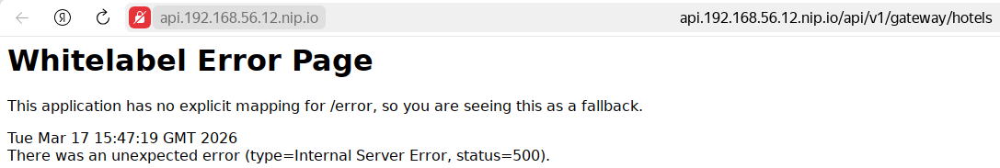

---

## 7. PersistentVolume для PostgreSQL

В предыдущем проекте база хранила данные в `emptyDir` — томе, который живёт ровно столько, сколько под. Пересоздание пода означало потерю всех баз. Здесь том заменяется на постоянный.

[postgres-pv.yml](./k3s/postgres-pv.yml) — том типа `hostPath`, то есть каталог на диске конкретного узла:

```yaml
spec:
  capacity:
    storage: 5Gi
  accessModes:
    - ReadWriteOnce
  persistentVolumeReclaimPolicy: Retain
  storageClassName: manual
  hostPath:
    path: /data/postgres
  nodeAffinity:
    required:
      nodeSelectorTerms:
        - matchExpressions:
            - key: kubernetes.io/hostname
              operator: In
              values:
                - worker2
```

Блок `nodeAffinity` здесь не украшение, а обязательное условие. `hostPath` — это каталог на диске одной машины, и данные в нём никуда не переезжают. Если планировщик запустит под PostgreSQL на другом узле, том окажется недоступен либо, что хуже, подхватится пустой каталог с того же путём — и база молча стартует с нуля. Привязка тома к `worker2` и `nodeSelector` в самом Deployment закрепляют базу за одним узлом.

Значение `persistentVolumeReclaimPolicy: Retain` означает, что при удалении PVC том не очищается: данные остаются на диске и переживают даже удаление заявки.

`storageClassName: manual` в PV и PVC совпадают намеренно — это отключает динамическое провижининг и связывает заявку именно с этим томом, а не с автоматически созданным.

Подготовка каталога на узле и применение манифестов:

```bash
sudo mkdir -p /data/postgres
sudo chmod 777 /data/postgres

kubectl apply -f postgres-pv.yml
kubectl apply -f postgres-pvc.yml
```

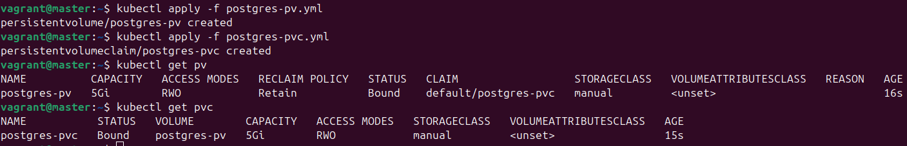

В [postgres.yml](./k3s/my-app/postgres.yml) том переключается с временного на постоянный:

```yaml
# было
- name: postgres-data
  emptyDir: {}

# стало
- name: postgres-data
  persistentVolumeClaim:
    claimName: postgres-pvc
```

### Проверка сохранности данных

Проверка проводится так: в базе создаётся тестовая БД, под удаляется, и после автоматического пересоздания список баз проверяется заново.

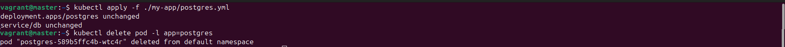
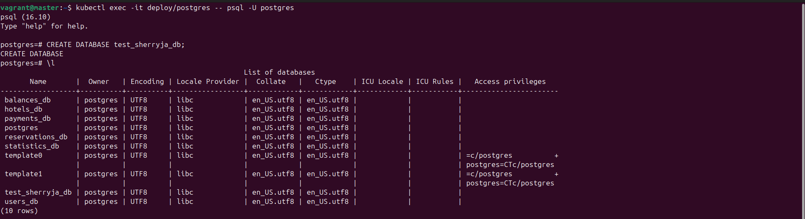
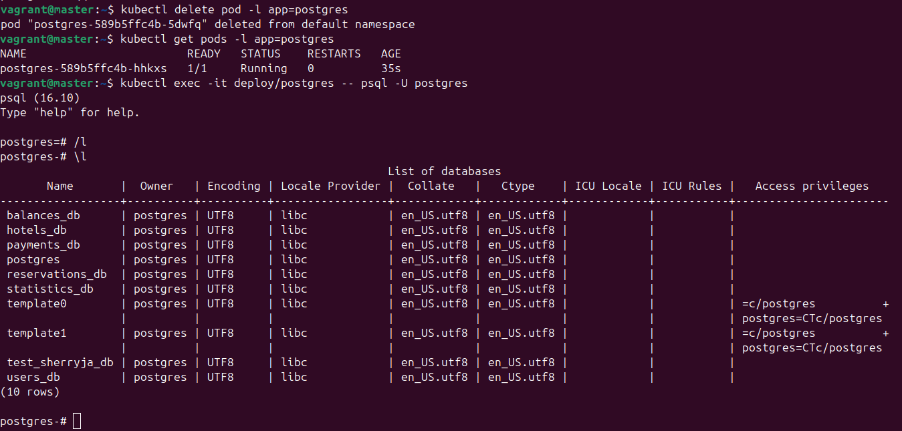

После `kubectl delete pod -l app=postgres` кластер поднимает новый под, и `\l` показывает все шесть рабочих баз плюс созданную вручную `test_sherryja_db`. Данные пережили пересоздание — том работает.

---

## 8. Запуск приложения

Манифесты приложения перенесены из предыдущего проекта и лежат в [k3s/my-app](./k3s/my-app): ConfigMap с адресами и портами сервисов, Secret с учётными данными, PostgreSQL с init-скриптом на 6 баз, RabbitMQ и семь микросервисов, каждый со своим Deployment и Service.

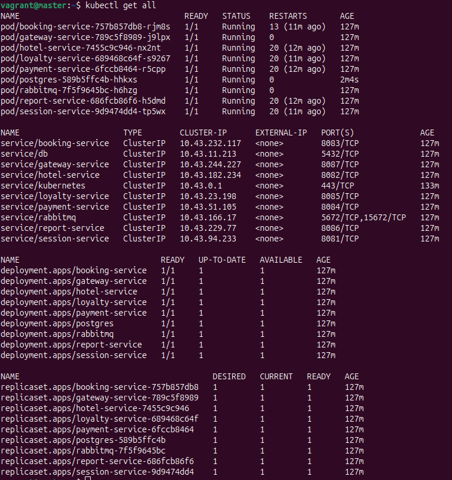
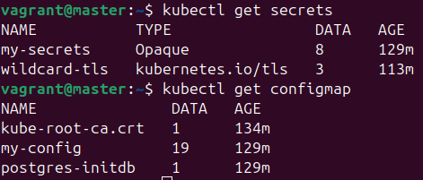

---

## 9. Функциональные тесты

Перед прогоном потребовалась правка [configmap.yml](./k3s/my-app/configmap.yml) — и это прямое следствие седьмого пункта.

Пока база жила в `emptyDir`, она поднималась пустой при каждом рестарте, init-скрипт заново создавал шесть баз, а Hibernate с настройкой `create` заново создавал таблицы. С постоянным томом init-скрипт при перезапуске уже не отрабатывает — каталог данных не пуст, — и Hibernate в режиме `create` затирал бы существующие таблицы при каждом старте сервиса.

Решение — сменить режим на `update`:

```yaml
SPRING_JPA_HIBERNATE_DDL_AUTO: update
```

В этом режиме Hibernate достраивает недостающие таблицы и колонки, не трогая существующие данные. Это единственный режим, совместимый с постоянным хранилищем.

Изменения ConfigMap не подхватываются работающими подами автоматически — переменные окружения читаются один раз при старте контейнера. Поэтому Deployment'ы пересоздаются:

```bash
kubectl delete deployment <name>
kubectl apply -f <name>.yml
```

В коллекции Postman переменная `API_HOST` меняется на `api.192.168.56.12.nip.io`, а `USERS_PORT` и `GATEWAY_PORT` очищаются: порты теперь не нужны, весь трафик идёт через Ingress на стандартный порт.

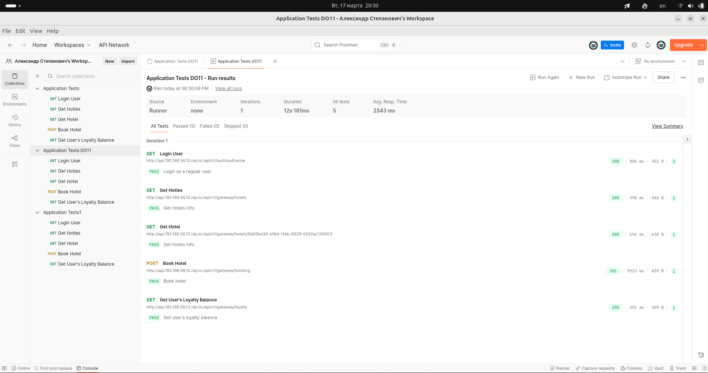

Прогон: 5 запросов, 5 успешных, 0 упавших, общее время 12 секунд.

---

## 10. Prometheus Operator

Мониторинг ставится Helm-чартом `kube-prometheus-stack` — он разворачивает сразу Prometheus Operator, Prometheus, Alertmanager, Grafana, node-exporter и kube-state-metrics.

Установка Helm на мастер:

```bash
curl https://raw.githubusercontent.com/helm/helm/main/scripts/get-helm-3 | bash
```

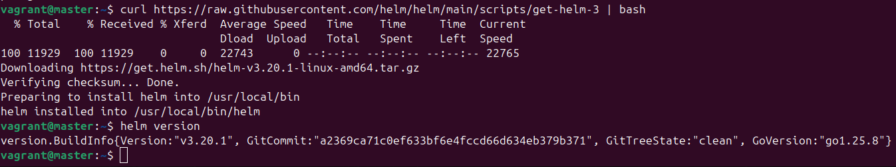

Подключение репозитория чартов:

```bash
helm repo add prometheus-community https://prometheus-community.github.io/helm-charts
helm repo update
```

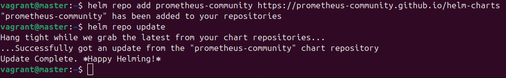

Отдельный namespace для стека:

```bash
kubectl create namespace monitoring
```

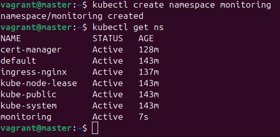

Перед установкой Helm нужно указать, с каким кластером работать. В k3s kubeconfig лежит не в `~/.kube/config`, а в `/etc/rancher/k3s/k3s.yaml`, поэтому без явного `KUBECONFIG` Helm не находит кластер:

```bash
export KUBECONFIG=/etc/rancher/k3s/k3s.yaml
helm install prometheus prometheus-community/kube-prometheus-stack --namespace monitoring
kubectl get pods -n monitoring
```

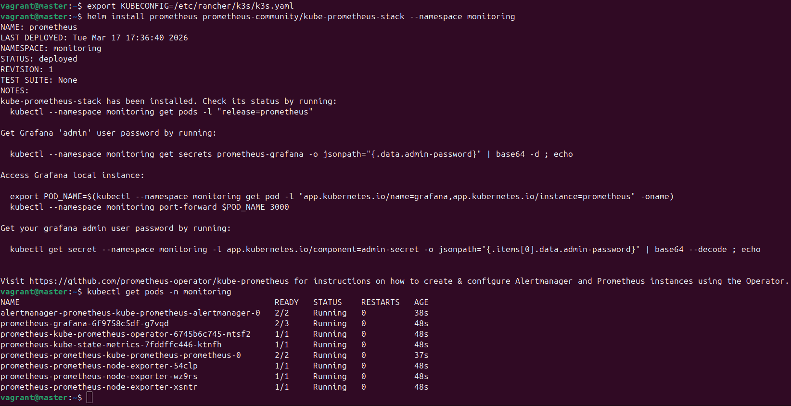

В namespace `monitoring` поднимаются 8 подов: Alertmanager, Grafana, оператор, kube-state-metrics, сам Prometheus и три node-exporter — по одному на каждый узел кластера.

---

## Итоги

Кластер k3s из трёх узлов собирается одной командой и работает: штатный Traefik заменён на ingress-nginx, приложение доступно по доменному имени с TLS, база данных переведена на постоянный том и переживает пересоздание пода, функциональные тесты проходят полностью, метрики собираются Prometheus Operator.

> Секреты в манифестах — учебные заглушки для локального стенда (`postgres/postgres`, `guest/guest`), взятые из поставки учебного приложения. Это не пример работы с секретами в рабочем проекте.
