# Развёртывание приложения в Kubernetes

Отчёт о выполнении проекта: работа с готовым манифестом в minikube, написание собственного набора манифестов для приложения из 7 микросервисов и сравнение двух стратегий переразвёртывания.

---

## Стенд

Локальный кластер поднимается в **minikube** с 4 ГБ памяти, гипервизор — Docker. Приложение то же, что и в остальных проектах серии: система бронирования отелей из 7 микросервисов на Spring Boot плюс PostgreSQL и RabbitMQ.

| Сервис | Порт | База |
|---|---|---|
| session-service | 8081 | users_db |
| hotel-service | 8082 | hotels_db |
| booking-service | 8083 | reservations_db |
| payment-service | 8084 | payments_db |
| loyalty-service | 8085 | balances_db |
| report-service | 8086 | statistics_db |
| gateway-service | 8087 | — |

---

# Часть 1. Готовый манифест

## 1.1. Запуск окружения

minikube и kubectl ставятся по инструкциям с официальных сайтов. Кластер запускается с явным ограничением памяти:

```bash
minikube start --memory=4096
```

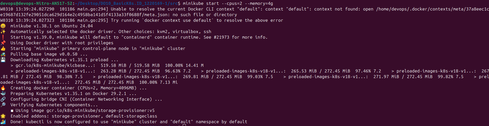

## 1.2. Применение готового манифеста

К поднятому кластеру применяется учебный манифест — четыре сервиса: apache, catalog, customer и order.

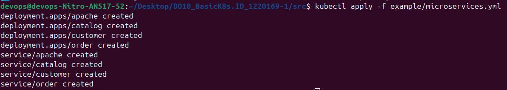

## 1.3. Панель управления

```bash
minikube dashboard
```

Команда поднимает веб-интерфейс и сама открывает его в браузере.

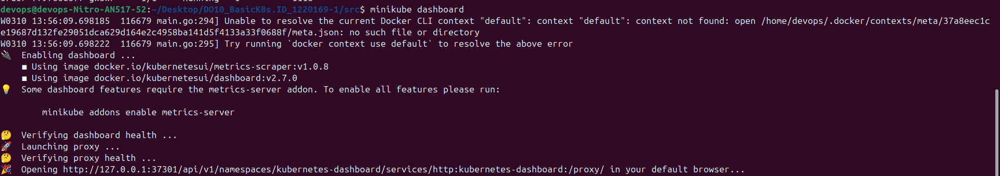
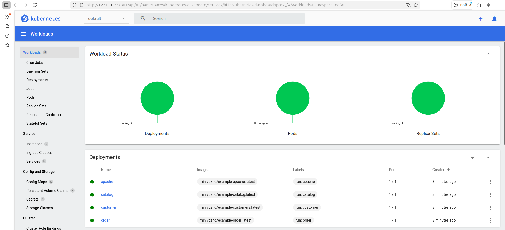

## 1.4. Туннели к сервисам

Поды кластера живут в собственной сети и снаружи недоступны. `minikube service` пробрасывает туннель до NodePort сервиса и выдаёт адрес, по которому он открывается с хоста.

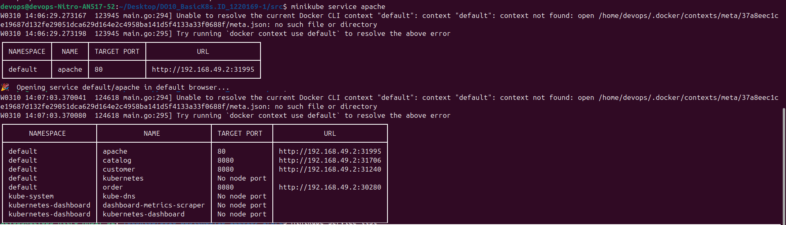

Список сервисов с назначенными портами:

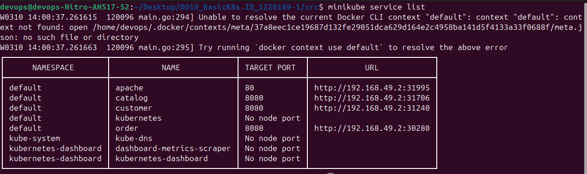

## Проверка работоспособности

Сервис apache получил порт 31995. Вывод `kubectl get services` сопоставлен с тем, что отдаёт браузер по адресу `http://192.168.49.2:31995/`, где `192.168.49.2` — адрес узла minikube.

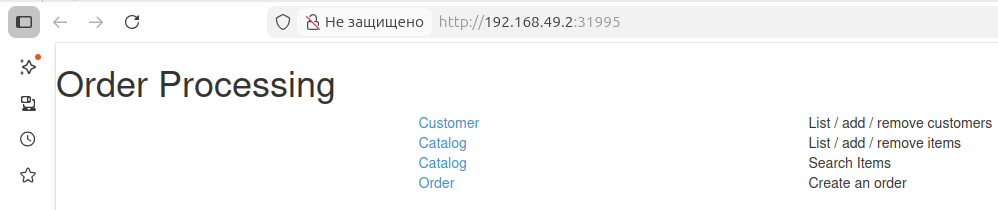
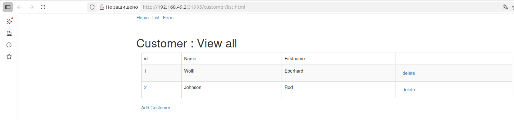
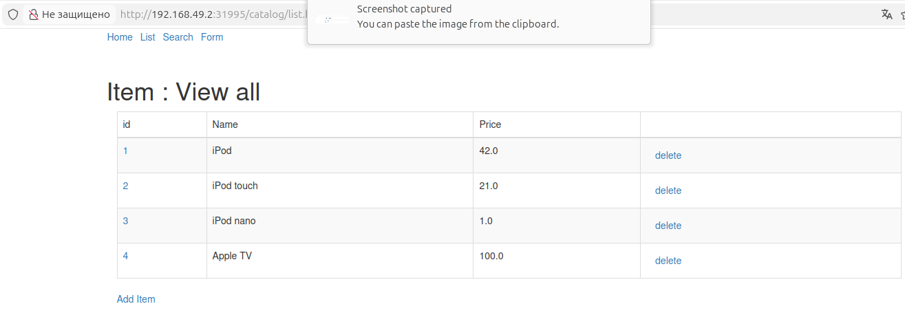
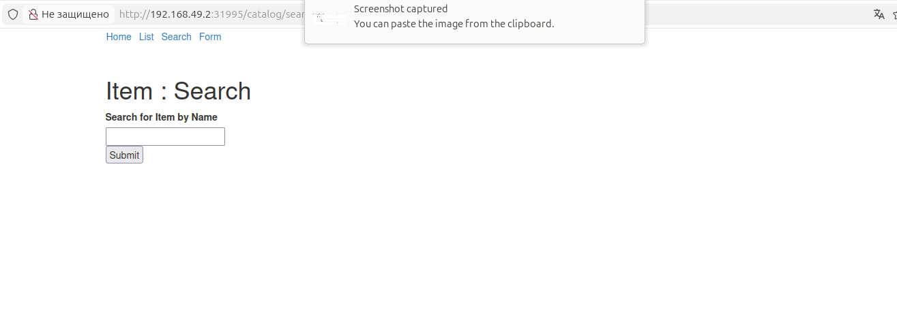
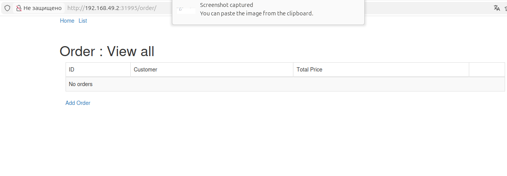

Остановка кластера после первой части:

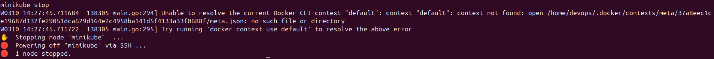

---

# Часть 2. Собственный манифест

## 2.1. Написание манифестов

Кластер запускается заново, теперь с явным указанием драйвера:

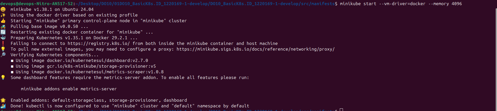

Приложение описано пятью манифестами. Разбиение по файлам сделано не по типу объекта, а **по порядку применения**: цифры в начале имён задают последовательность, в которой `kubectl apply -f ./manifests/` их обходит.

| Файл | Что описывает |
|---|---|
| [01-namespace.yaml](./manifests/01-namespace.yaml) | Namespace `basic-kuber` |
| [02-configmap.yaml](./manifests/02-configmap.yaml) | карта конфигурации и init-скрипт базы |
| [03-secrets.yaml](./manifests/03-secrets.yaml) | учётные данные БД, брокера и ключи авторизации |
| [04-services.yaml](./manifests/04-services.yaml) | 9 Service |
| [05-deployments.yaml](./manifests/05-deployments.yaml) | 9 Deployment |

Порядок здесь принципиален: namespace должен существовать раньше объектов внутри него, а ConfigMap и Secret — раньше подов, которые на них ссылаются. Иначе поды поднимутся в состоянии `CreateContainerConfigError`.

### Карта конфигурации

В `environments` собраны адреса и порты, по которым микросервисы находят друг друга. Имена хостов совпадают с именами Service — их резолвит внутренний DNS кластера.

```yaml
SESSION_SERVICE_HOST: "session-service"
SESSION_SERVICE_PORT: "8081"
...
POSTGRES_HOST: "db"
POSTGRES_DB_SESSION: "users_db"
POSTGRES_DB_HOTEL: "hotels_db"
```

Общего ключа `POSTGRES_DB` нет намеренно: база у каждого сервиса своя, и нужный ключ каждый Deployment подставляет себе сам через `configMapKeyRef`.

Второй ConfigMap, `database-script`, содержит SQL создания шести баз. Он монтируется в контейнер PostgreSQL как `/docker-entrypoint-initdb.d/` и выполняется при первом старте.

### Секреты

```yaml
stringData:
  POSTGRES_USER: "postgres"
  POSTGRES_PASSWORD: "postgres"
  RABBIT_MQ_USER: "guest"
  RABBIT_MQ_PASSWORD: "guest"
  privateKey: "<приватный ключ: base64 от DER>"
  publicKey: "<публичный ключ: base64 от DER>"
```

`stringData` вместо `data` избавляет от ручного кодирования в base64 — Kubernetes делает это сам, а в манифесте значения остаются читаемыми.

### Service

Девять Service связываются с подами по метке `svc: <имя>`. Тип `NodePort` стоит только у `session-service` и `gateway-service` — только к ним нужен доступ снаружи, для функциональных тестов. Остальные семь остаются `ClusterIP` и наружу не публикуются.

### Deployment

Реплика у всех одна — требование задания. Микросервисы получают переменные окружения целиком через `envFrom`, а поверх каждый доопределяет свою базу:

```yaml
env:
- name: POSTGRES_DB
  valueFrom:
    configMapKeyRef:
      name: environments
      key: POSTGRES_DB_SESSION
envFrom:
- configMapRef:
    name: environments
- secretRef:
    name: svc-secrets
```

`gateway-svc` — единственный без `POSTGRES_DB` и без `secretRef`: собственной базы у него нет, он только маршрутизирует запросы.

## 2.2. Запуск приложения

```bash
kubectl apply -f ./manifests/
```

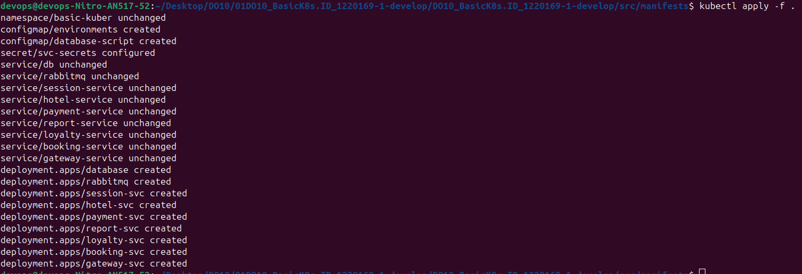

## 2.3. Проверка состояния объектов

Состояние проверяется парой команд `kubectl get <тип> <имя>` и `kubectl describe <тип> <имя>` по каждому виду объектов.

<details>
<summary><strong>Secrets</strong></summary>

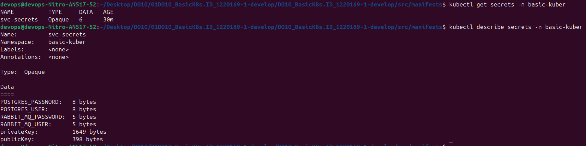

</details>

<details>
<summary><strong>ConfigMaps</strong></summary>

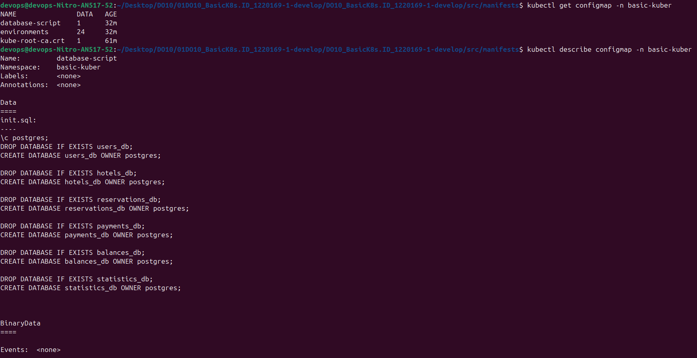


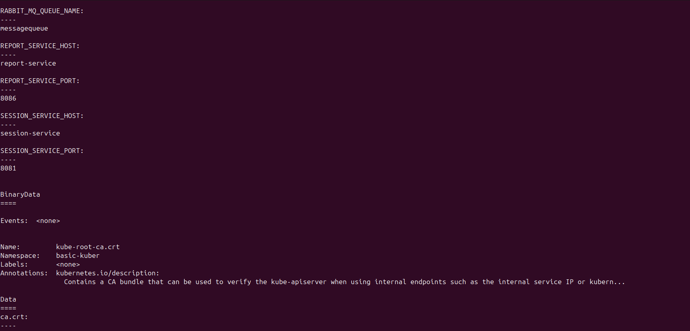


</details>

<details>
<summary><strong>Pods</strong></summary>

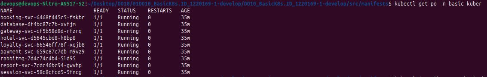
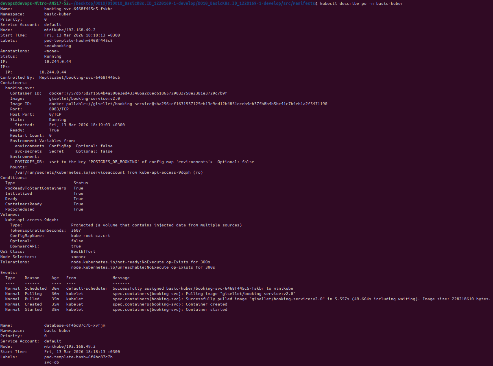

</details>

<details>
<summary><strong>Deployments</strong></summary>

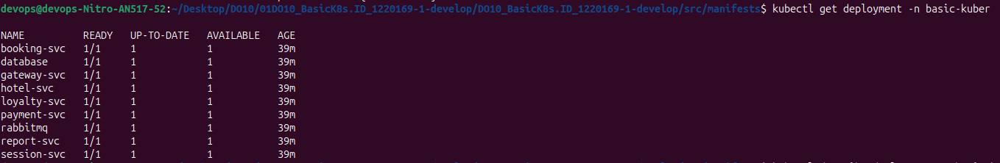
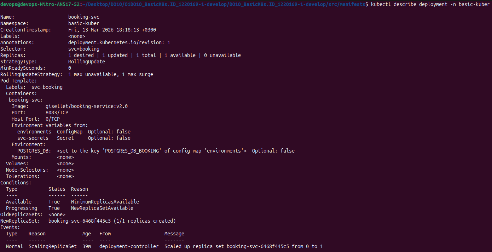

</details>

<details>
<summary><strong>Services</strong></summary>

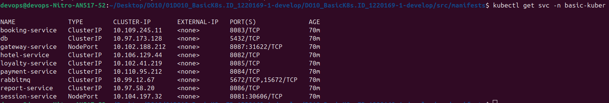
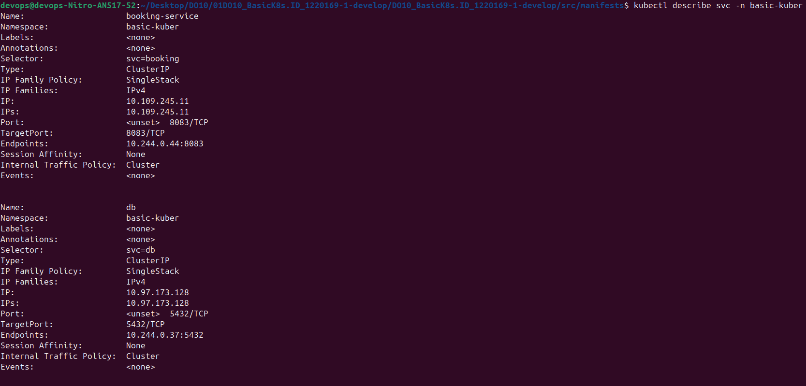

</details>

## 2.4. Проверка значений секретов

Kubernetes хранит значения Secret в base64, поэтому для проверки их нужно декодировать обратно:

```bash
kubectl get secret svc-secrets -n basic-kuber -o jsonpath='{.data.POSTGRES_USER}' | base64 --decode; echo
kubectl get secret svc-secrets -n basic-kuber -o jsonpath='{.data.POSTGRES_PASSWORD}' | base64 --decode; echo
kubectl get secret svc-secrets -n basic-kuber -o jsonpath='{.data.RABBIT_MQ_USER}' | base64 --decode; echo
kubectl get secret svc-secrets -n basic-kuber -o jsonpath='{.data.RABBIT_MQ_PASSWORD}' | base64 --decode; echo
kubectl get secret svc-secrets -n basic-kuber -o jsonpath='{.data.privateKey}' | base64 --decode; echo
kubectl get secret svc-secrets -n basic-kuber -o jsonpath='{.data.publicKey}' | base64 --decode; echo
```

`base64 --decode` не добавляет перевод строки в конце, из-за чего вывод склеивается со следующим приглашением командной строки. Завершающий `echo` решает это.

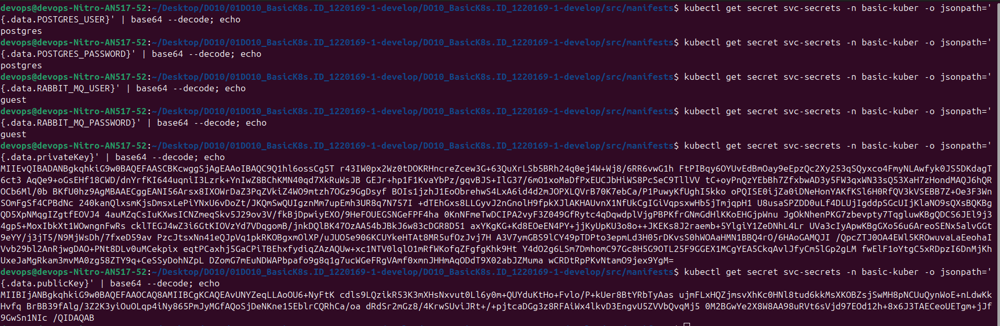

## 2.5. Логи приложения

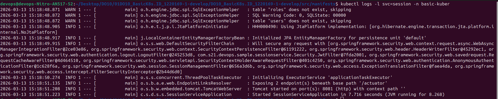

## 2.6. Туннели к сервисам

Доступ к двум сервисам, которые нужны тестам, пробрасывается через `port-forward` — по одной команде в отдельном терминале:

```bash
kubectl port-forward svc/gateway-service -n basic-kuber 8087:8087
kubectl port-forward svc/session-service -n basic-kuber 8081:8081
```

## 2.7. Функциональные тесты

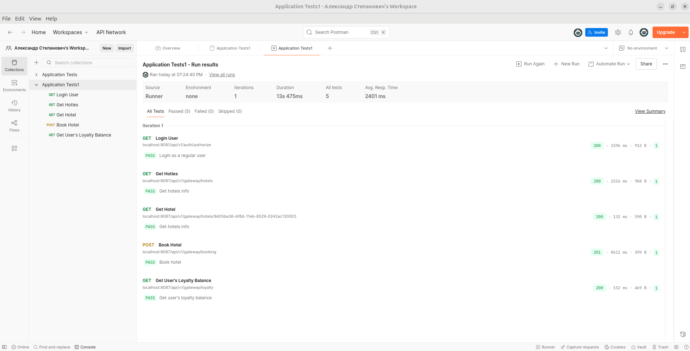

## 2.8. Панель управления

<details>
<summary><strong>Deployments, Pods, ReplicaSets</strong></summary>

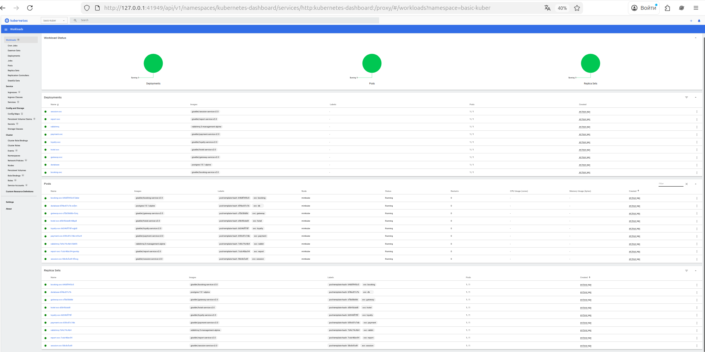

</details>

<details>
<summary><strong>Services</strong></summary>

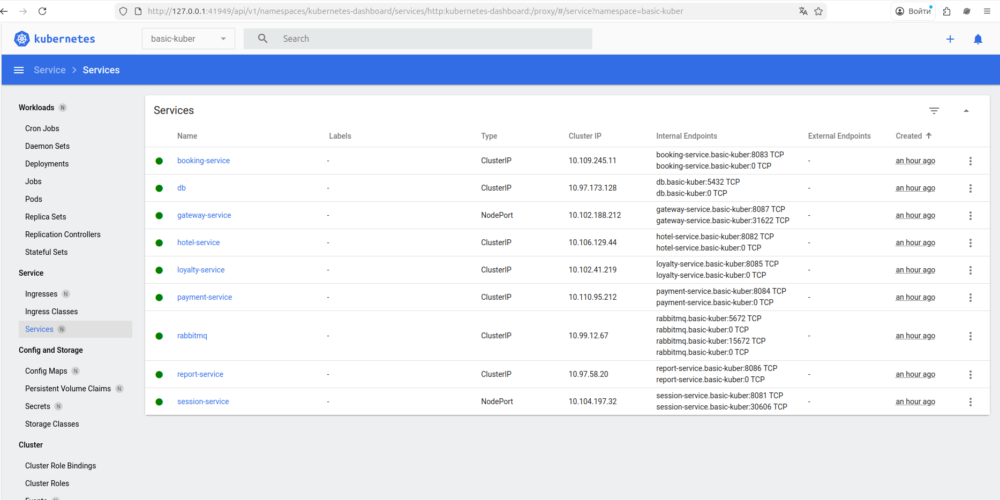

</details>

<details>
<summary><strong>ConfigMaps</strong></summary>

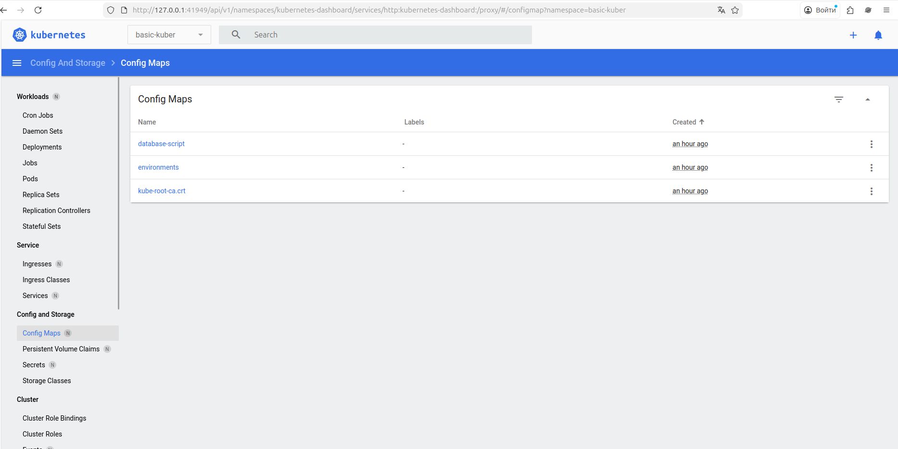

</details>

<details>
<summary><strong>Secrets</strong></summary>

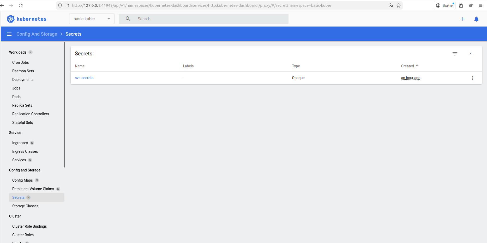

</details>

<details>
<summary><strong>Namespaces</strong></summary>

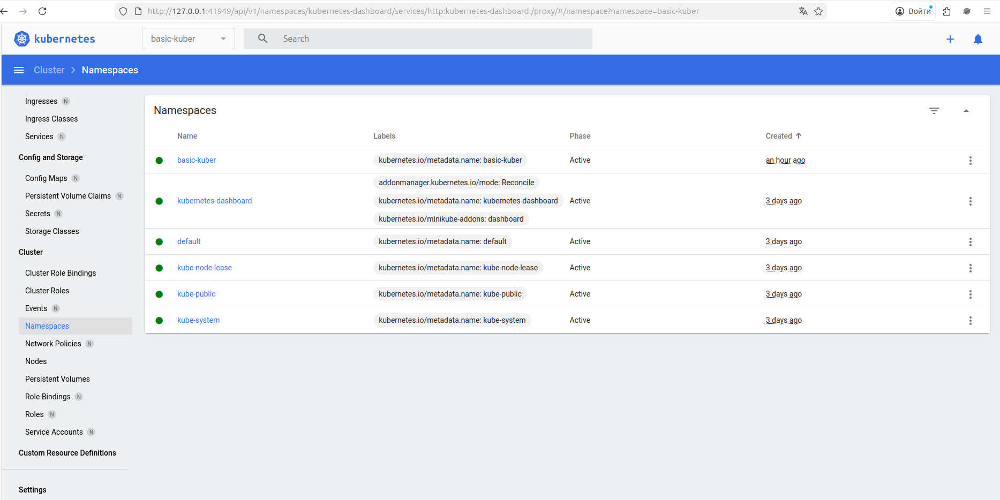

</details>

<details>
<summary><strong>Узлы кластера</strong></summary>

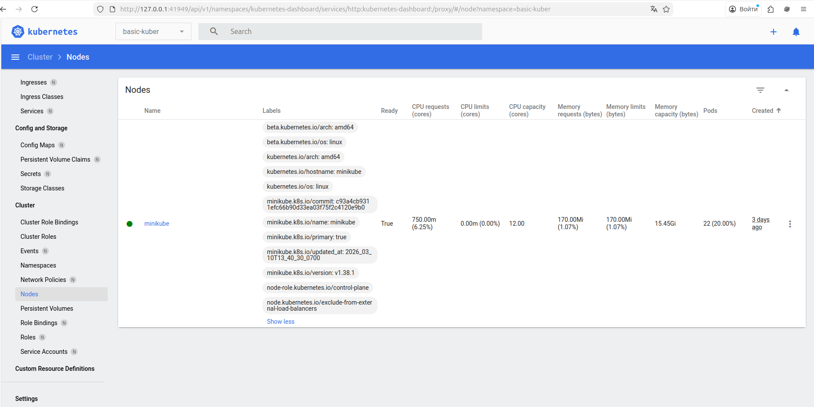

</details>

<details>
<summary><strong>Логи пода session-service</strong></summary>

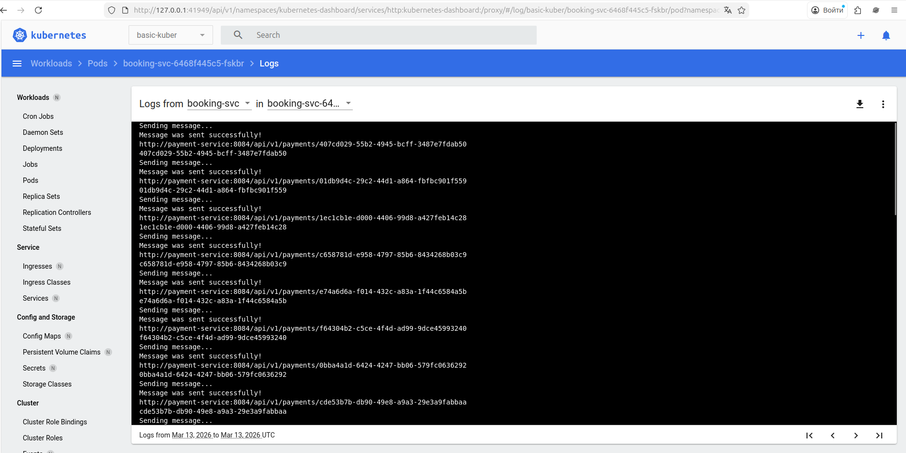

</details>

<details>
<summary><strong>Загрузка ЦП и памяти</strong></summary>

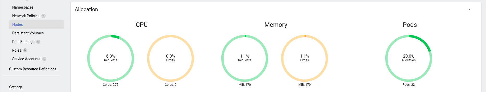

</details>

## 2.9. Сравнение стратегий развёртывания

Для замера написан скрипт [deploy.sh](./deploy.sh). Ключевая деталь: сам `kubectl apply` возвращается почти мгновенно — он лишь отправляет манифест в API, а раскатка идёт асинхронно. Поэтому реальное время даёт не он, а ожидание завершения через `kubectl rollout status` по каждому Deployment:

```bash
start_time=$SECONDS

kubectl apply -f ./manifests/

for deploy in $(kubectl get deployments -n basic-kuber -o name); do
    kubectl rollout status "$deploy" -n basic-kuber
done

elapsed=$(( $SECONDS - start_time ))
```

Цикл идёт по всем Deployment в namespace, а не по списку имён, — добавление сервиса не требует правки скрипта.

Чтобы обновление было настоящим, а не пустым, образы переключены на более раннюю версию с исходным `pom.xml`: тег `:latest` заменён на `:03`.

**Recreate:**

```yaml
strategy:
  type: Recreate
```

**RollingUpdate:**

```yaml
strategy:
  type: RollingUpdate
  rollingUpdate:
    maxUnavailable: 1
    maxSurge: 1
```

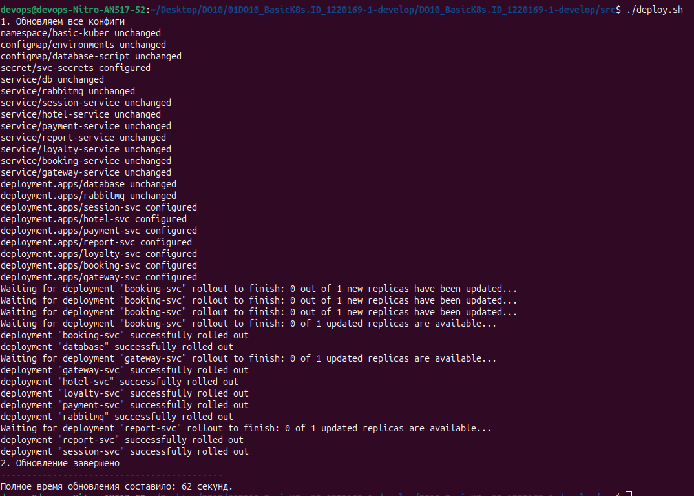
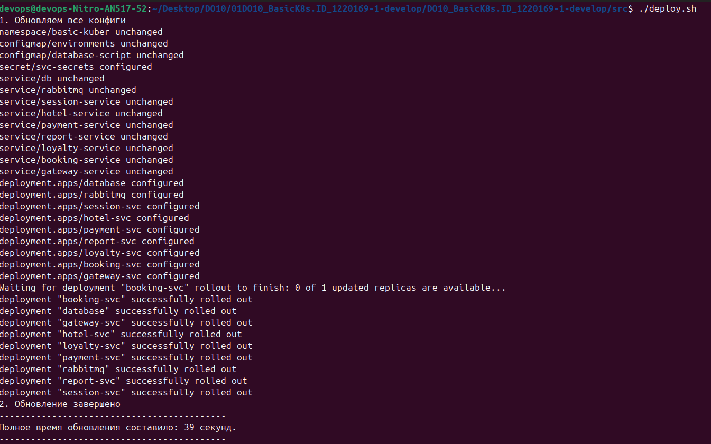

### Результат

| Стратегия | Время переразвёртывания |
|---|---|
| Recreate | 62 секунды |
| RollingUpdate | 39 секунд |

Разница объясняется механикой. `Recreate` сначала гасит все старые поды и только потом начинает поднимать новые — Spring Boot стартует 15–35 секунд, и всё это время сервис недоступен. `RollingUpdate` с `maxSurge: 1` поднимает новый под рядом со старым и переключается на него только после готовности, поэтому ожидания «на пустом месте» нет.

Плата за скорость — период, когда в кластере одновременно работают обе версии сервиса. Для приложения, где версии совместимы, это приемлемо; при несовместимой миграции схемы БД предпочтительнее `Recreate` с осознанным простоем.

---

## Итоги

Приложение из 7 микросервисов развёрнуто в Kubernetes собственным набором манифестов, состояние всех объектов проверено, функциональные тесты пройдены, обе стратегии развёртывания замерены.

> Секреты в манифестах — учебные заглушки для локального стенда (`postgres/postgres`, `guest/guest`). Пара RSA-ключей заменена заглушкой, команда генерации своей — в шапке `03-secrets.yaml`.
