# Мониторинг в реальном времени: нагрузка, логи, метрики

Отчёт о выполнении проекта: скрипты создания и уборки нагрузки на файловую систему, генерация и разбор логов nginx, наблюдение за машиной через Prometheus и Grafana и собственный экспортёр метрик.

Части 1–6 — скрипты на Bash, части 7–9 — работа со стендом мониторинга, подтверждённая скриншотами.

---

## Часть 1. Создание структуры в заданном каталоге

Скрипт принимает шесть параметров и создаёт заданное число папок с файлами внутри:

```bash
./main.sh /home/user/test 3 abc 5 file.txt 50kb
```

Разбор параметров вынесен в [validation.sh](./01/validation.sh), который подключается через `source` — проверенные значения остаются в переменных вызывающего скрипта, отдельная передача не нужна.

Путь обязан быть абсолютным. Требование не формальное: скрипт создаёт файлы пачками, и относительный путь при запуске из другого каталога засорил бы не тот каталог.

### Генерация имён

Имена строятся детерминированно из набора букв, без счётчика коллизий:

```bash
function generate_name() {
  idx=$1
  chars_in_name=$2
  simbs_array=($(create_arr $chars_in_name))
  index_arr=$(($idx%${#chars_in_name}))
  repetition=$(($idx/${#chars_in_name}))
  ...
}
```

По индексу вычисляется, какую букву повторить и сколько раз, — комбинации не пересекаются по построению. К имени добавляется дата создания: по ней часть 3 потом находит, что удалять.

### Остановка по свободному месту

Проверка вызывается перед созданием **каждого** файла, а не раз в цикле по папкам:

```bash
function memcheck() {
  avail=$(df -P -BG "$dir" | tail -1 | awk '{print $4}' | sed 's/G//')
  if [ "$avail" -le 1 ]; then echo 1; else echo 0; fi
}
```

Флаг `-BG` заставляет `df` выводить размеры сразу в гигабайтах — иначе пришлось бы разбирать единицы измерения.

---

## Часть 2. Заполнение файловой системы

Задание формулируется прямо: «при запуске скрипта в различных местах файловой системы должны быть созданы папки с файлами», а часть 3 в условии начинается со слов «ты запустил скрипт не на том компьютере». Опасность заложена в саму постановку.

> **Скрипт целенаправленно занимает место на диске** и останавливается, только когда свободного остаётся 1 ГБ. По умолчанию он работает внутри песочницы `02/sandbox` рядом с собой: разбрасывание по каталогам сохраняется, но всё созданное лежит в одном дереве. Поведение из задания — по всей файловой системе — включается явным четвёртым параметром и требует подтверждения словом `YES`.

```bash
./main.sh az az.az 3Mb          # песочница, безопасно
./main.sh az az.az 3Mb /        # по всей машине, с подтверждением
```

Корень записывается первой строкой журнала:

```
ROOT	/путь/до/02/sandbox
```

По ней часть 3 понимает, в каких границах убирать, — иначе уборка работает вслепую.

Логика разнесена по файлам, `main.sh` задаёт только порядок:

| Файл | Роль |
|---|---|
| [input.sh](./02/input.sh) | проверка трёх параметров |
| [create_structure.sh](./02/create_structure.sh) | создание папок и файлов |
| [log.sh](./02/log.sh) | запись журнала |
| [output.sh](./02/output.sh) | итог и время работы |

```bash
./main.sh az az.az 3Mb
```

### Выбор места размещения

Каталоги-кандидаты ищутся от корня области работы, с ограничением глубины и с исключениями:

```bash
{
  echo "$TARGET_ROOT"
  find "$TARGET_ROOT" -mindepth 1 -maxdepth 2 -type d 2>/dev/null
} | grep -v -E "/(bin|sbin|media)(/|$)" | grep -v "^/tmp" | head -500
```

Системные каталоги исключены, чтобы не сломать машину. `/tmp` исключён по другой причине: он очищается сам, и как демонстрация занятого места не годится. Сам корень добавлен в список отдельной строкой — в чистой песочнице подкаталогов ещё нет, и без него циклу не с чего начать.

`sudo` в скрипте не используется. Объекты создаются только там, где у запустившего и так есть право записи: это ограничивает возможный ущерб и не требует ввода пароля в цикле.

### Разбор вывода `df`

Свободное место проверяется перед каждым шагом, а не после, — иначе цикл успел бы выйти за порог. При разборе есть неочевидная деталь:

```bash
local free_space_clean=$(echo "$free_space" | sed 's/,/./g')
```

При русской локали `df -h` отделяет дробную часть запятой, а `bc` такое число не принимает. Без замены сравнение с порогом молча ломается.

Единица измерения проверяется явно: если `df` показывает уже не гигабайты, а мегабайты, работа прекращается сразу — до порога в этом случае и так дошло.

---

## Часть 3. Уборка

Скрипт удаляет то, что создала часть 2. Три способа, номер — первый параметр:

```bash
./main.sh 1     # по журналу
./main.sh 2     # по дате создания
./main.sh 3     # по маске имени
```

| Способ | Файл | Особенность |
|---|---|---|
| по журналу | [clean_by_log.sh](./03/clean_by_log.sh) | самый точный: удаляется ровно то, что записано |
| по дате | [clean_by_date.sh](./03/clean_by_date.sh) | зацепит и посторонние файлы того же промежутка |
| по маске | [clean_by_mask.sh](./03/clean_by_mask.sh) | зависит от того, насколько специфична маска |

Первый способ надёжнее двух остальных ровно потому, что часть 2 при создании ведёт журнал: удаление работает по списку, а не по угадыванию признака. Два других отбирают объекты по признаку — и потому по своей природе могут задеть постороннее.

### Границы уборки

Все три способа работают внутри корня, записанного частью 2 в первой строке журнала. Граница проверяется даже в режиме по журналу: журнал — обычный текстовый файл, его можно отредактировать, и строка вида `/etc` без проверки привела бы к удалению системного каталога.

```bash
case "$TARGET_PATH" in
  "$TARGET_ROOT"/*) ;;
  *) skipped=$((skipped + 1)); continue ;;
esac
```

Удаление по дате и по маске сначала **показывает найденное и спрашивает подтверждение**. Флаг `-delete` у `find` для этого не годится: он срабатывает сразу, и посмотреть список заранее невозможно.

Маска, состоящая только из `*` и `?`, отклоняется — она не задаёт ничего и означает «удалить всё содержимое». Символ `/` в маске тоже отклоняется: `-name` сопоставляется с именем объекта, а не с путём.

Пути к вспомогательным файлам строятся от расположения скрипта:

```bash
SCRIPT_DIR="$(cd "$(dirname "${BASH_SOURCE[0]}")" && pwd)"
source "$SCRIPT_DIR/input.sh" "$@"
```

Так скрипт запускается из любого каталога.

---

## Часть 4. Генерация логов nginx

Разбирать логи реального веб-сервера негде, поэтому они генерируются — в формате COMBINED, том же, что nginx пишет по умолчанию и который понимает goaccess.

```bash
./main.sh        # логи за 5 дней
```

Совместимость формата здесь не мелочь: части 5 и 6 разбирают эти логи штатными инструментами, и собственный формат потребовал бы собственного парсера.

---

## Часть 5. Разбор логов через awk

Четыре режима, номер — единственный параметр:

```bash
./main.sh 1     # все записи, отсортированные по коду ответа
./main.sh 2     # уникальные IP
./main.sh 3     # запросы с ошибками 4xx и 5xx
./main.sh 4     # уникальные IP среди ошибочных запросов
```

В формате COMBINED первое поле — адрес клиента, девятое — код ответа. Отсюда `$1` и `$9`:

```bash
awk '$9 ~ /^[45][0-9][0-9]$/ {print $0}' "${LOG_FILES[@]}"
```

Ошибки отбираются регулярным выражением по первой цифре кода, а не перечислением конкретных значений: диапазоны 4xx и 5xx покрываются целиком, включая нестандартные коды.

Разные коды возврата на разные ошибки (`1` — нет параметра, `2` — неверный параметр, `3` — логи не найдены) позволяют вызывающей стороне отличить причину отказа.

Каталог с логами определяется от расположения скрипта, а не от текущего:

```bash
SCRIPT_DIR="$(cd "$(dirname "${BASH_SOURCE[0]}")" && pwd)"
LOG_DIR="$SCRIPT_DIR/../04"
```

Иначе запуск вида `bash 05/main.sh 1` из корня проекта логов не находил.

---

## Часть 6. Отчёт через goaccess

`goaccess` строит из тех же логов готовую HTML-страницу со сводкой — посетители, коды ответов, популярные страницы:

```bash
./main.sh                                              # отчёт рядом со скриптом
REPORT_PATH=/media/sf_shared/report.html ./main.sh     # в общую папку VirtualBox
```

Второй вариант удобен на виртуальной машине: отчёт формируется внутри неё, а открывается браузером на хосте через общую папку. Раньше этот путь был вписан в скрипт жёстко, и на машине без такой папки перенаправление вывода завершалось ошибкой.

Скрипт запускается без параметров и на любые аргументы отвечает отказом. Перед работой проверяется наличие `goaccess` и самих логов — вместо невнятной ошибки перенаправления выводится, что именно отсутствует.

---

## Часть 7. Prometheus и Grafana

### Установка

```bash
sudo apt install prometheus
sudo snap install grafana
```

Порты: **9090** для Prometheus, **3000** для Grafana. Оба веб-интерфейса открываются с хост-машины после проброса портов.

### Дашборд

На дашборд выведены четыре показателя. Запросы на PromQL:

**Свободное место на корневом разделе, в гигабайтах:**
```promql
node_filesystem_avail_bytes{mountpoint="/"} / 1024 / 1024 / 1024
```

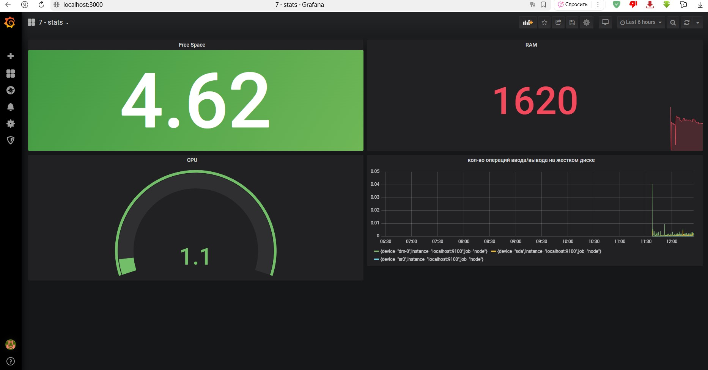

**Доступная оперативная память, в мегабайтах:**
```promql
node_memory_MemAvailable_bytes / 1024 / 1024
```

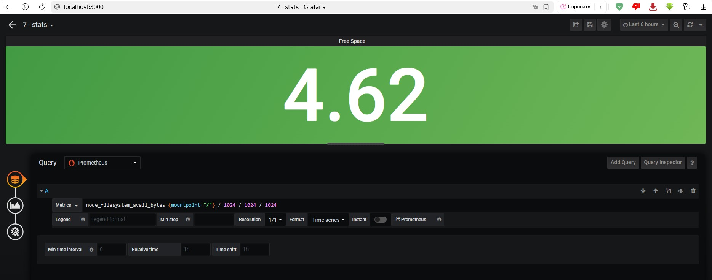

**Загрузка процессора, в процентах:**
```promql
100 - (avg by (instance) (irate(node_cpu_seconds_total{mode="idle"}[5m])) * 100)
```

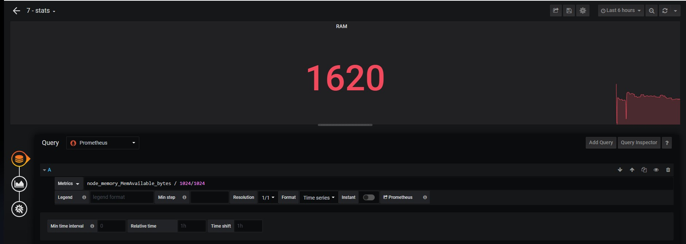

Прямой метрики «загрузка ЦП» не существует — Prometheus отдаёт накопленное время в каждом режиме. `irate` переводит счётчик в скорость роста, а вычитание доли простоя из ста даёт занятость.

**Операции ввода-вывода на диске:**
```promql
irate(node_disk_io_time_weighted_seconds_total[5m])
```

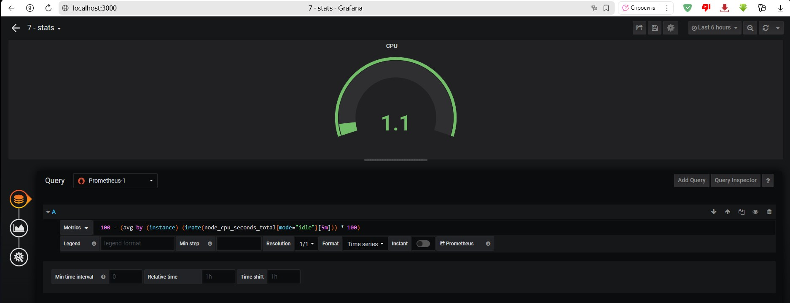

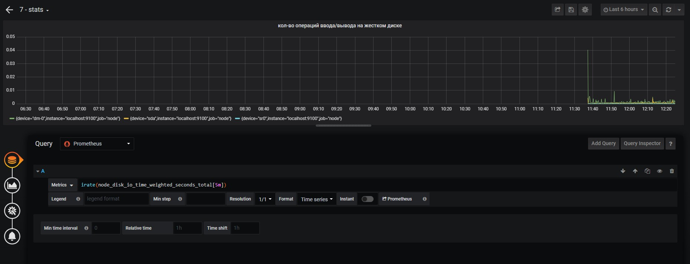

### Наблюдение под нагрузкой

Источник нагрузки — скрипт из части 2, который заполняет диск.

До запуска:

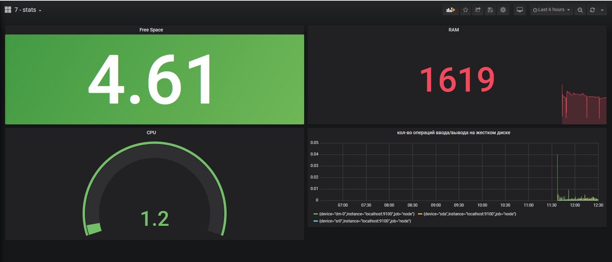

В процессе — свободного места 3.34 ГБ:

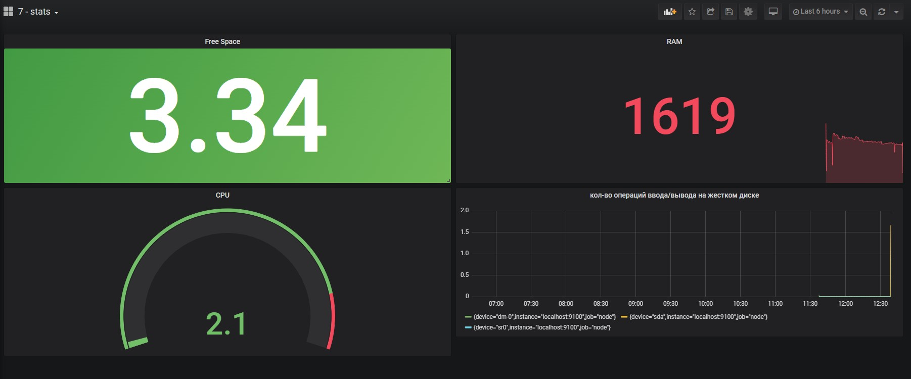

Позже — уже 2.04 ГБ:

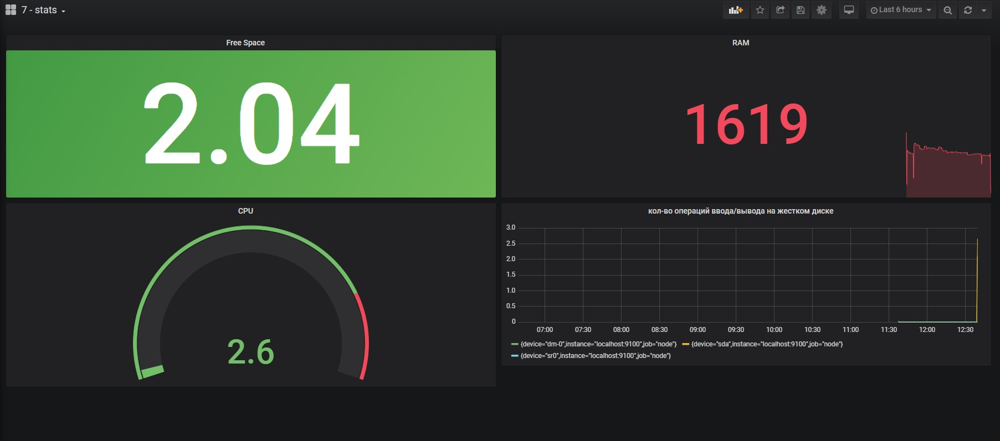

Загрузка процессора при этом выросла незначительно (2.1 → 2.6 процента): скрипт упирается в диск, а не в вычисления. На графике дисковых операций виден подъём и последующий спад — файлы создаются, по окончании работа с диском прекращается.

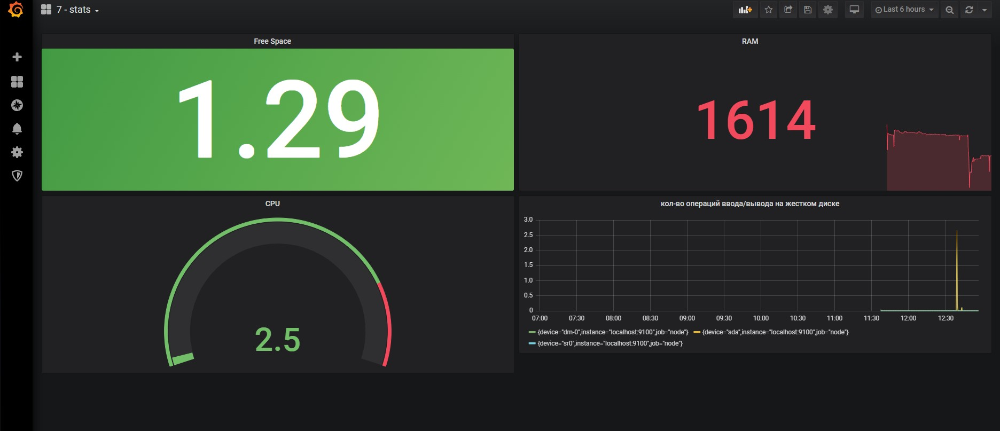

### Стресс-тест

```bash
sudo apt install stress
stress -c 2 -i 1 -m 1 --vm-bytes 32M -t 10s
```

Аргументы: два процесса на процессор, один на дисковые операции, один на память с выделением 32 МБ, длительность 10 секунд.

До нагрузки:


Во время:

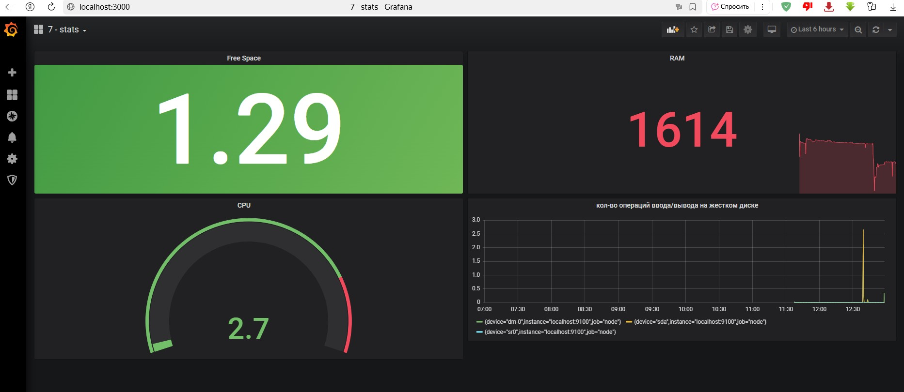

После возврата к покою:

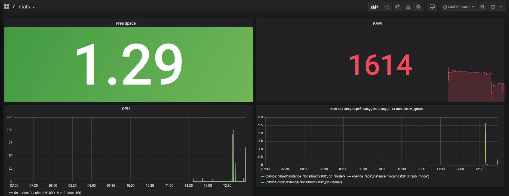

Процессор подробнее:

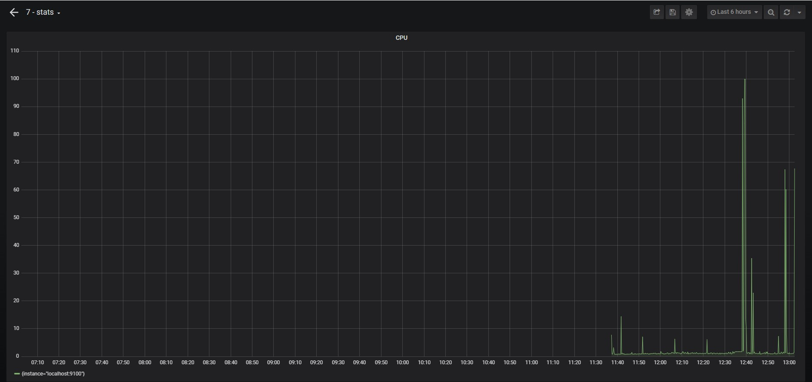

Разница между двумя видами нагрузки видна на графиках: скрипт из части 2 нагружает диск и вытесняет свободное место, `stress` поднимает процессор и память, почти не трогая диск.

---

## Часть 8. Готовый дашборд

Вместо ручной сборки панелей берётся готовый дашборд **Node Exporter Quickstart and Dashboard** из каталога Grafana Labs: на сайте копируется его идентификатор, дальше импорт по нему.

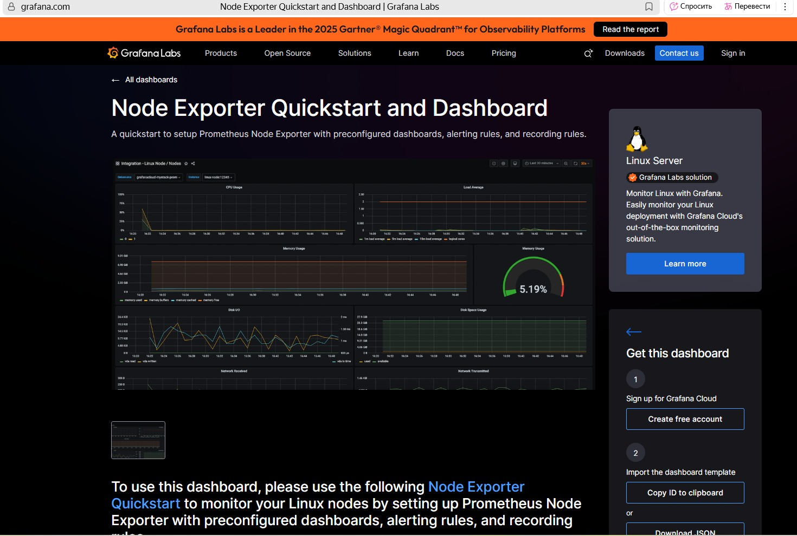

### Те же тесты на готовом дашборде

До стресс-теста и после:

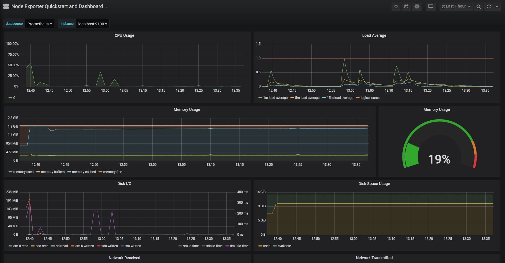
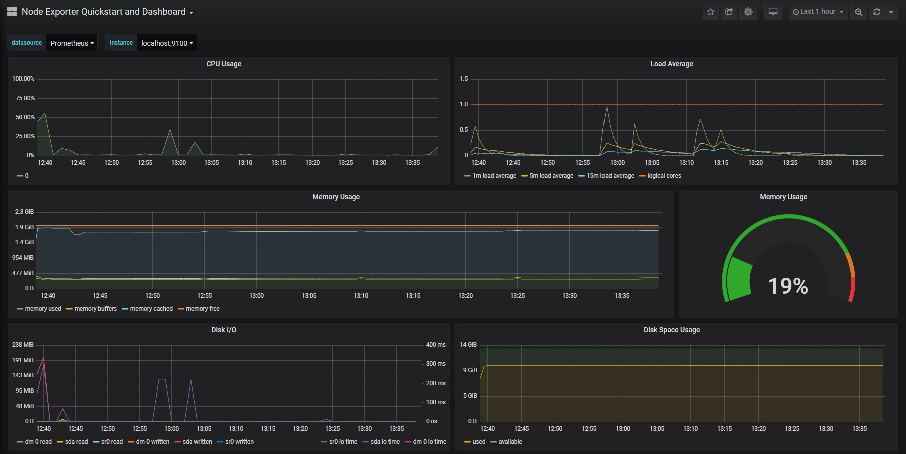

До запуска скрипта из части 2 и после:

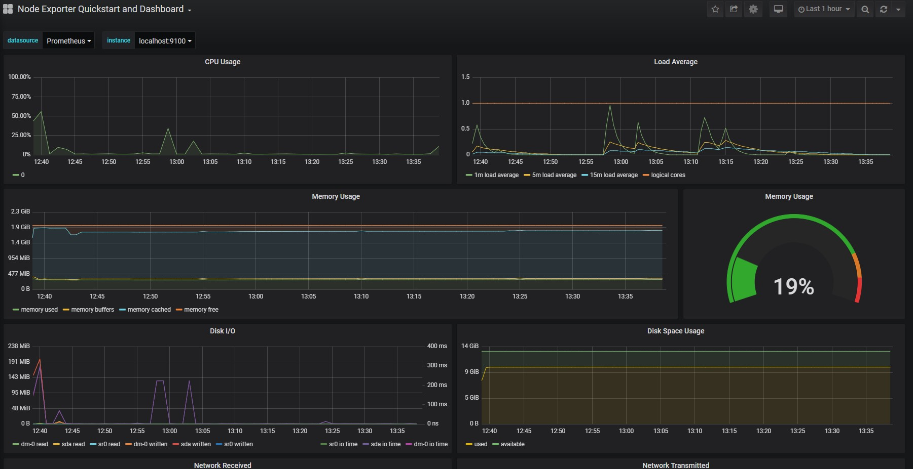
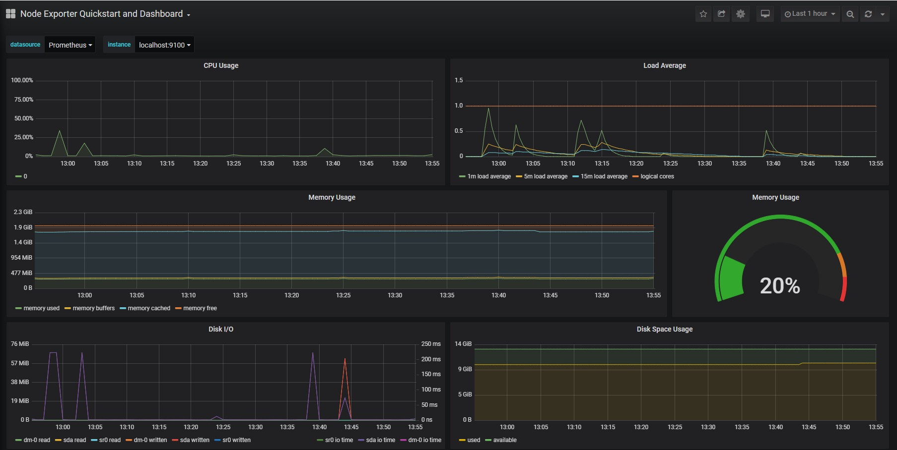

Готовый дашборд показывает те же величины подробнее и разбивает их по устройствам и ядрам — руками столько панелей не собирают.

### Нагрузка на сеть

Для теста поднимается вторая виртуальная машина в той же сети: клонирование, добавление интерфейсов, настройка Netplan.

```bash
iperf3 -s      # на принимающей машине
iperf3 -c      # на отправляющей
```

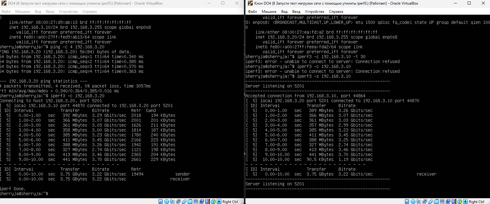
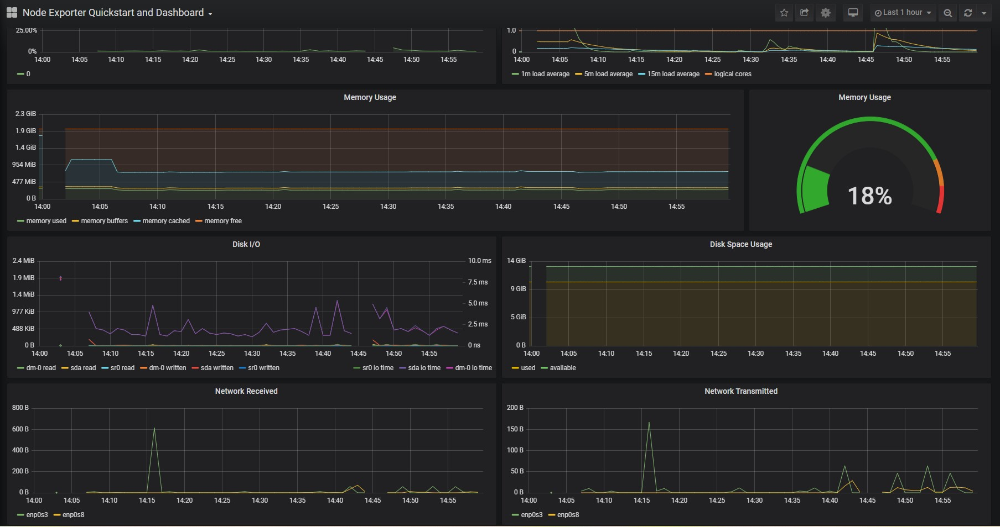

---

## Часть 9. Собственный экспортёр метрик

Задача части — отдавать Prometheus собственные метрики, не пользуясь `node_exporter`.

### Формат экспозиции

[Скрипт](./09/main.sh) раз в пять секунд перезаписывает файл в текстовом формате Prometheus:

```
# HELP node_sherryja_CPU_used_in_percent The total CPU used as percent value
# TYPE node_sherryja_CPU_used_in_percent gauge
node_sherryja_CPU_used_in_percent 0.5
```

Каждая метрика описывается тремя строками: `HELP` с описанием, `TYPE` с типом, затем имя и значение. Формат тот же, что у `node_exporter`, — Prometheus не различает источники и собирает такие метрики штатным способом.

Тип **gauge** выбран потому, что все три величины могут и расти, и убывать. Для счётчика, который только растёт, был бы `counter`, и функции вроде `irate` вели бы себя иначе.

Собираются три показателя:

| Метрика | Источник |
|---|---|
| `node_sherryja_CPU_used_in_percent` | `ps -eo pcpu` с суммированием по всем процессам |
| `node_sherryja_DISC_SPACE_free_in_bytes` | `df -B1 /home` |
| `node_sherryja_RAM_free_in_bytes` | `free -b` |

Все три берутся в байтах и процентах без преобразований: Prometheus хранит числа как есть, а перевод в удобные единицы делается уже на дашборде.

### Подключение к Prometheus

В конфигурацию Prometheus добавляется третья цель — порт 8080:

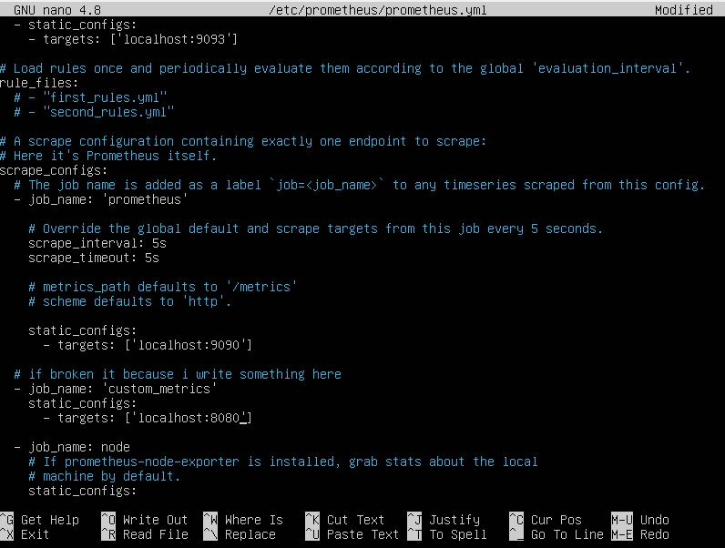

Файл с метриками отдаёт nginx. Для этого создаётся отдельный конфиг сайта, указывающий на каталог с метриками и порт 8080:

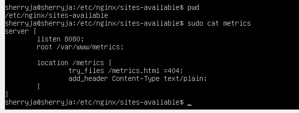

Созданный в `sites-available` конфиг сам по себе не действует — nginx читает только то, что лежит в `sites-enabled`. Сайт включается симлинком:

```bash
sudo ln -s /etc/nginx/sites-available/metrics /etc/nginx/sites-enabled/
```


Такое разделение обязанностей — скрипт только пишет файл, отдаёт его веб-сервер — избавляет от необходимости реализовывать HTTP внутри скрипта.

Скрипт запускается в фоне:

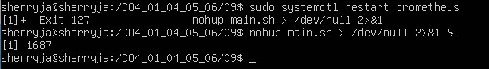

Проверка отдачи по адресу `localhost:8080/metrics`:

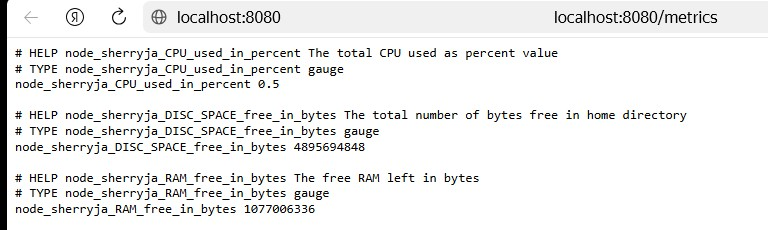

### Метрики в Prometheus

Все три показателя доступны для запросов наравне со штатными:

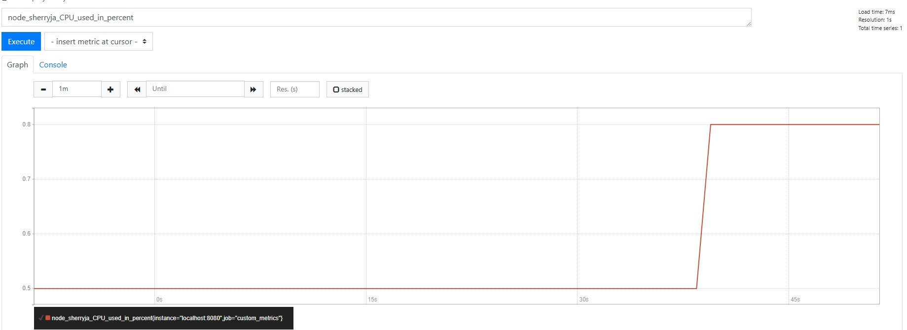
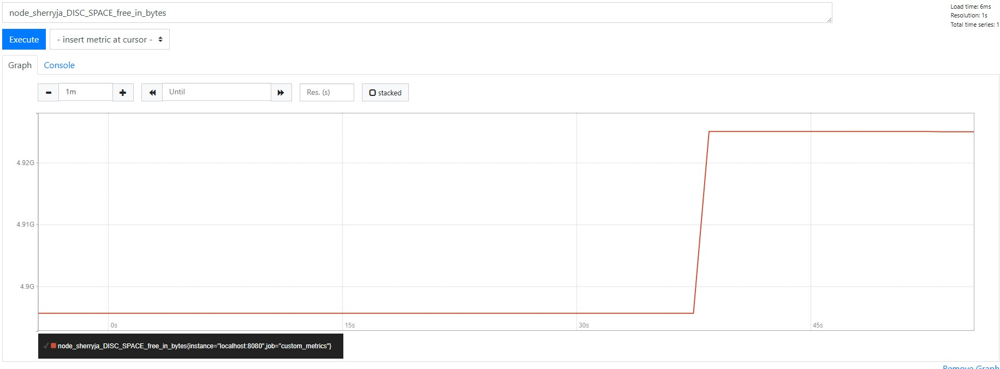
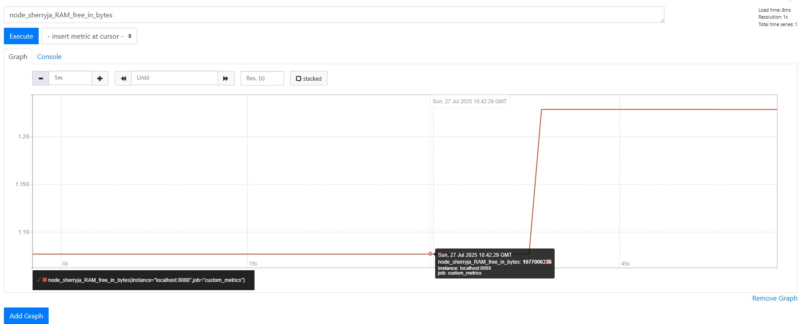

---

## Итоги

Проект соединяет две стороны наблюдаемости: чем нагружать и чем смотреть. Скрипты частей 1–3 создают и убирают нагрузку на файловую систему, части 4–6 — генерируют и разбирают логи, части 7–9 — показывают систему через Prometheus и Grafana, включая собственный источник метрик.

Наиболее содержательная часть — девятая. Она показывает, что экспортёр метрик не обязан быть отдельной программой: достаточно писать текстовый файл в известном формате и отдавать его любым веб-сервером. Prometheus не различает, кто на другом конце.
