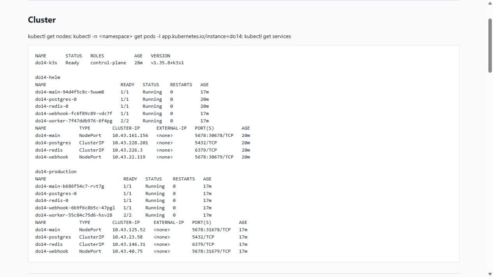
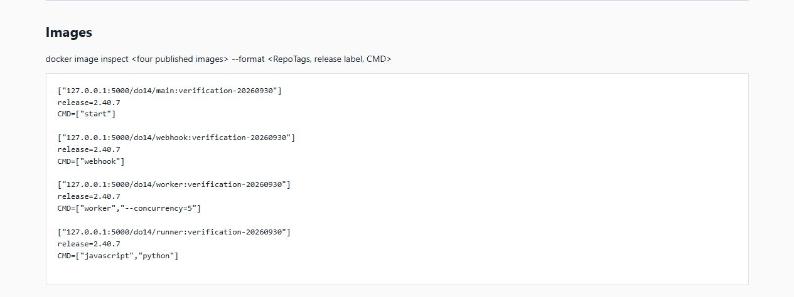
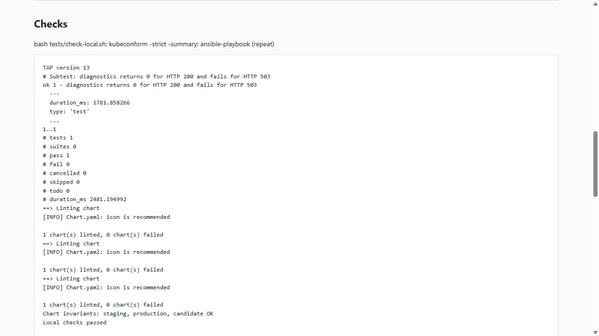
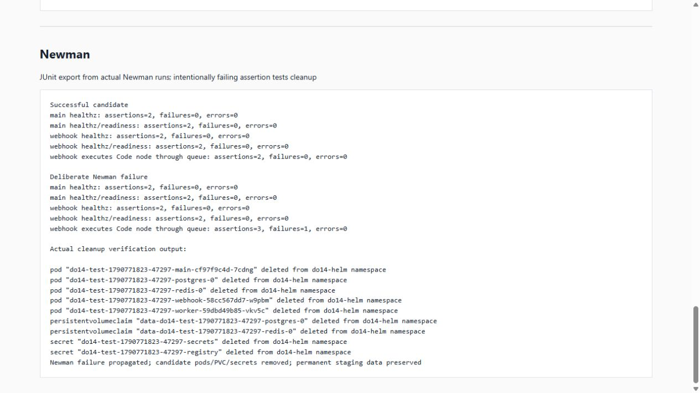
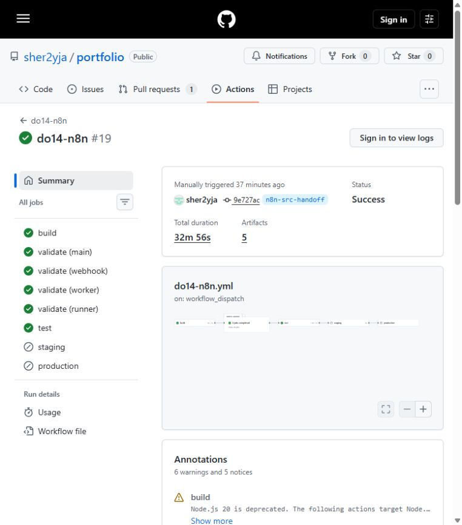
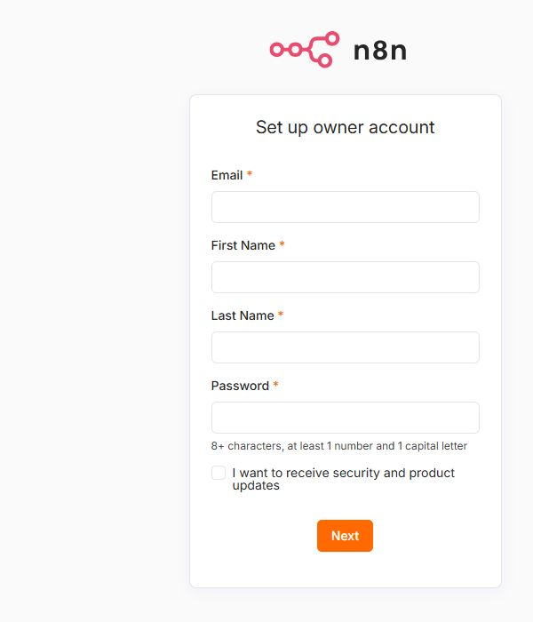

# Отчёт: часть Сани

Дата текущей проверки: 30 сентября 2026. Это отчёт о фактическом состоянии доработки; исторические результаты GitHub не считаются доказательствами нового цикла.

## С1. Школьный GitLab

Открыта: доступ и версия сервера не предоставлены. Подготовлены Runner values, RBAC и пример pipeline. Совместимая версия официального chart, регистрация, DinD push и pull k3s требуют реального школьного сервера.

## Кластер и среда

В Ubuntu 24.04 WSL установлены Docker Engine, QEMU/libvirt, Ansible, Vagrant, Helm, kubectl и Node. `systemctl is-active docker libvirtd` вернул `active` для обоих; `docker version` через локальный `/var/run/docker.sock` подтвердил сервер 29.1.3. QEMU запущен с `-accel kvm -machine none -display none -nodefaults -daemonize` и завершён после проверки; аппаратный KVM доступен.

Первый `virsh net-start default` завершился ошибкой `Network is already in use by interface virbr0`. Проверены отсутствие доменов, dnsmasq и интерфейсов на мосту; оставшийся неактивный мост удалён, libvirt пересоздал сеть успешно. Установлен vagrant-libvirt 0.12.2. `vagrant up --no-provision` создал гостевую Ubuntu 24.04 с KVM, 4 CPU / 6144 MiB и заменил insecure SSH key; VM загрузилась по адресу 192.168.121.254. Ansible установил k3s v1.35.8+k3s1; узел Ready. Повторный прогон дал `ok=7 changed=0 failed=0`. Для этой среды использована копия playbook с дополнительным environment сетевого proxy; задачи совпадают с src/ansible/site.yml. Чистый хост Ubuntu 22.04 не проверен.

Фактически проверены: Docker Engine 29.1.3, Node 22.23.3, Newman 6.2.1, Helm 3.21.3, kubectl 1.35.8, Ansible core 2.16.3, Vagrant 2.4.9, vagrant-libvirt 0.12.2.

Дополнительная проверка после перезапуска WSL: рабочая копия и Vagrant cache перенесены пользователю devops1, в `/home/devops1/work/n8n-src` и `/home/devops1/.vagrant.d`. Пользователь имеет доступ к Docker/KVM/libvirt. Режим mirrored с `ignoredPorts=67` устранил отказ прямого доступа WSL/VM к Docker Hub и конфликт DHCP libvirt с Windows. Docker Hub вернул штатный HTTP 401 из WSL и VM без proxy. Временный proxy удалён из окружения k3s. После перезапуска оба релиза имеют пять готовых Pod, все четыре NodePort отвечают, SQL-маркер `preserved` сохранился. [Журнал проверки перезапуска](evidence/2026-09-30/restart-checks.log). Во время работы гостя нужен открытый сеанс WSL; автоматическое завершение WSL прерывает VM. При повторном старте выявлены оставшийся пустой мост и устаревшее состояние libvirt; удалён только пустой мост, libvirtd перезапущен, существующий домен запущен без пересоздания диска.

Рисунок 1. Снимок страницы с фактическим выводом kubectl: узел Ready, пять Pod на окружение, worker 2/2, отдельные NodePort. Это просмотр сохранённого вывода команд, не снимок терминала.

## С2–С3. Dockerfile и Helm

Созданы четыре Dockerfile с версией из Chart.yaml; команды ролей находятся в образах. SSH-клиенты удаляются из main/webhook/worker. Чарт содержит три Deployment и два StatefulSet; worker имеет n8n и task-runner. Дополнительный cluster-summary перенесён в `../monitoring/cluster-summary/`.

Команда `bash tests/check-local.sh` прошла: Bash syntax, ShellCheck, Helm lint и рендер staging/production/candidate; проверены пять Pod по одному replica, два контейнера worker, NodePort 30678/30679 и 31678/31679, отсутствие NodePort у кандидата и cluster-summary в рабочем чарте.

Прямой `docker pull` из WSL завершился сетевым тайм-аутом. Через временный локальный CONNECT proxy с сетевым транспортом Windows оба базовых образа скачаны успешно: n8n digest `sha256:ffeb52485f78b1b06c9a832205853cf75da72a07a514c9a27724df85979d6c34`, runners digest `sha256:2a76a2c69ec50c8210c866918de106b592ab4a566c290e5a9a78dc3a6e0351bf`. Обход относится к этой среде и не входит в передаваемый src.

`REGISTRY=127.0.0.1:5000/do14 IMAGE_TAG=verification-20260930 bash ci/build.sh` с локальными тестовыми credentials завершился успешно: собраны и опубликованы четыре собственных образа; main/webhook/worker вернули 2.40.7, SSH-команды отсутствуют, version labels всех четырёх образов совпали. Локальный Registry без authentication доступен k3s через приватный SSH-туннель и явный HTTP mirror; это проверка сборки и передачи образов, а не подтверждение школьного TLS/auth/read-only token.

Образ runners имеет release tag 2.40.7. Его внутренний JavaScript package.json показывает @n8n/task-runner 2.40.3 — это соответствует [исходникам официального релиза](https://github.com/n8n-io/n8n/blob/n8n%402.40.7/packages/%40n8n/task-runner/package.json). Внутренний номер не подменяется.

Рисунок 2. Реальный docker image inspect: четыре repository с общим тегом проверки, release labels и собственные команды ролей. Снимок страницы с сохранённым выводом.

Дополнительно kubeconform 0.6.7 со схемами Kubernetes 1.30.0 подтвердил все три рендера: каждый содержит 10 ресурсов, `Valid: 10, Invalid: 0, Errors: 0, Skipped: 0`.

Рисунок 3. Реальный вывод tests/check-local.sh: диагностический тест и lint трёх вариантов. Полные записи: [static-checks.log](evidence/2026-09-30/static-checks.log), [schema-checks.log](evidence/2026-09-30/schema-checks.log), [ansible-repeat.log](evidence/2026-09-30/ansible-repeat.log).

## С4–С7. Скрипты и Newman

Реализованы build/deploy/test/test-candidate. Build использует password-stdin; deploy — atomic/wait, фиксированные namespace, сохранение постоянных секретов; candidate создаёт свежую БД, owner, импортирует и публикует workflow, перезапускает процессы и удаляет только собственные ресурсы.

`node --test tests/check-health.test.mjs` прошёл: диагностическая команда возвращает 0 на HTTP 200 и 1 на HTTP 503. Это модульная проверка диагностической команды. Newman health/readiness — компонентные проверки; webhook проверяет queue mode, передачу уникального значения и Code-узел.

Кандидат `do14-test-1790772131-48835` на свежей БД прошёл автоматическую настройку owner, import/publish и перезапуск. Newman: 5 запросов, 10 assertions, 0 failures; функциональный POST вернул HTTP 200 и подтвердил Code-узел и точный echo уникального входа. [JUnit реального прогона](evidence/2026-09-30/newman-success.xml), [полный журнал](evidence/2026-09-30/newman-success-run.log). Релиз, Pod, оба PVC и оба секрета удалены.

Проверены ненулевые коды при неверном окружении, отсутствии build credentials, неверном формате тега, отказе Registry (`127.0.0.1:9`), отсутствии encryption key и попытке смены существующего пароля БД. Тест над постоянным do14 запрещён.

Повторный staging сохранил UID PostgreSQL PVC и SQL-маркер `preserved`. Обновление с тегом `does-not-exist-20260930` и timeout 90s завершилось ошибкой и атомарным откатом; прежний проверенный image tag восстановлен, SQL-маркер сохранился. Production развёрнут тем же проверенным тегом. Все четыре NodePort ответили `{"status":"ok"}` с хоста WSL.

Намеренный провал Newman сначала выявил ещё завершающийся Pod после возврата Helm. Добавлено явное ожидание удаления Pod по уникальному release selector. Повторный кандидат `do14-test-1790771823-47297` дал 11 assertions / 1 намеренную ошибку, вернул ненулевой код; после возврата скрипта проверено отсутствие его Pod/PVC/Secret и сохранение постоянного SQL-маркера staging. [JUnit намеренного провала](evidence/2026-09-30/newman-deliberate-failure.xml), [полный журнал и проверка очистки](evidence/2026-09-30/newman-failure-run.log).

Рисунок 4. Страница с результатами реальных JUnit и журналом очистки. Красная проверка добавлена намеренно только в интеграционной рабочей копии для проверки отказа pipeline; в передаваемой коллекции её нет. [Сохранённая страница доказательств](evidence/2026-09-30/verification.html).

## С8. Runner и GitHub Actions

Загрузка `registry:2` после изменения сети прошла через Docker Engine и k3s напрямую. Повторный кандидат `do14-test-1790774168-2253` прошёл fresh-owner/import/publish/restart/Newman: 5 запросов, 10 assertions, 0 failures. После возврата скрипта его Pod/PVC/Secret отсутствуют. [Журнал повторного кандидата](evidence/2026-09-30/candidate-after-restart.log).

Текущий приоритет по указанию пользователя: завершить GitHub. Школьный GitLab пока выполняет коллега; отсутствие доступа к нему не останавливает GitHub-работу.

Подготовлены отдельные manager/job ServiceAccount, namespace Role, DinD TLS и concurrency=1. На реальном k3s `kubectl auth can-i` подтвердил exec, port-forward и pods/log, а также отказ get secrets в kube-system и create namespaces. Кандидат и оба постоянных deploy выполнялись с токеном job ServiceAccount. Регистрация GitLab Runner и DinD job остаются частью открытой С1.

GitHub workflow адаптирован к четырём образам и проверке кандидата перед staging; security checks сохранены. API GitHub подтвердил status offline у do14-runner. Новый полный удалённый цикл и ручной GitHub production не запускались.

Workflow прошёл actionlint 1.7.12; проигнорирована только проверка известного пользовательского label do14-deploy. Создана отдельная runner-VM n8n-github-runner_default, первоначально 2 CPU / 2 GiB. Actions Runner 2.337.0 проверен по опубликованному digest, зарегистрирован как do14-runner-wsl и запущен systemd от vagrant. GitHub API подтвердил online; старый offline runner сохранён. Реальные команды подтвердили версии Node/Helm/Newman и ограничение RBAC. Secrets окружений получили три значения, предварительно сверенные с существующими Kubernetes Secrets, PULL_USER и PULL_TOKEN. Пользовательский classic PAT проверен через GitHub API: аккаунт sher2yja, единственный scope read:packages; GHCR вернул manifest нового main image. Значение токена в отчёт не включается.

[Draft PR №1](https://github.com/sher2yja/portfolio/pull/1) опубликован из ветки n8n-src-handoff. [GitHub run 36725328766](https://github.com/sher2yja/portfolio/actions/runs/36725328766) для SHA e9510085e08e65eff818d8b8381c27a79ee605eb: build success, все четыре validate success, test queued. Это подтверждает сборку/push четырёх образов и проверки Helm/Kubernetes/Trivy; кандидат и постоянные деплои этим прогоном ещё не подтверждены. [Снимок состояния run](evidence/2026-09-30/github-run-36725328766.json). Workflow_dispatch на feature-ветке не развёртывает постоянные окружения: условия staging/production требуют main.

После сообщения пользователя о нехватке памяти проверено: WSL использовал 7173 MiB RAM и 778 MiB swap, Windows имел 1,9 ГБ свободной памяти. Обе VM остановлены через `vagrant halt`, libvirt подтвердил shut off; затем выполнен `wsl --shutdown`. Windows освободил память до 7,9 ГБ. Диски/PVC сохранены; runner при остановленной VM ожидаемо offline. Следующий запуск стенда нужен для реального CI, а не для подготовки токена в браузере.

В исходных Vagrantfile память уменьшена до 4096 MiB для приложения и 1024 MiB для GitHub runner. На момент этого изменения размеры ещё не были применены к существующим доменам и проверены интеграционно. При последней проверке Windows имел около 2 ГБ свободной RAM; VM оставлены выключенными до освобождения памяти пользователем.

При следующем запуске libvirt подтвердил фактические 4194304/1048576 KiB. WSL ограничен 6 GiB. Первое выполнение GitHub test на этом размере выявило FailedScheduling / Insufficient memory: main/webhook кандидата не помещались из-за старых requests окружений 384/512 MiB. Прогон 36725328766 отменён; build и четыре validate уже завершились успешно. [Реальные предупреждения из CI artifact](evidence/2026-09-30/github-candidate-scheduling-warnings.txt). После принудительного завершения runner остались ресурсы кандидата; общий скрипт дополнен безопасным --cleanup-only и шагом always() для повторной очистки. Через эту команду удалены оставшиеся Pod/PVC/Secret конкретного do14-test-1790777947-1259.

Request n8n установлен в 256 MiB в общем values; переопределения 384/512 MiB в окружениях удалены, лимиты сохранены. Новая проверка требует, чтобы requests трёх одновременно работающих релизов оставляли 1 GiB для k3s/system. ShellCheck, node:test, Helm lint/invariants, проверки отказа очистки без собственного имени и actionlint прошли. Оба постоянных релиза получили 256 MiB через общие deploy-скрипты, прежний проверенный тег verification-20260930 сохранён. В гостях измерены примерно 2,5 GiB использованной памяти приложения и 0,46 GiB runner, без guest swap. В WSL файловый кеш достигал 2,7 GiB; однократное освобождение чистого кеша вернуло свободную RAM Windows с 0,2 до 1,7 GiB. Для следующего старта установлен disk cache=none; XML менялся только при остановленных доменах, идентичность и диски сохранены, оба Vagrantfile validated. Результат повторного build/validate/test после исправлений описан ниже.

### Повторный GitHub-прогон при 4 + 1 GiB

30.09.2026 [прогон 36731183090](https://github.com/sher2yja/portfolio/actions/runs/36731183090) на SHA `9e727ac817770bcd42d2d202cf22cb82f2dd8f38` завершился success: build четырёх образов, четыре validate и test на `do14-runner-wsl`. Кандидат `do14-test-36731183090-1` прошёл fresh-owner, import, publish, restart и Newman: пять запросов, десять assertions, ноль failures. [Метаданные GitHub](evidence/2026-09-30/github-run-36731183090.json), [JUnit](evidence/2026-09-30/github-newman-36731183090.xml), [выдержка фактического job log](evidence/2026-09-30/github-test-36731183090-excerpt.log).

Обычная очистка и повторный шаг always() завершились успешно. После них Pod/PVC/Secret кандидата отсутствовали; оба постоянных релиза имели по пять Ready Pod, worker — 2/2. UID PostgreSQL PVC staging `fefc54a0-c0f4-43ce-995f-4677deb5c4a8` и SQL-маркер `1|preserved` сохранились. [Снимок состояния после CI](evidence/2026-09-30/github-post-test-36731183090.log). В этом снимке нет проверки NodePort; результаты прежней проверки доступны отдельно в restart-checks.log. Отмена задания с новым шагом always() ещё не проверена: подтверждены обычный успешный путь и ранее выполненная ручная очистка после отмены.

В этом прогоне реально использовались VM 4096/1024 MiB и disk cache=none. Свободная RAM Windows во время работы колебалась примерно от 0,6 до 1,8 GiB; в госте приложения при CLI-настройке отмечено 19 MiB swap. Оба гостя и WSL после проверки остановлены; Windows показал 8,28 GiB свободной RAM. Уменьшенная конфигурация проходит этот smoke-тест, но нагрузочный тест и постоянная фоновая работа вместе с браузерами не подтверждены.

Рисунок 6. Реальный скриншот страницы GitHub Actions, прогон 36731183090. Build, четыре validate и test успешны. Staging/production пропущены по условию ветки: этот прогон выполнялся на n8n-src-handoff. Полный цикл с автоматическим staging и отдельным ручным production остаётся открытым.

## С9–С10. Документация и доказательства

Инструкции: README.md и runner/NOTES.md. Финальный GitLab pipeline, CI variables и школьные скриншоты — часть Максима.

Рисунок 5. Реальный интерфейс нового staging после развёртывания, 30.09.2026. Browser открыт через localhost port-forward к main. Постоянный owner оставлен для оператора; одноразовый тестовый owner создавался только у кандидата.

## Открытые условия передачи

- Подтвердить новый GitHub build → test → staging и ручной production.
- Выполнить С1 и зафиксировать совместимую версию GitLab Runner chart.
- Максим должен воспроизвести build/test/оба deploy на Ubuntu 22.04 без правок.

Статус: локальная реализация проверена; передача не закрыта, С1 открыта. Полный новый GitHub цикл и воспроизведение Максимом на Ubuntu 22.04 ещё не подтверждены.
