# Сети в Linux: адресация, маршрутизация, фильтрация

Отчёт о выполнении проекта: расчёт адресного пространства, статическая маршрутизация между подсетями через два маршрутизатора, настройка сетевого экрана, раздача адресов по DHCP, трансляция адресов и SSH-туннели.

Весь стенд собран на виртуальных машинах Ubuntu 20.04 LTS в VirtualBox, конфигурация сети — через Netplan.

---

## Стенд

Работа идёт на двух наборах машин. В частях 2–4 достаточно пары рабочих станций в одной сети; с пятой части поднимается полноценная схема из двух подсетей, разделённых маршрутизаторами.

```
        сеть 10.10.0.0/18                          сеть 10.20.0.0/26
                                                                     
   ┌──────────┐                                          ┌──────────┐
   │   ws11   │                                          │   ws21   │
   │ 10.10.0.2│                                     ┌────┤10.20.0.10│
   └────┬─────┘                                     │    └──────────┘
        │                                           │                
        │         ┌────────────────────────┐        │    ┌──────────┐
        │         │   сеть 10.100.0.0/16   │        ├────┤   ws22   │
        │         │                        │        │    │10.20.0.20│
   ┌────┴─────────┴──┐                ┌────┴────────┴──┐ └──────────┘
   │       r1        │                │       r2       │             
   │ enp0s3 10.10.0.1│◄──────────────►│enp0s3 10.100.0.12
   │ enp0s8 10.100.0.11               │enp0s8 10.20.0.1│             
   └─────────────────┘                └────────────────┘             
                                                                     
   маршрут на r1:                     маршрут на r2:                 
   10.20.0.0/26 via 10.100.0.12       10.10.0.0/18 via 10.100.0.11   
```

Рабочие станции знают только свой шлюз по умолчанию. Маршрутизаторы знают друг о друге и о чужой подсети — этого достаточно, чтобы трафик ходил между сетями в обе стороны.

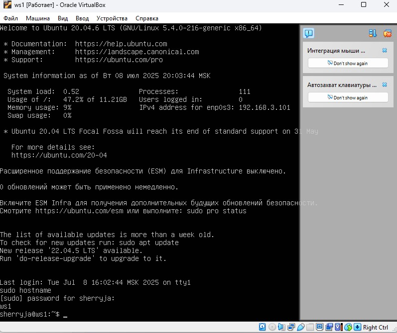

---

# Часть 1. Расчёт адресов

Инструмент части — **ipcalc**: по адресу и маске он выдаёт адрес сети, широковещательный адрес, диапазон хостов и запись маски во всех формах.

## 1.1. Сети и маски

Адрес сети для `192.167.38.54/13`:

```bash
ipcalc 192.167.38.54/13
```

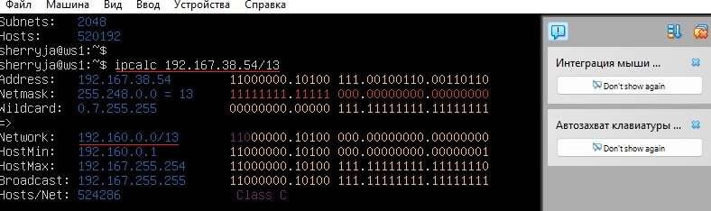

Перевод маски `255.255.255.0` в префиксную и двоичную запись. ipcalc принимает маску только вместе с адресом, поэтому вторым аргументом подставляется нулевой адрес:

```bash
ipcalc 0.0.0.0 255.255.255.0
```

Результат — `/24` и `11111111.11111111.11111111.00000000`.

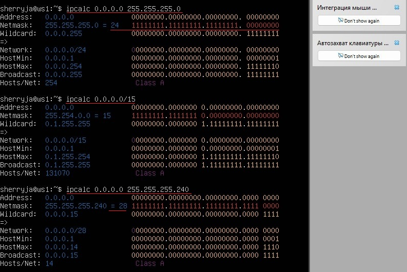

Обратный перевод для `/15` даёт `255.254.0.0` и `11111111.11111110.00000000.00000000`.

Запись `/15` — это CIDR-нотация: первые 15 бит адреса относятся к сети, оставшиеся `32 − 15 = 17` отведены под хосты. Маска в этой записи — число, у которого первые *n* бит равны единице, а остальные нулю; отсюда однозначное соответствие между префиксом и десятичной формой.

Двоичную форму ipcalc не принимает, поэтому `11111111.11111111.11111111.11110000` переводится в десятичную вручную: `255.255.255.240`.

Минимальный и максимальный хост в сети `12.167.38.4` с масками `/8`, `255.255.254.0` и `/4`:

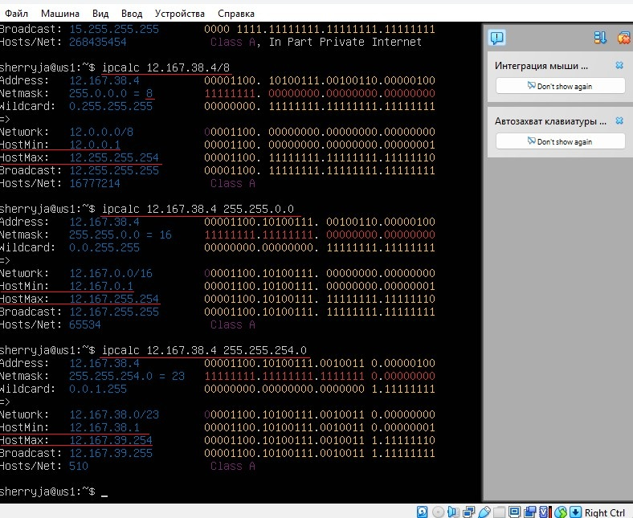
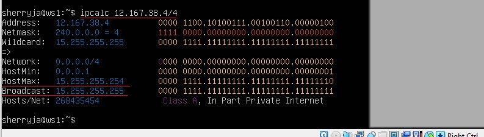

## 1.2. Localhost

**Localhost** — имя, которым машина обращается сама к себе. Обычно оно ассоциируется с `127.0.0.1`, но под loopback зарезервирован весь диапазон `127.0.0.0/8`, то есть адреса с `127.0.0.0` по `127.255.255.255`. Любой адрес из этого диапазона ведёт на локальную машину.

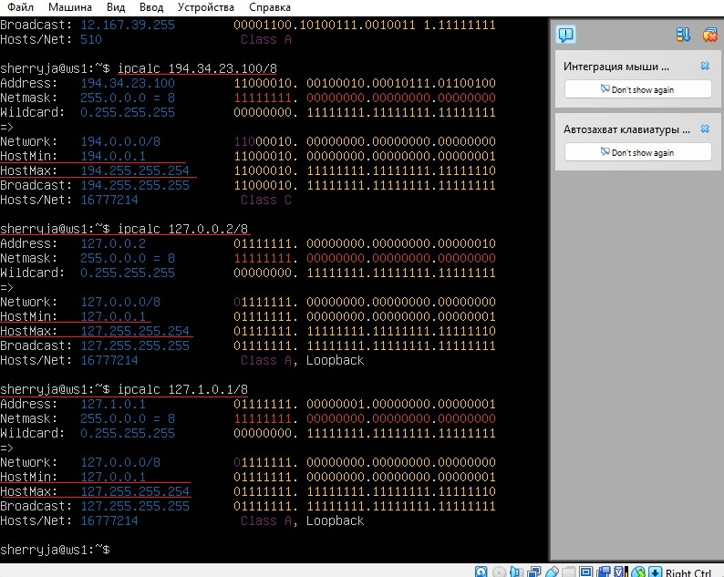

Из предложенного списка к приложению на localhost обращаются только `127.0.0.2` и `127.1.0.1` — оба попадают в диапазон между минимальным и максимальным хостом.

## 1.3. Диапазоны и сегменты сетей

**Частный** адрес используется внутри локальной сети и в интернете напрямую не виден. **Публичный** уникален в глобальной сети и идентифицирует устройство в интернете.

Под частные адреса зарезервированы три диапазона:

| Диапазон | Класс |
|---|---|
| `10.0.0.0` – `10.255.255.255` | A |
| `172.16.0.0` – `172.31.255.255` | B |
| `192.168.0.0` – `192.168.255.255` | C |

Разбор предложенного списка:

| Адрес | Тип | Почему |
|---|---|---|
| `10.0.0.45` | частный | диапазон A |
| `134.43.0.2` | публичный | вне зарезервированных |
| `192.168.4.2` | частный | диапазон C |
| `172.20.250.4` | частный | внутри `172.16` – `172.31` |
| `172.0.2.1` | публичный | второй октет меньше 16 |
| `192.172.0.1` | публичный | не `192.168` |
| `172.68.0.2` | публичный | второй октет больше 31 |
| `172.16.255.255` | частный | граница диапазона B |
| `10.10.10.10` | частный | диапазон A |
| `192.169.168.1` | публичный | не `192.168` |

Три адреса из списка выглядят частными, но ими не являются: `172.0.2.1` и `172.68.0.2` не попадают в диапазон `172.16` – `172.31`, а `192.169.168.1` и `192.172.0.1` — не `192.168`. Близость первого октета ничего не решает.

Далее нужно определить, какие адреса могут быть шлюзом сети `10.10.0.0/18`:

```bash
ipcalc 10.10.0.0/18
```

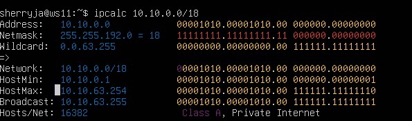

Диапазон сети — от `10.10.0.0` до `10.10.63.255`. Подходят `10.10.0.2`, `10.10.10.10` и `10.10.1.255`. Не подходят `10.0.0.1` (другая сеть) и `10.10.100.1` (третий октет за границей `/18`).

---

# Часть 2. Статическая маршрутизация между двумя машинами

Исходное состояние интерфейсов на обеих машинах:

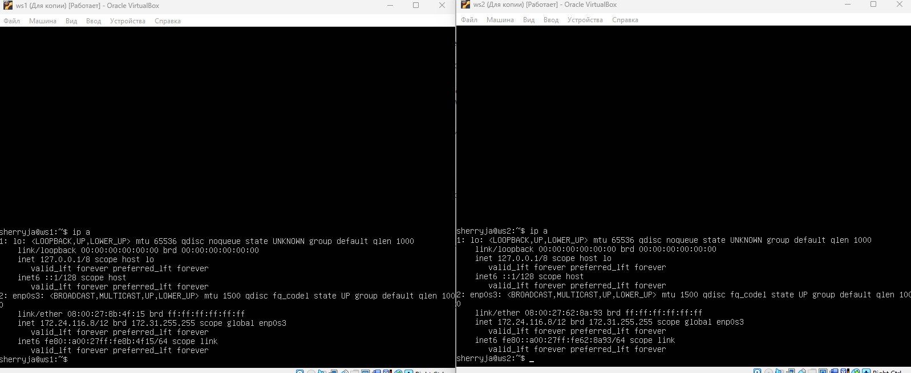

Конфигурация Netplan до добавления маршрутов:

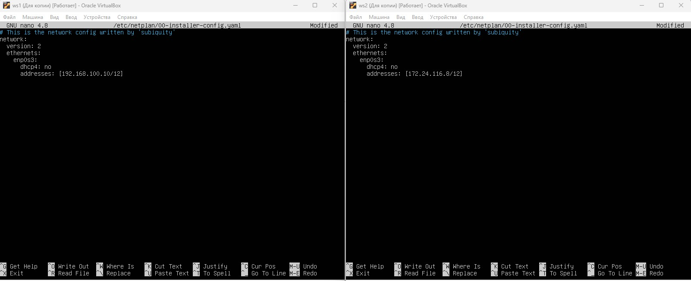

## 2.1. Маршрут вручную

```bash
sudo ip route add 172.24.116.8 dev enp0s3
```

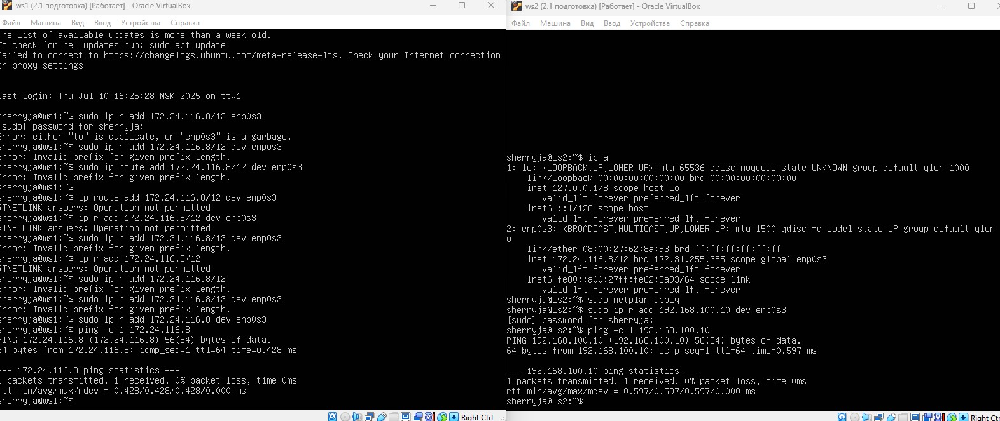

Маршрут добавляется в обе стороны, после чего машины пингуются. Такой маршрут живёт **до перезагрузки**: он существует только в таблице маршрутизации ядра и нигде не записан.

## 2.2. Маршрут с сохранением

Чтобы маршрут пережил перезагрузку, он прописывается в файл Netplan:

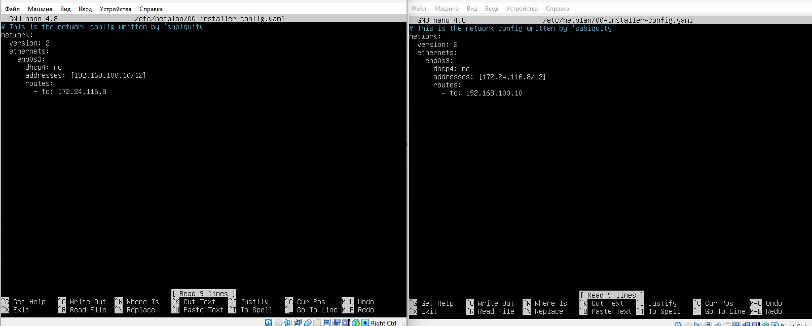

После `sudo netplan apply` связь работает и восстанавливается автоматически при следующем запуске:

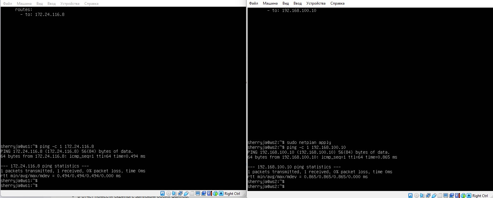

---

# Часть 3. Пропускная способность

## 3.1. Перевод единиц

Единицы измерения в сетях легко перепутать: скорость канала принято указывать в битах в секунду, а объём файлов — в байтах. Отсюда деление на 8.

| Исходно | Результат |
|---|---|
| 8 Mbps | 1 MB/s |
| 100 MB/s | 800 000 Kbps |
| 1 Gbps | 1000 Mbps |

## 3.2. Измерение через iperf3

**iperf3** измеряет реальную пропускную способность между двумя узлами: на одной машине запускается сервер, на другой клиент.

```bash
iperf3 -s          # на принимающей машине
iperf3 -c <адрес>  # на отправляющей
```

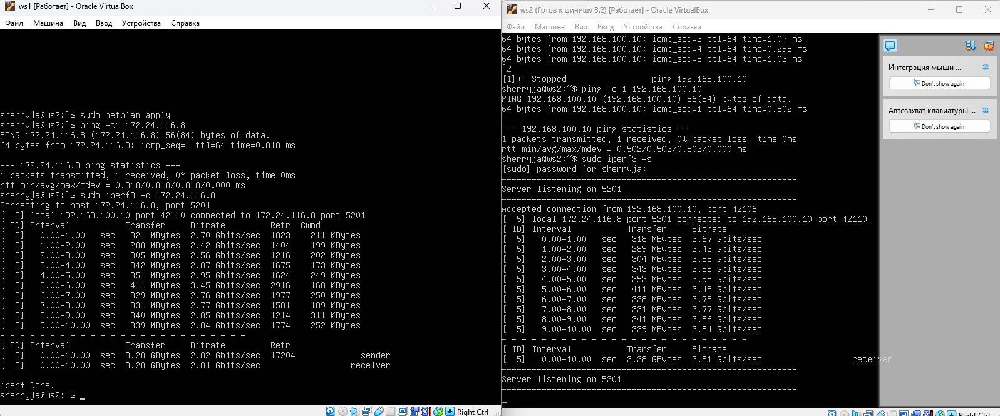

---

# Часть 4. Сетевой экран

## 4.1. iptables

**iptables** управляет правилами фильтрации трафика в ядре. Ключевое свойство: правила в цепочке проверяются **по порядку сверху вниз, и применяется первое совпавшее**. Остальные уже не рассматриваются.

Именно это и проверяется в задании. Готовятся два варианта `/etc/firewall.sh`, отличающиеся только порядком двух последних правил:

```bash
#!/bin/sh

# сброс всех правил
iptables -F
iptables -X

# разрешить ssh
iptables -A INPUT -p tcp --dport 22 -j ACCEPT

# разрешить http
iptables -A INPUT -p tcp --dport 80 -j ACCEPT

# запретить ответ на ping
iptables -A OUTPUT -p icmp --icmp-type echo-reply -j DROP

# разрешить ответ на ping
iptables -A OUTPUT -p icmp --icmp-type echo-reply -j ACCEPT
```

Во втором варианте две последние строки переставлены местами.

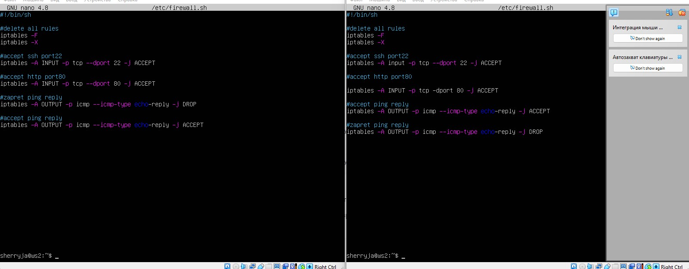

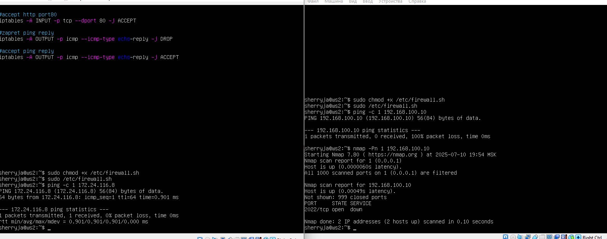

Результат прямо противоположный. В варианте выше первым встречается `DROP` — машина перестаёт отвечать на ping, до правила `ACCEPT` дело не доходит. Во втором варианте первым идёт `ACCEPT`, и ответы проходят: правило `DROP` ниже никогда не срабатывает.

## 4.2. nmap

**nmap** сканирует узел и показывает, какие порты на нём открыты. Инструмент двойного назначения: им пользуются и при поиске уязвимостей, и при обслуживании сети.

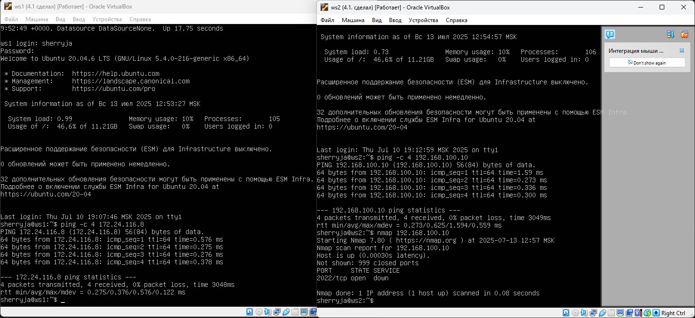

Проверка показывает разницу между «машина недоступна» и «машина не отвечает на ping»: из-за правила `DROP` одна из машин не отвечает на пинг, но nmap видит её как активную и находит открытые порты. Отсутствие ответа на ping не означает, что узла нет.

---

# Часть 5. Маршрутизация между подсетями

## 5.1. Адресация машин

Все пять машин настраиваются через Netplan. Маршрутизаторы получают по два интерфейса — по одному в каждую сеть, к которой подключены.

**r1:**
```yaml
network:
  version: 2
  ethernets:
    enp0s3:
      dhcp4: no
      addresses: [10.10.0.1/18]
    enp0s8:
      dhcp4: no
      addresses: [10.100.0.11/16]
```

**r2:**
```yaml
network:
  version: 2
  ethernets:
    enp0s3:
      dhcp4: no
      addresses: [10.100.0.12/16]
    enp0s8:
      dhcp4: no
      addresses: [10.20.0.1/26]
```

**Рабочие станции** — один интерфейс и шлюз по умолчанию:

| Машина | Адрес | Шлюз |
|---|---|---|
| ws11 | `10.10.0.2/18` | `10.10.0.1` |
| ws21 | `10.20.0.10/26` | `10.20.0.1` |
| ws22 | `10.20.0.20/26` | `10.20.0.1` |

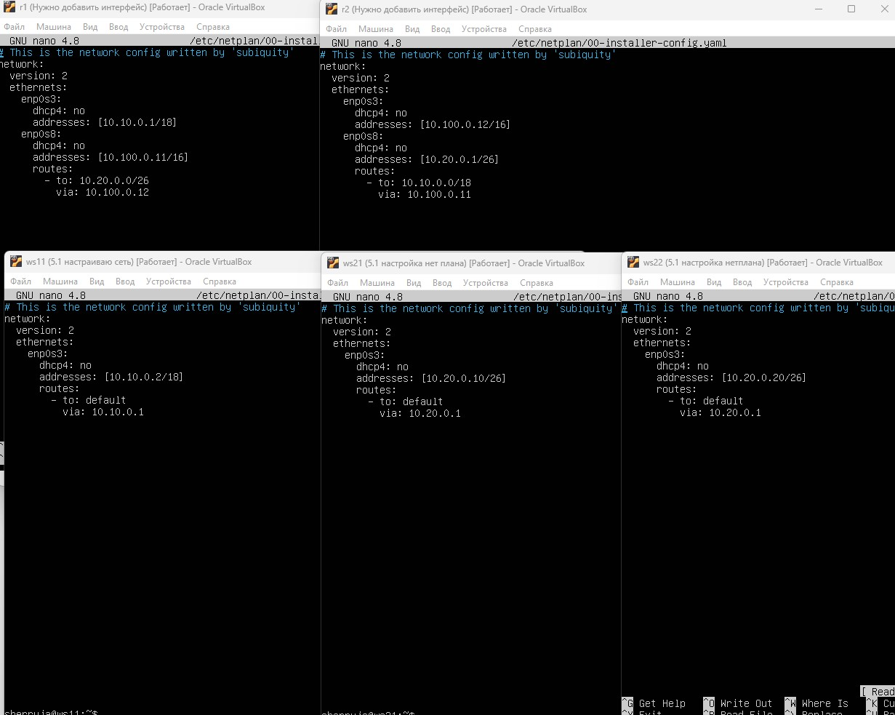

Проверка адресов через `ip -4 a`:

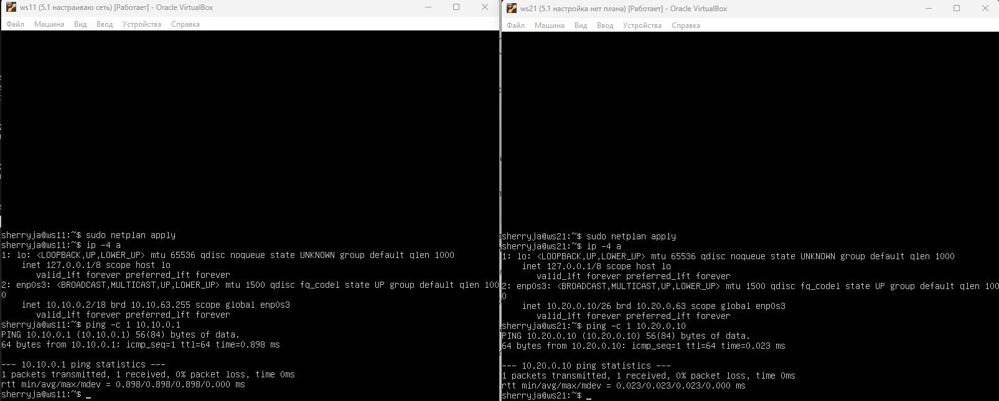
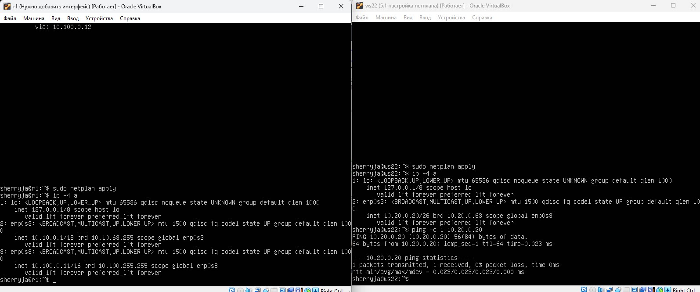
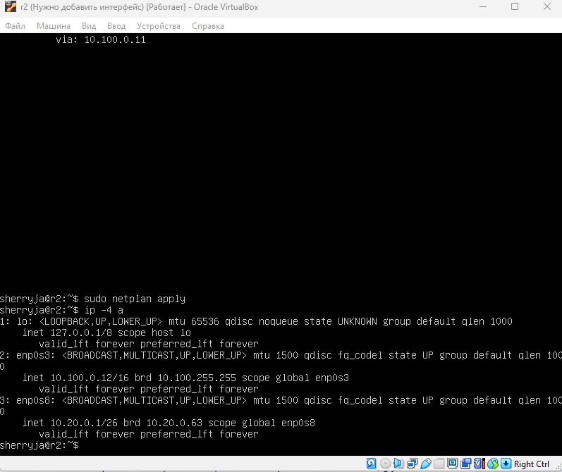

## 5.2. Включение переадресации

По умолчанию Linux не пересылает пакеты между своими интерфейсами: машина с двумя интерфейсами маршрутизатором сама по себе не становится. Функция включается отдельно.

```bash
sysctl -w net.ipv4.ip_forward=1
```

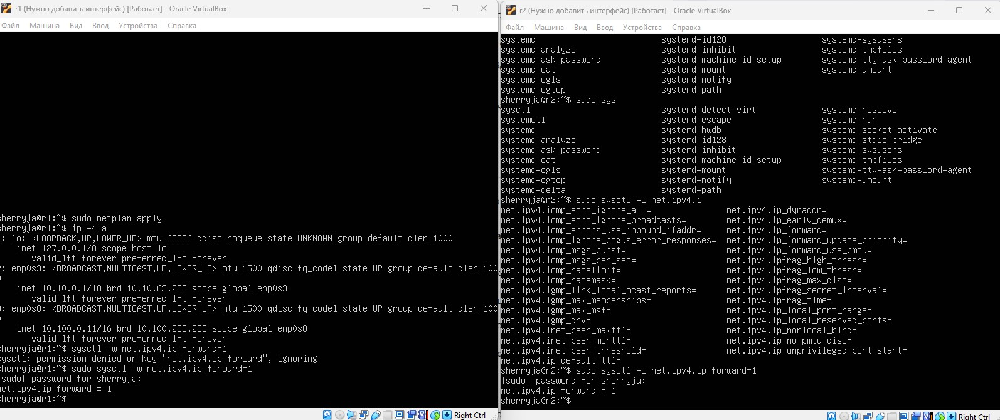

Эта команда действует до перезагрузки. Чтобы настройка сохранялась, та же строка прописывается в `/etc/sysctl.conf`:

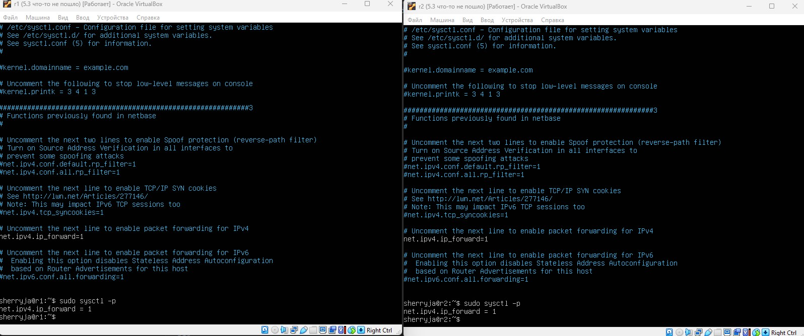

## 5.3. Маршрут по умолчанию

Рабочие станции получают шлюз по умолчанию — адрес маршрутизатора своей сети:

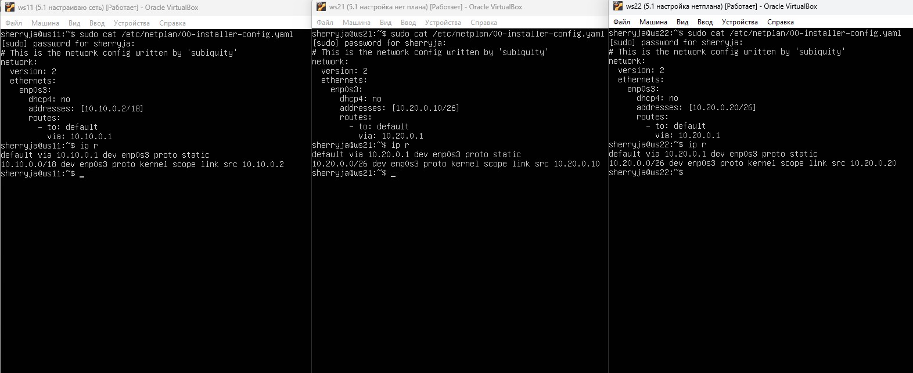

Проверка таблицы маршрутизации:

```bash
ip r
```

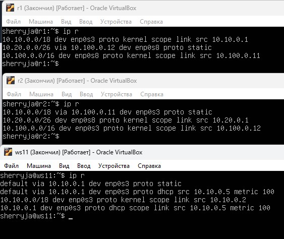

Пинг проходит, а `tcpdump` на r2 показывает проходящий трафик:

```bash
tcpdump -tn -i eth0
```

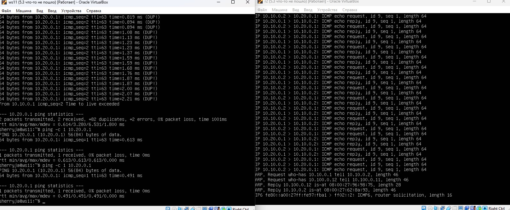

## 5.4. Статические маршруты между сетями

Шлюза по умолчанию мало: r1 знает про свои сети `10.10.0.0/18` и `10.100.0.0/16`, но про `10.20.0.0/26` за вторым маршрутизатором — нет. Маршрут прописывается явно, на каждом роутере в сторону чужой сети:

```yaml
# на r1
routes:
  - to: 10.20.0.0/26
    via: 10.100.0.12

# на r2
routes:
  - to: 10.10.0.0/18
    via: 10.100.0.11
```

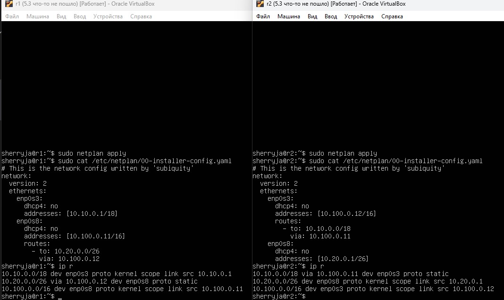

Проверка, какой маршрут выбирается для конкретной сети:

```bash
ip r list 10.10.0.0/18
ip r list 0.0.0.0/0
```

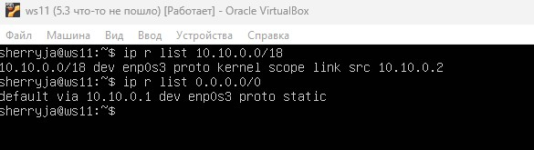

Для `10.10.0.0/18` выбирается не маршрут по умолчанию, а конкретный — по **правилу самого длинного совпадения префикса**. Маршрутизатор из всех подходящих записей берёт ту, у которой с адресом назначения совпадает больше бит. Маска `/18` фиксирует 18 бит, `0.0.0.0/0` — ни одного, поэтому конкретный маршрут приоритетнее. Маршрут по умолчанию работает как запасной вариант: он применяется, только когда точнее ничего не нашлось.

## 5.5. Построение списка маршрутизаторов

На r1 запускается перехват, на ws11 — трассировка до ws21:

```bash
tcpdump -tnv -i enp0s3        # на r1
traceroute 10.20.0.10         # на ws11
```

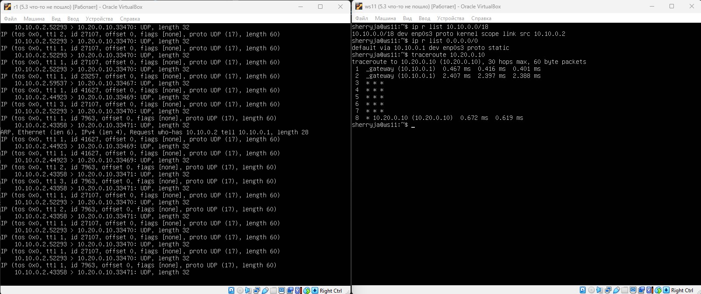

**Как работает traceroute.** Утилита отправляет пакеты с постепенно растущим значением TTL — счётчиком оставшихся переходов. Первый пакет уходит с `TTL = 1`: первый же маршрутизатор уменьшает его до нуля, отбрасывает пакет и возвращает ICMP-сообщение «time exceeded». Из этого ответа traceroute узнаёт адрес первого узла на пути. Дальше TTL увеличивается на единицу, и на каждом шаге отзывается следующий маршрутизатор.

Признак того, что цель достигнута, другой. Пакеты отправляются на заведомо незанятый порт, и когда до конечного узла доходит очередь, он отвечает не «time exceeded», а «порт недоступен» — по этому ответу утилита понимает, что дошла, и завершает работу.

В выводе видно, что часть промежуточных узлов отвечает звёздочками: они настроены не отвечать на такие пакеты, но путь через них всё равно строится.

## 5.6. ICMP при маршрутизации

```bash
tcpdump -n -i eth0 icmp       # на r1
ping -c 1 10.30.0.111         # на ws11
```

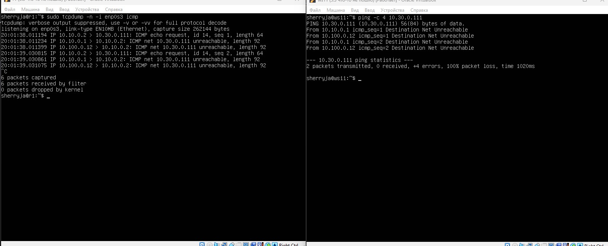

Адрес `10.30.0.111` не принадлежит ни одной сети стенда. Пакет уходит по маршруту по умолчанию, доходит до маршрутизатора, у которого нет маршрута к этой сети, и тот возвращает ICMP-сообщение о недостижимости — это и видно в перехвате.

---

# Часть 6. Раздача адресов по DHCP

До этого момента все адреса назначались вручную. DHCP снимает эту работу: сервер выдаёт клиенту адрес, маску, шлюз и DNS автоматически.

Конфигурация сервера на r2 — `/etc/dhcp/dhcpd.conf`:

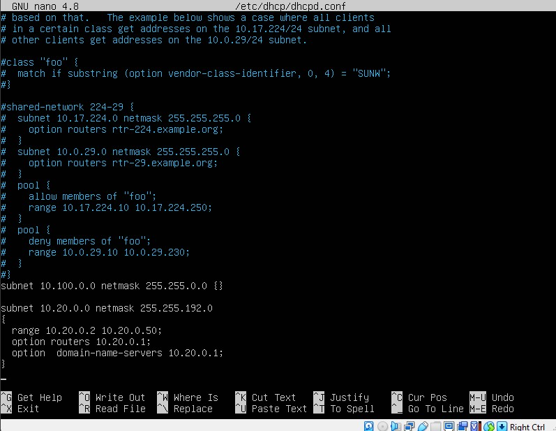

Файл `/etc/resolv.conf` на r2:

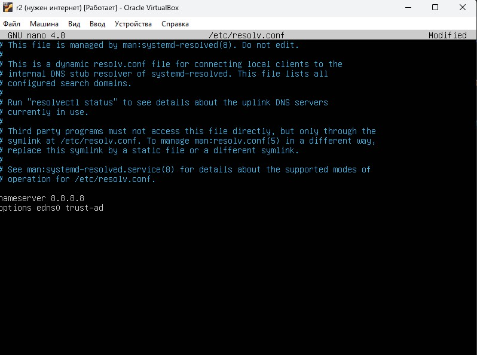

Запуск и проверка службы:

```bash
systemctl restart isc-dhcp-server
systemctl status isc-dhcp-server
```

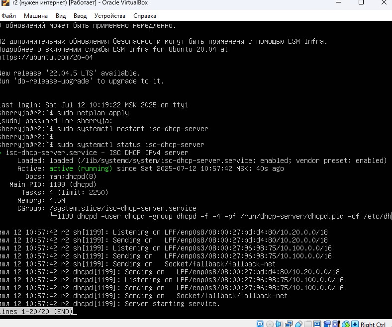

Клиент получает адрес:

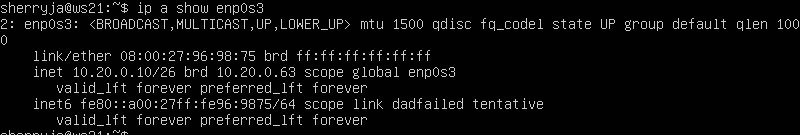

Для ws11 в конфигурации задаётся привязка к MAC-адресу — так машина каждый раз получает один и тот же адрес, оставаясь при этом клиентом DHCP:

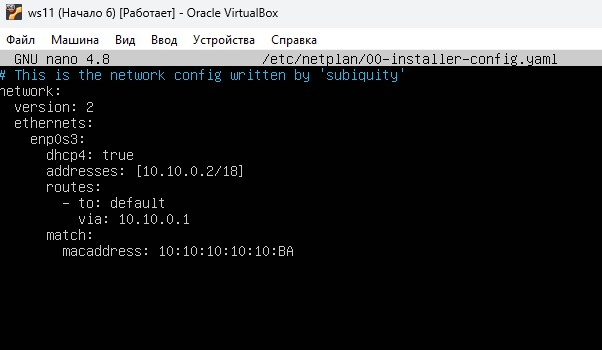

Аналогичная настройка сервера на r1:

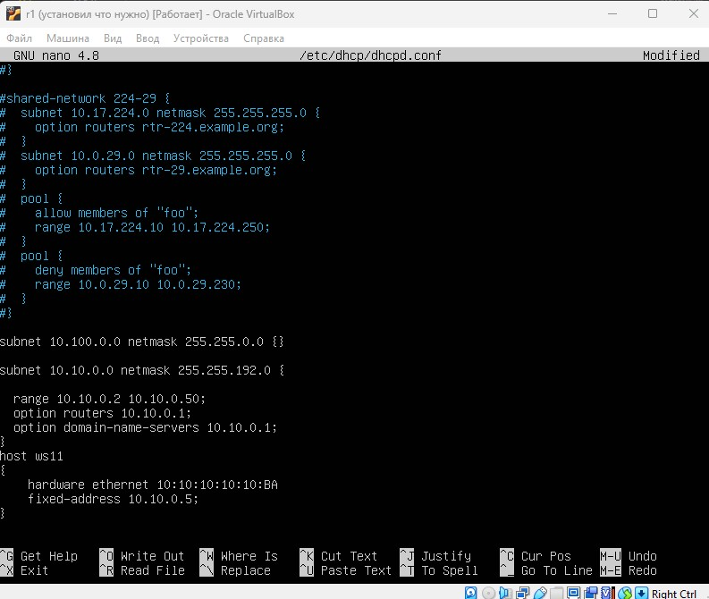
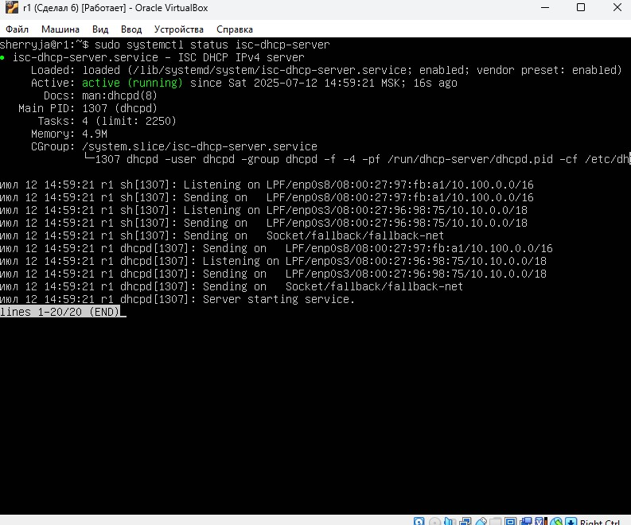

Обновление адреса на клиентах:

```bash
sudo dhclient -r enp0s3    # освободить текущий адрес
sudo dhclient -v enp0s3    # запросить новый
```

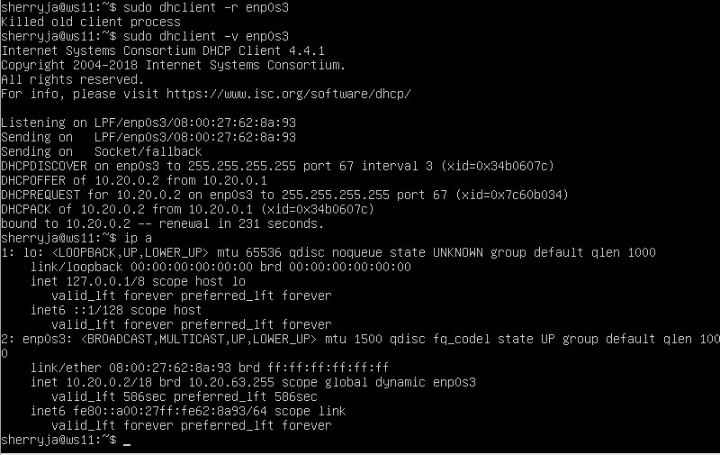
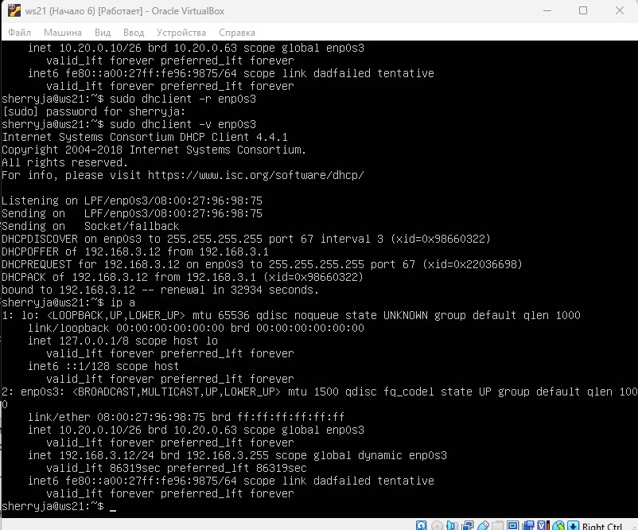

Связь после перехода на динамическую адресацию сохраняется:

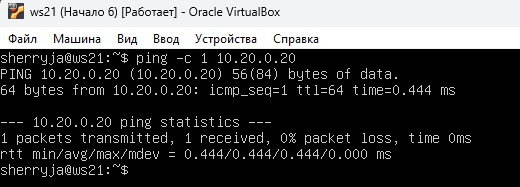

---

# Часть 7. Трансляция адресов

**NAT** подменяет IP-адрес в заголовке пакета. Меняться может адрес отправителя — тогда это **SNAT**, — или адрес получателя, тогда **DNAT**. Первый нужен, чтобы машины частной сети выходили наружу под одним адресом; второй — чтобы снаружи обращаться к машине, у которой собственного внешнего адреса нет.

Для проверки на r1 и на ws22 поднимается Apache. По умолчанию он слушает только локально, поэтому в `/etc/apache2/ports.conf` строка `Listen 80` заменяется на `Listen 0.0.0.0:80`:

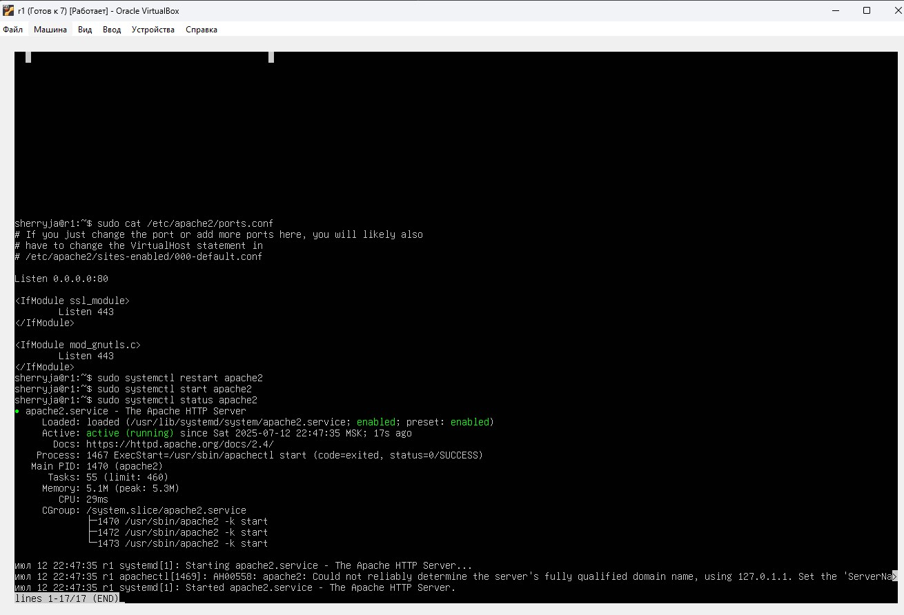
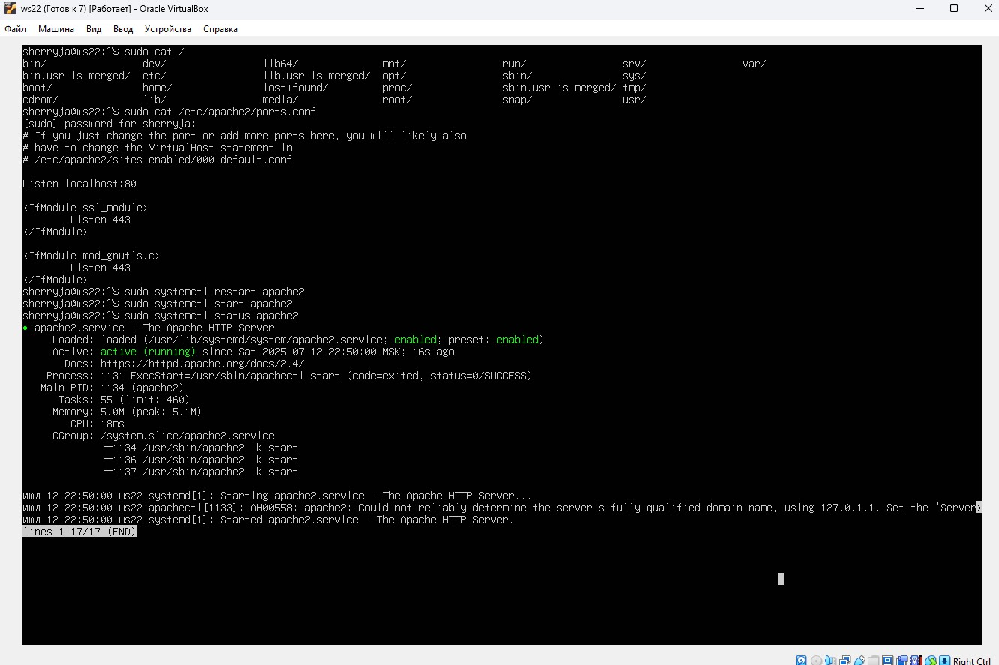

Правила сетевого экрана:

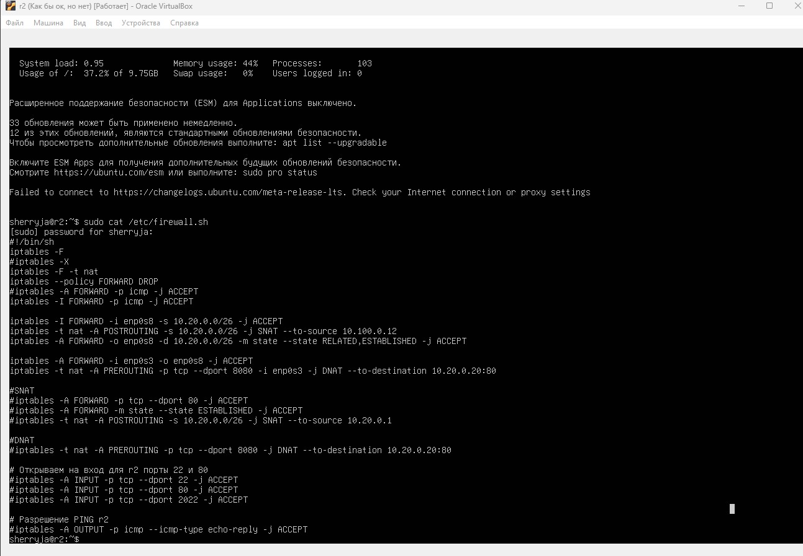

Первая проверка — пинг с ws22 до r1:

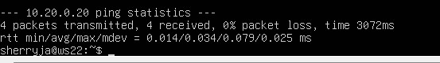

Добавляется правило, разрешающее маршрутизацию пакетов ICMP:

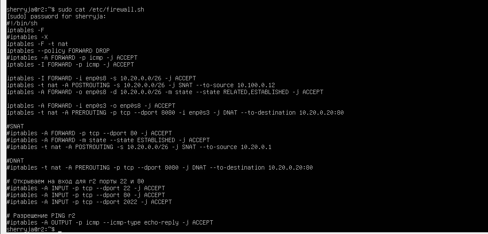
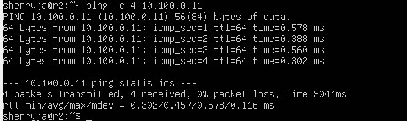

Затем включается SNAT — маскирование адресов локальной сети `10.20.0.0` за r2:

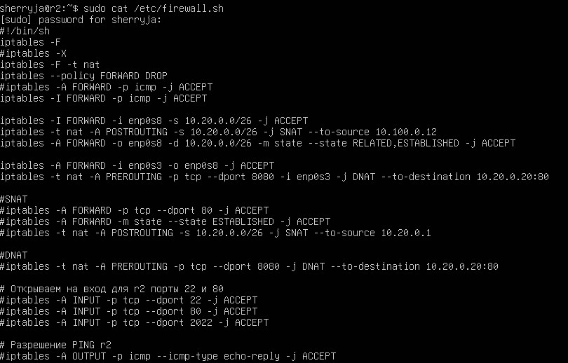

**Проверка SNAT.** С ws22 устанавливается TCP-соединение с Apache на r1:

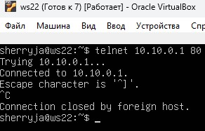

Соединение устанавливается и затем закрывается удалённой стороной. Это подтверждает работу SNAT: пакеты от ws22 маскируются адресом r2 и доходят до r1. Закрытие соединения сразу после установки — ожидаемое поведение: telnet не отправляет HTTP-запрос, и сервер разрывает связь по таймауту.

**Проверка DNAT.** С r1 устанавливается соединение с Apache на ws22 — но не по адресу ws22, а по адресу r2 и порту 8080:

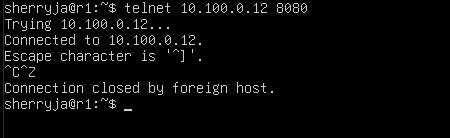

Соединение проходит, значит правило DNAT корректно перенаправляет порт 8080 на r2 в порт 80 на ws22. Машина ws22 при этом собственного адреса в сети r1 не имеет.

---

# Часть 8. SSH-туннели

Задача части — получить доступ к сервису, который намеренно закрыт от сети. На ws22 Apache перенастраивается на прослушивание только локального интерфейса: в `/etc/apache2/ports.conf` строка `Listen 80` заменяется на `Listen localhost:80`.

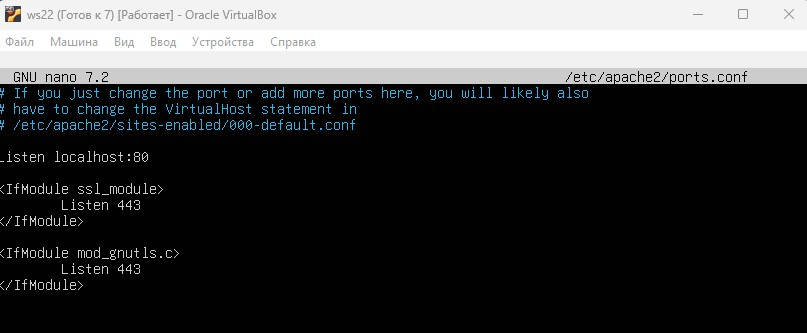
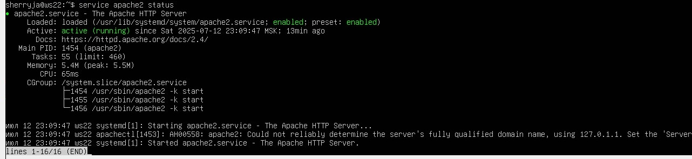

После этого напрямую с других машин веб-сервер недоступен — по замыслу.

## Local TCP forwarding

Туннель поднимается **с той машины, которой нужен доступ**. Порт 8080 на ws21 связывается с портом 80 на самой ws22 — с точки зрения Apache запрос приходит с localhost, что его и устраивает:

```bash
ssh -L 8080:localhost:80 10.20.0.20    # на ws21
telnet 127.0.0.1 8080
```

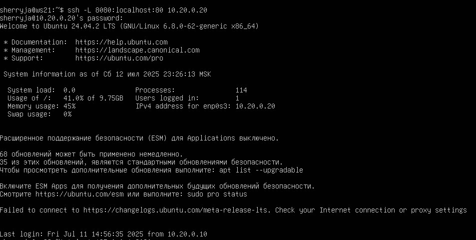
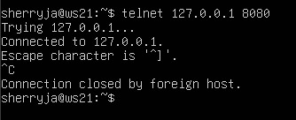

## Remote TCP forwarding

Обратный вариант: туннель открывается **с машины, где работает сервис**, и пробрасывает порт на удалённую сторону. Полезен, когда инициировать соединение может только та сторона, где сервис запущен.

```bash
ssh -R 8080:localhost:80 10.20.0.20
telnet 127.0.0.1 8080
```

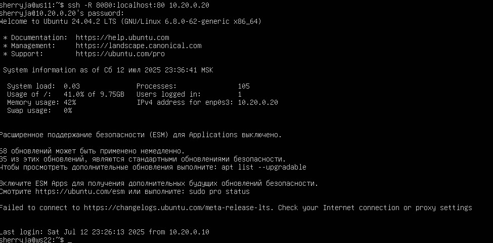
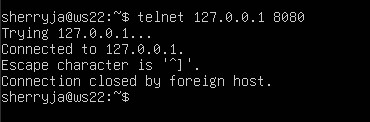

---

## Итоги

Собран стенд из пяти машин с двумя подсетями и двумя маршрутизаторами. Настроены статическая маршрутизация в обе стороны, фильтрация трафика, автоматическая раздача адресов, трансляция адресов в обе стороны и туннелирование поверх SSH. Каждый шаг подтверждён выводом команд диагностики.
