# Наблюдаемость кластера Docker Swarm

Отчёт о развёртывании стека мониторинга поверх приложения из семи микросервисов: сбор метрик и логов, визуализация, оповещения о критических событиях.

---

## Стенд

Три виртуальные машины Ubuntu 22.04, поднимаются из [Vagrantfile](./Vagrantfile) командой `vagrant up`:

| Узел | Адрес | Роль | Ресурсы |
|---|---|---|---|
| `manager01` | 192.168.56.10 | менеджер Swarm | 4 CPU / 4 ГБ |
| `worker01` | 192.168.56.11 | рабочий узел | 4 CPU / 4 ГБ |
| `worker02` | 192.168.56.12 | рабочий узел | 4 CPU / 4 ГБ |

Три машины нужны по существу задания: экспортёры запускаются в режиме `global`, по экземпляру на узел, и на одиночной машине нечем показать ни разделение метрик по узлам, ни распределение контейнеров по кластеру.

Каталог проекта монтируется на все три машины в `/home/vagrant/app`. На этом держатся две вещи: bind-mount конфигураций в compose-файлах и передача токена входа в кластер — менеджер кладёт его в `scripts/`, рабочие узлы оттуда читают.

Провижининг ставит Docker ([scripts/installdocker.sh](./scripts/installdocker.sh)), собирает кластер ([scripts/manager.sh](./scripts/manager.sh), [scripts/join.sh](./scripts/join.sh)) и настраивает `cron` для собственного экспортёра метрик. После подъёма последней машины триггер Vagrant выводит сводку по кластеру.

---

## Часть 1. Сбор метрик и логов

### 1. Кластер Docker Swarm

Оверлейная сеть создаётся до стеков и объявлена в compose-файлах как внешняя. Это обязательное условие: если бы её создавал сам стек, стек приложения и стек мониторинга получили бы каждый свою сеть и Prometheus не смог бы обращаться к микросервисам по именам.

```bash
docker network create --driver overlay --attachable hotel-overlay-net
docker stack deploy -c docker-compose.yml hotel-app
docker stack deploy -c docker-compose.portainer.yml portainer
docker stack deploy -c docker-compose.monitoring.yml monitoring
```

Последовательность собрана в [scripts/deploy.sh](./scripts/deploy.sh).

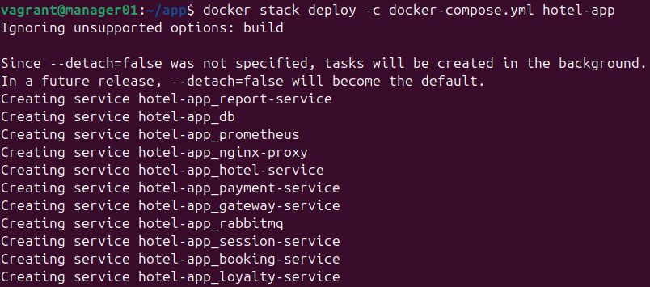
*Развёртывание стека `hotel-app`*

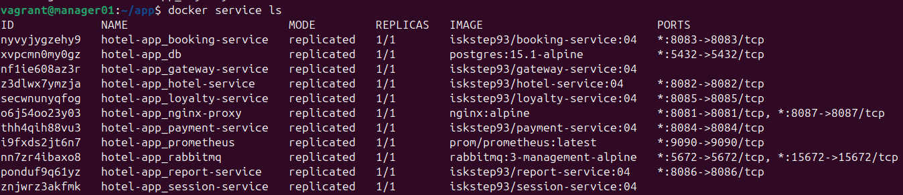
*Все сервисы приложения запущены*

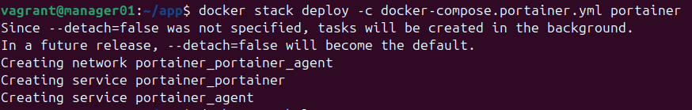
*Развёртывание стека Portainer*

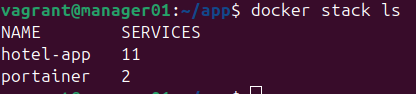
*Стеки, развёрнутые в кластере*

Portainer в задание не входит, но избавляет от переключений между узлами при разборе неполадок — вся раскладка контейнеров по машинам видна на одном экране.

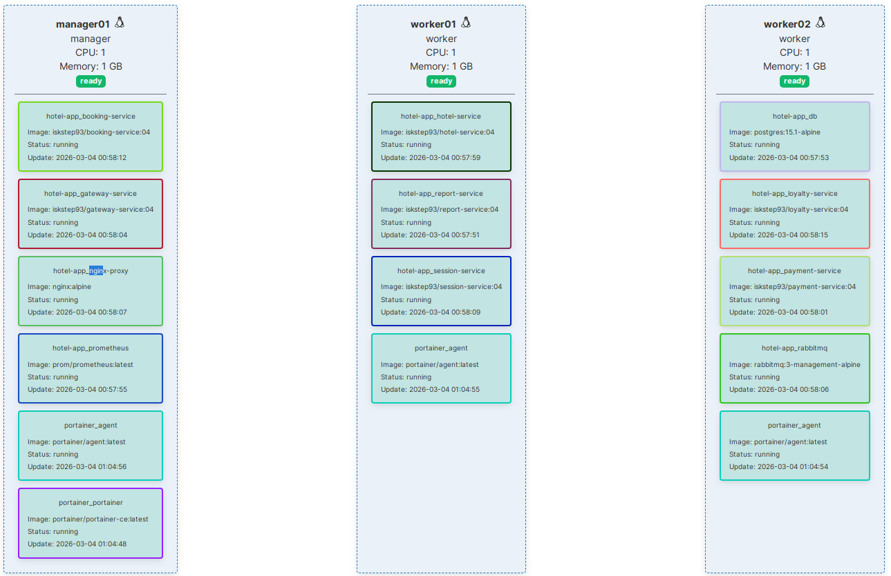
*Распределение контейнеров по узлам кластера*

### 2. Счётчики приложения на Micrometer

Метрики машин и контейнеров собирают готовые экспортёры, но величины, которые знает только приложение, приходится инструментировать в коде. Задание требует пять таких счётчиков; они распределены по четырём микросервисам из семи:

| Микросервис | Счётчик | Что считает |
|---|---|---|
| `booking-service` | `rabbitmq_sent_total` | отправленные в очередь сообщения |
| `booking-service` | `bookings_counter_total` | бронирования |
| `report-service` | `rabbitmq_processed_total` | обработанные из очереди сообщения |
| `gateway-service` | `gateway_requests_total` | запросы, пришедшие на шлюз |
| `session-service` | `authorization_requests_total` | запросы на авторизацию |

Пара «отправлено — обработано» выбрана не случайно: расхождение между этими двумя счётчиками показывает, что потребитель очереди отстаёт или не справляется. Одного счётчика для этого недостаточно.

Micrometer — фасад над системами сбора метрик: код приложения работает с его интерфейсом и ничего не знает о Prometheus. Подключение состоит из трёх частей.

**Зависимости в `pom.xml`.** Actuator открывает служебные эндпоинты, вторая зависимость учит его отдавать метрики в формате Prometheus по адресу `/actuator/prometheus`:

```xml
<dependency>
    <groupId>org.springframework.boot</groupId>
    <artifactId>spring-boot-starter-actuator</artifactId>
</dependency>
<dependency>
    <groupId>io.micrometer</groupId>
    <artifactId>micrometer-registry-prometheus</artifactId>
</dependency>
```

**Разрешение в `application.properties`:**

```properties
management.endpoints.web.exposure.include=*
management.endpoint.metrics.enabled=true
management.endpoint.prometheus.enabled=true
```

**Сам счётчик.** Реестр приходит через конструктор, счётчик создаётся один раз при старте, дальше только инкрементируется:

```java
import io.micrometer.core.instrument.Counter;
import io.micrometer.core.instrument.MeterRegistry;

private final Counter sentMessages;

public QueueProducer(MeterRegistry registry) {
    this.sentMessages = Counter.builder("rabbitmq_sent_total")
            .description("Количество отправленных сообщений в RabbitMQ")
            .register(registry);
}

public void send(String message) {
    // ...отправка в очередь...
    sentMessages.increment();
}
```

Суффикс `_total` здесь уместен: это counter, величина только растёт. Тип виден в выдаче эндпоинта.

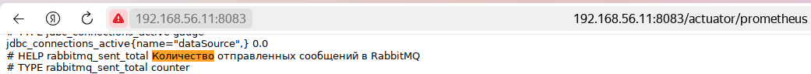
*`rabbitmq_sent_total` в выдаче `/actuator/prometheus` — с описанием и объявленным типом `counter`*

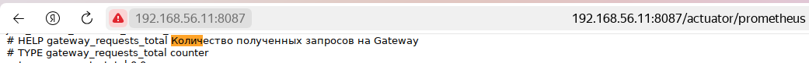
*Счётчик запросов на шлюзе*

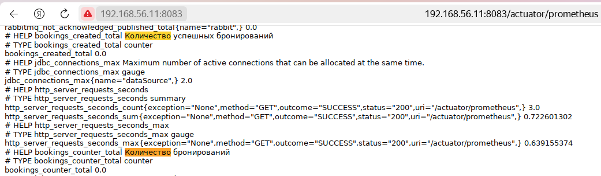
*Счётчики бронирований*

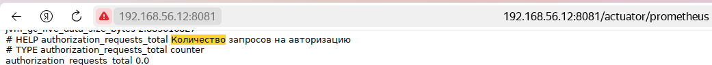
*Счётчик запросов на авторизацию*

Prometheus опрашивает эти четыре сервиса чаще остальных целей — раз в 5 секунд против общих 15. Счётчики приложения меняются рывками от действий пользователя, и при редком опросе короткие всплески на графике не видны.

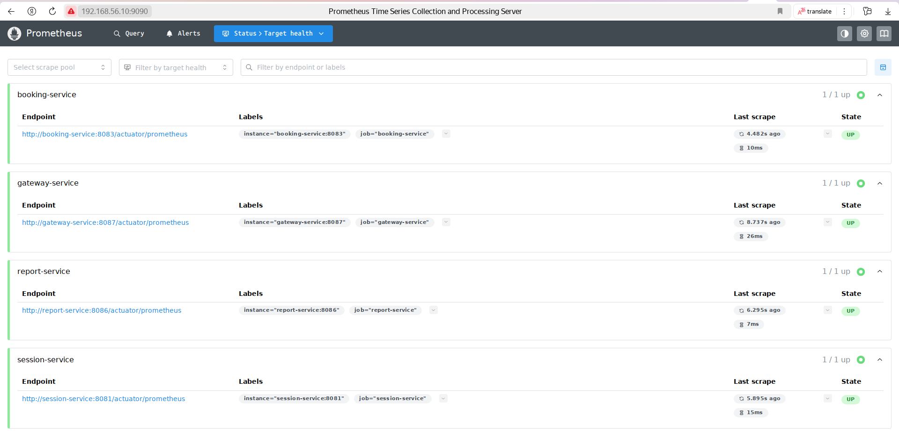
*Панель Target health: все четыре эндпоинта приложения доступны*

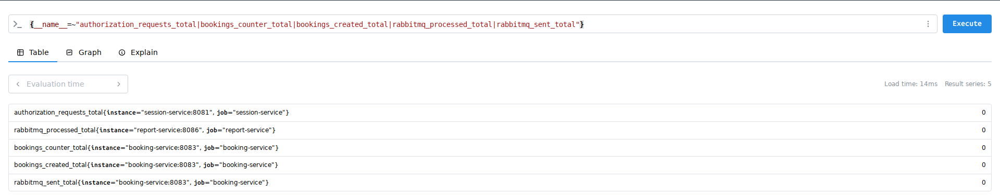
*Запрос ко всем счётчикам приложения сразу — метрики собраны, значения нулевые до подачи нагрузки*

### 3. Логи через Loki

Loki устроен иначе, чем привычные системы поиска по логам: полнотекстовый индекс не строится, индексируются только метки — контейнер, узел, стек, — а сами строки складываются сжатыми блоками. Отсюда экономность к диску и особенность запросов: сначала отбор по меткам, потом поиск внутри отобранного.

Сбор ведёт `promtail`. Список контейнеров ему не задан: агент обнаруживает их сам через сокет Docker и перечитывает каждые 5 секунд, поэтому новый контейнер попадает в сбор без правки конфигурации и перезапуска.

Правило `relabel` отрезает ведущий слеш от имени контейнера — Docker отдаёт имена в виде `/booking-service`, и без обработки метка выглядела бы в Grafana как `/booking-service`.

Конфигурации: [loki-config.yml](./loki-config.yml), [promtail-config.yml](./promtail-config.yml).

На этом шаге Loki, Promtail и Grafana собирались отдельным промежуточным стеком — заготовкой, которая на следующем шаге вошла в общий стек мониторинга целиком.

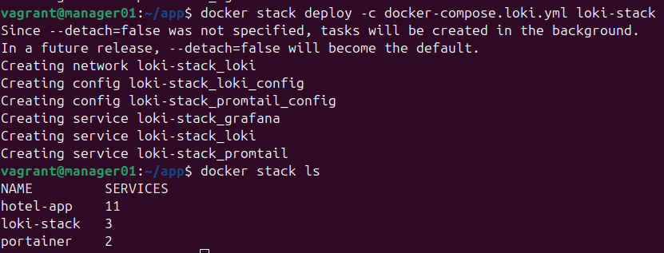
*Развёртывание сервисов сбора логов*

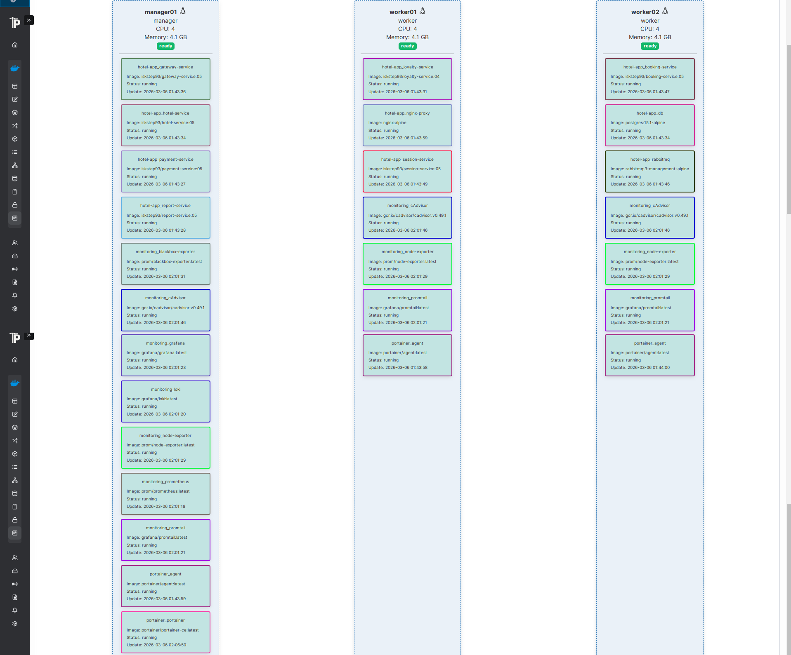
*Раскладка по узлам: `cAdvisor`, `node-exporter` и `promtail` присутствуют на всех трёх машинах, Prometheus, Grafana, Loki и Blackbox — только на менеджере*

Этот снимок показывает результат решений о размещении. Сервисы сбора запущены в режиме `global` — они читают состояние своего узла, и на другой машине их данные бесполезны. Сервисы хранения закреплены за менеджером: их тома локальные, переезд контейнера означал бы потерю накопленного.

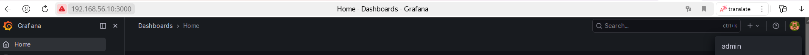
*Grafana доступна на порту 3000*

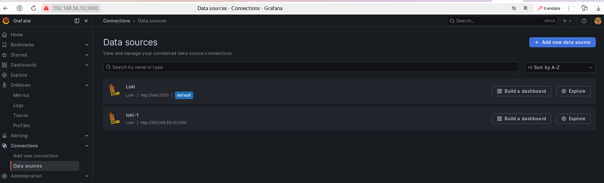
*Стартовый экран*

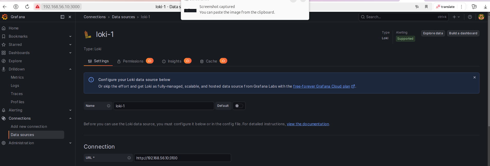
*Добавление Loki как источника данных*

Источник данных сначала добавлялся вручную через интерфейс. Позже описание источника было перенесено в подмену `entrypoint` контейнера Grafana: файл провижининга создаётся до её старта, и после развёртывания стенда никаких ручных действий не требуется.

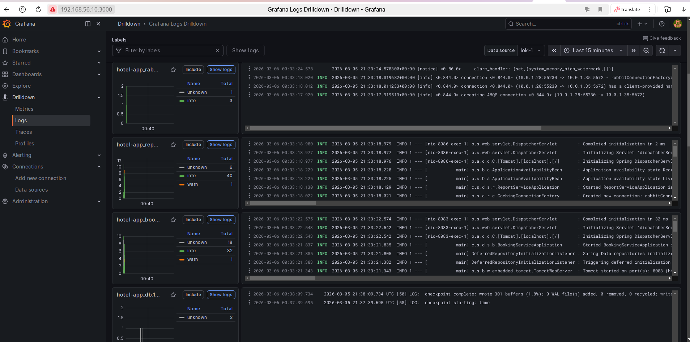
*Логи контейнеров доступны для запросов*

### 4. Стек мониторинга

Промежуточный стек заменён общим — [docker-compose.monitoring.yml](./docker-compose.monitoring.yml) на восемь сервисов:

| Сервис | Порт | Режим | Что делает |
|---|---|---|---|
| `prometheus` | 9090 | менеджер | опрос целей, хранение рядов, расчёт правил |
| `grafana` | 3000 | менеджер | дашборды поверх Prometheus и Loki |
| `loki` | 3100 | менеджер | хранилище логов |
| `alertmanager` | 9093 | менеджер | маршрутизация оповещений |
| `blackbox-exporter` | 9115 | менеджер | проверка доступности адресов |
| `node-exporter` | 9100 | global | метрики машин |
| `cAdvisor` | 8080 | global | метрики контейнеров |
| `promtail` | — | global | сбор логов |

**Конфигурации доставляются двумя разными способами, и это не непоследовательность.** Prometheus и Blackbox получают файлы через `volumes`, остальные — через `configs` Swarm. Bind-mount требует, чтобы файл физически лежал на узле, куда попал контейнер: для сервисов, закреплённых за менеджером, это допустимо, а для `promtail` с `mode: global` — нет. Поэтому у него, Loki и Alertmanager содержимое конфигурации хранится в самом Swarm и раздаётся на узлы.

**Проверка доступности снаружи устроена наизнанку.** Prometheus опрашивает не проверяемый адрес, а `blackbox_exporter`, передавая ему цель параметром запроса. Этим заняты три правила `relabel_configs` в [prometheus/prometheus.yml](./prometheus/prometheus.yml): адрес цели кладётся в параметр `target`, сохраняется как метка `instance`, а фактическим адресом опроса становится сам экспортёр. Без последнего правила Prometheus пошёл бы на google.com напрямую и получил HTML вместо метрик.

**Узлы опрашиваются по адресам, а не по имени сервиса.** `node_exporter` запущен в трёх экземплярах; обращение по имени сервиса Swarm балансировалось бы между ними, и Prometheus видел бы одну цель вместо трёх, потеряв разделение метрик по узлам.

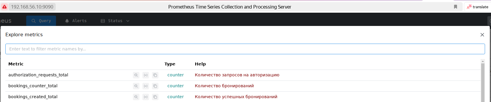
*Метрики доступны для запросов*

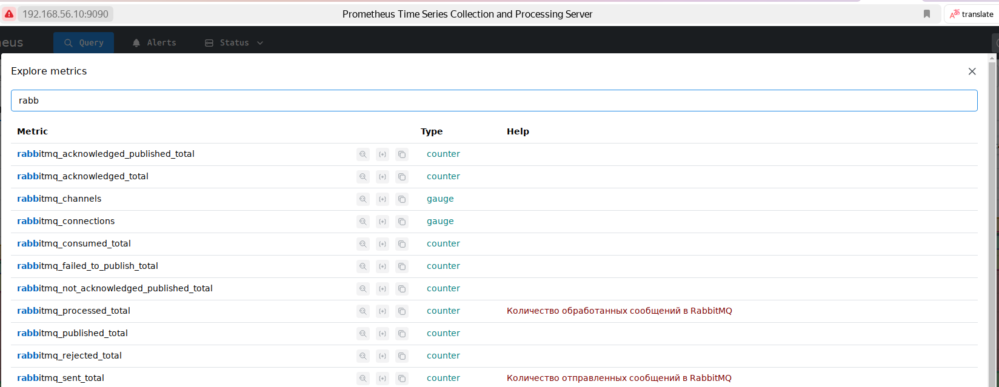
*Grafana в составе общего стека мониторинга*

#### Собственный экспортёр метрик

Количество контейнеров и образов на узле не отдаёт ни один из подключённых экспортёров. Писать для этого отдельный сервис не понадобилось: `node_exporter` умеет отдавать вместе со своими метриками содержимое файлов из каталога, заданного ключом `--collector.textfile.directory`.

Достаточно раз в минуту перезаписывать текстовый файл в формате экспозиции — [scripts/swarm-metrics.sh](./scripts/swarm-metrics.sh), 20 строк на bash:

```
# HELP swarm_containers_running Количество запущенных контейнеров
# TYPE swarm_containers_running gauge
swarm_containers_running 12
```

Запись идёт во временный файл с последующим `mv`. Переименование в пределах файловой системы атомарно, поэтому `node_exporter` никогда не прочитает файл наполовину записанным. Прямая запись такую гонку допускает, и при опросе раз в 15 секунд против записи раз в минуту она рано или поздно случилась бы.

Обновление поставлено в `cron`, а не выполняется по запросу: `node_exporter` только читает готовый файл и ничего не запускает, поэтому обновлять его должен кто-то со стороны.

---

## Часть 2. Визуализация

Grafana развёрнута ещё на предыдущем шаге и вошла в общий стек. Источник данных Loki описан провижинингом, Prometheus добавлен вторым источником.

Дашборд собран из 15 панелей, сохранён в [grafana/Grafana.json](./grafana/Grafana.json) и пригоден к импорту.

Часть величин читается напрямую, но большинство приходится вычислять.

| Панель | Запрос |
|---|---|
| Количество нод | `sum(up{job="node_exporter"})` |
| Количество контейнеров | `sum(swarm_containers_running{job="node_exporter"})` |
| Количество стеков | `count(count by (container_label_com_docker_stack_namespace) (container_last_seen{container_label_com_docker_stack_namespace!=""}))` |
| Использование CPU по сервисам | `sum by (container_label_com_docker_swarm_service_name) (rate(container_cpu_usage_seconds_total{container_label_com_docker_swarm_service_name!=""}[5m])) * 100` |
| Использование CPU по ядрам и узлам | `100 - (avg by (instance) (rate(node_cpu_seconds_total{mode="idle"}[5m])) * 100)` |
| Затраченная RAM | `sum(container_memory_working_set_bytes{job="cAdvisor"}) / 1024 / 1024 / 1024` |
| Доступная и занятая память | `node_filesystem_size_bytes{mountpoint="/", fstype="ext4"} / 1024 / 1024` и разность с `node_filesystem_avail_bytes` |
| Количество CPU | `sum(machine_cpu_cores)` |
| Доступность google.com | `probe_success{instance="https://www.google.com"}` |
| Счётчики приложения (5 панелей) | `rabbitmq_sent_total`, `rabbitmq_processed_total`, `bookings_counter_total`, `gateway_requests_total`, `authorization_requests_total` |
| Логи приложения | `{container!=""} \| line_format` |

Три решения стоит пояснить отдельно.

**Загрузка процессора вычисляется, а не читается.** Готовой метрики «процент занятости» нет ни у `node_exporter`, ни у `cAdvisor` — оба отдают накопленное процессорное время счётчиком, который только растёт. `rate` превращает его в скорость роста: секунды процессорного времени в секунду реального. Для контейнеров это умножается на 100, для узлов берётся доля простоя и вычитается из ста.

**Нагрузка группируется по сервису, а не по контейнеру.** У сервиса с несколькими репликами нагрузка должна считаться суммарно, иначе панель показывала бы отдельную линию на каждую реплику. Группировка идёт по метке `container_label_com_docker_swarm_service_name`, которая появляется в метриках только благодаря ключу `--store_container_labels=true` у cAdvisor. На этих же метках держится подсчёт стеков.

**Доступность отображается текстом.** `probe_success` возвращает 1 или 0. Через «edit value mappings» единица подписывается как «доступен» — на панели состояния число само по себе ничего не сообщает читателю.

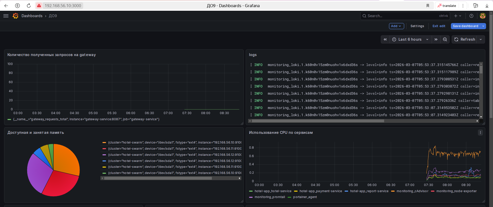
*Счётчики приложения, логи, память и нагрузка по сервисам*

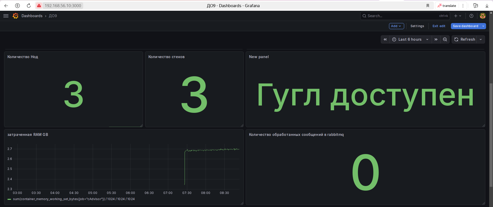
*Метрики узлов кластера*

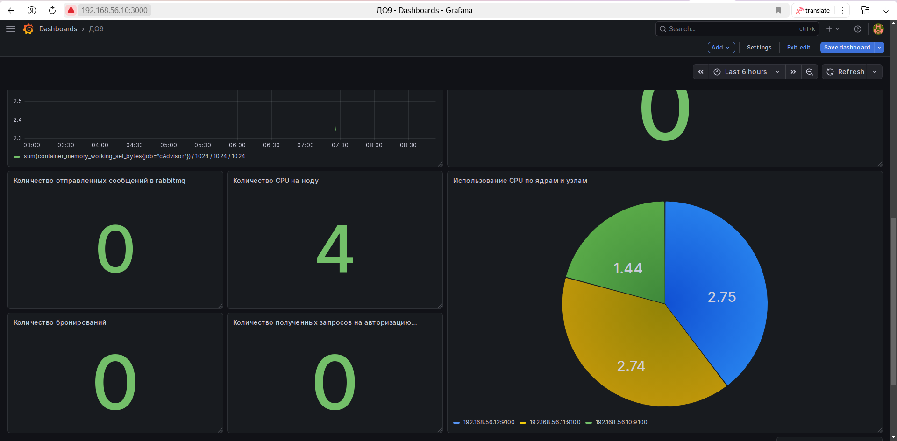
*Оставшиеся панели дашборда*

---

## Часть 3. Отслеживание критических событий

### Правила

Alertmanager развёрнут в составе общего стека. Prometheus пересчитывает правила из [prometheus/alert.rules.yml](./prometheus/alert.rules.yml) каждые 15 секунд и передаёт сработавшие ему.

Задание требует три события: доступная память меньше 100 Мб, затраченная контейнерами RAM больше 1 Гб, использование CPU сервисом выше 10%.

Условие `for: 30s` в каждом правиле означает, что алерт уходит не при первом же превышении, а только если условие держится полминуты. Без этого короткий всплеск нагрузки давал бы уведомление, за которым ничего не стоит.

Правила переписывались по ходу работы. В первом варианте нагрузка на память бралась из `container_memory_usage_bytes`, а CPU считался по каждому контейнеру отдельно. Итоговый вариант использует `container_memory_working_set_bytes` — это «рабочий набор», память, которую ядро не может освободить без свопа. Именно по ней срабатывает OOM killer, поэтому она точнее отражает риск, чем общее потребление, куда входит и переиспользуемый кеш.

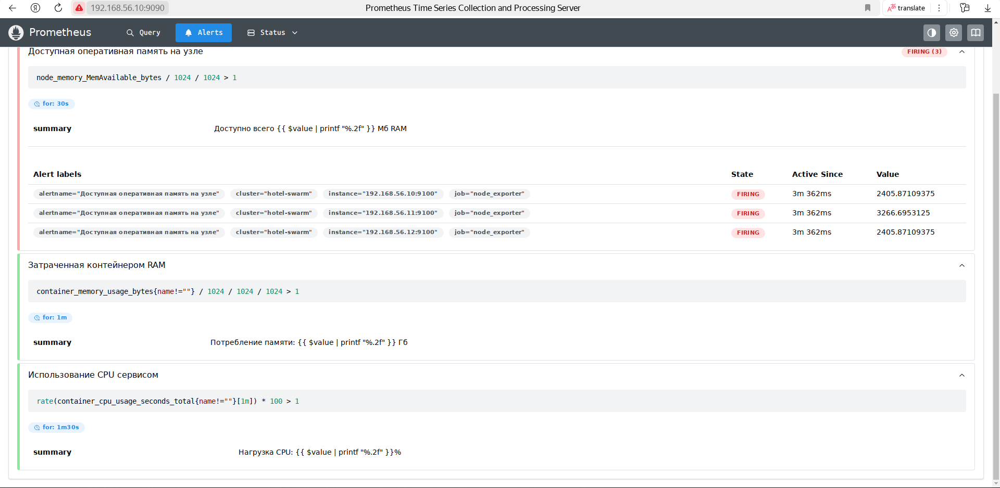
*Ранний вариант правил: алерт по памяти сработал сразу на всех трёх узлах*

Этот снимок показывает и причину группировки в Alertmanager. Правило по памяти относится к узлу, узлов три, и одно событие породило три одинаковых алерта, различающихся только меткой `instance`. Настройка `group_by: ['alertname']` схлопывает их в одно сообщение.

### Доставка

Маршрутизация описана в [alertmanager.yml](./alertmanager.yml), оформление сообщений — в [my_template.tmpl](./my_template.tmpl). Оба канала, Telegram и почта, объединены в один receiver: отдельных правил маршрутизации для этого не требуется.

Шаблон обслуживает и срабатывание, и отбой — Alertmanager вызывает его в обоих случаях, а различает их поле `.Status`. Без ветки `else` отбой приходил бы с тем же текстом, что и авария.

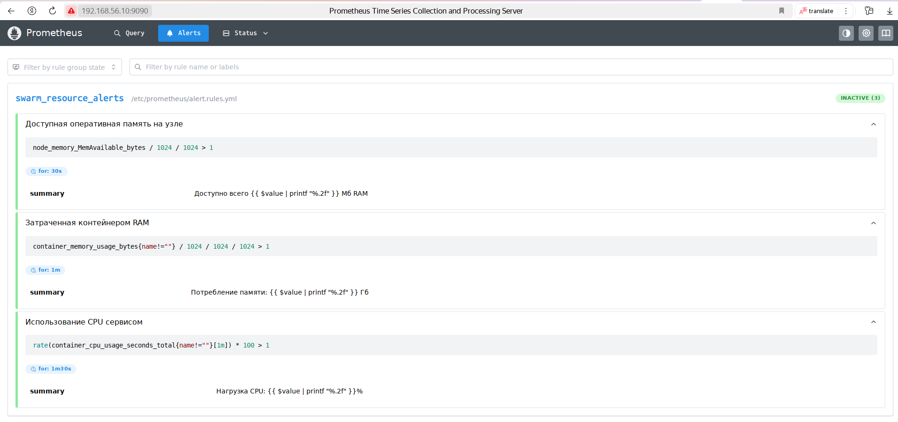
*Состояние правил после пересборки стека*

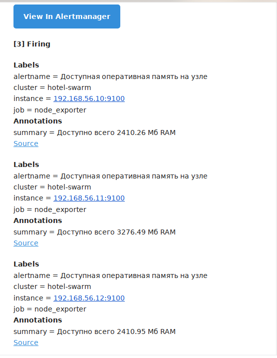
*Письмо доставлено, но попало в папку спама*

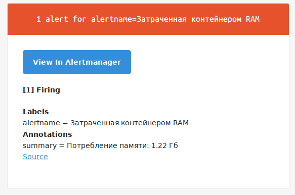
*Уведомление о срабатывании*

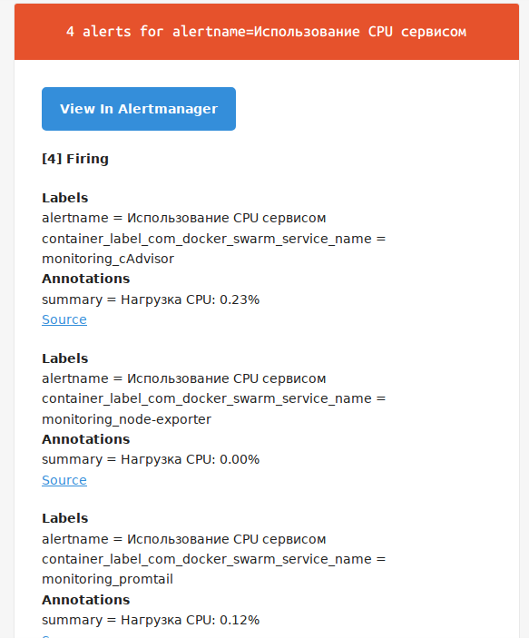
*Уведомление о срабатывании*

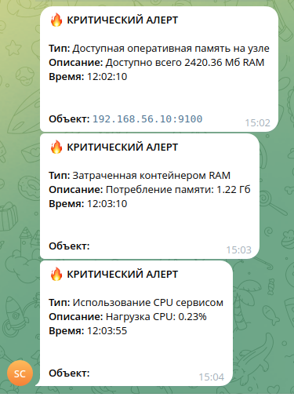
*Все три события в Telegram: тип, описание с подставленным значением, время и объект*

Сообщения показывают, что подстановка значений в шаблон работает: в тексте оказываются и вычисленная величина, и адрес узла, к которому она относится.

### О порогах

Дождаться реального падения свободной памяти ниже 100 Мб на трёх машинах, которые почти ничего не делают, невозможно. Убедиться же, что цепочка «правило → Alertmanager → шаблон → канал доставки» работает, было необходимо, поэтому на время проверки пороги занижались до заведомо истинных.

Снимок с уведомлениями показывает результат: алерт о памяти сообщает «доступно 2420 Мб», алерт о CPU — «нагрузка 0.23%». Обе величины далеки от аварийных, сработали именно тестовые условия. Третий алерт, о потреблении RAM, сработал по настоящему порогу: 1.22 Гб действительно превышают гигабайт.

В опубликованной версии пороги приведены к условиям задания, а тестовые значения оставлены комментарием рядом с каждым правилом — вместе с объяснением, зачем они занижались.

---

## Проверка конфигурации

Стек проверялся не только по внешнему поведению, но и штатными инструментами самих сервисов. Проверки нашли то, что не видно при работающем стенде.

| Проверка | Что нашлось |
|---|---|
| `promtool check config` | конфигурация верна, файл правил находится |
| `promtool check rules` | три правила разбираются; русские имена алертов допустимы |
| `promtool check metrics` | **имена метрик собственного экспортёра нарушали соглашение** |
| `amtool check-config` | конфигурация верна, шаблон подключается |
| `docker compose config` | **один из промежуточных compose-файлов не собирался** |
| `nginx -t` | конфигурация прокси верна |

**Имена метрик.** Первый вариант экспортёра отдавал `swarm_containers_total` и `swarm_images_total`. По соглашению Prometheus суффикс `_total` закреплён за типом counter — величиной, которая только растёт. Обе эти метрики — gauge, они могут и убывать. Имена исправлены на `swarm_containers` и `swarm_images`; метрики приложения переименования не требуют, там `_total` стоит у настоящих счётчиков.

**Промежуточный compose-файл.** Заготовка стека сбора логов объявляла сервис в сети `hotel-overlay-net`, не описав её в секции `networks`. Файл был вытеснен общим стеком мониторинга ещё в ходе работы и в публикацию не вошёл — соответствующий шаг описан выше словами.

**Об относительном пути к правилам.** Запись `rule_files: - "alert.rules.yml"` выглядит ненадёжной: рабочий каталог процесса в контейнере не совпадает с каталогом конфигурации. Проверка показала, что путь разрешается относительно каталога самого файла конфигурации, а оба файла монтируются в `/etc/prometheus`, — правила находятся.

Порядок разбора конфигураций после комментирования сверялся с исходным: `docker compose config` для всех compose-файлов и разобранный YAML для `prometheus.yml` совпадают побайтово.

---

## Итоги

Стек работает целиком. Метрики собираются с трёх уровней: машины отдают их через `node_exporter`, контейнеры — через `cAdvisor`, приложение — через собственные счётчики на Micrometer. Логи всех контейнеров доходят до Loki и доступны для запросов рядом с метриками. Дашборд отображает все пятнадцать показателей из задания. Правила срабатывают, уведомления приходят обоими каналами с подставленными значениями.

Главный результат — понимание, что экспортёр метрик не обязан быть программой. Prometheus не различает, кто на другом конце: сложный сервис, который что-то считает, или текстовый файл в известном формате, отданный чужим экспортёром. Задача сводится к тому, чтобы величина оказалась в нужном формате по доступному адресу, и решать её стоит самым дешёвым из подходящих способов.

Второе — что почти ни одна интересная величина не читается напрямую. Занятость процессора, отставание очереди, доступность сервиса снаружи, количество стеков — всё это вычисляется из более простых показателей, а иногда и из меток, которые нужно заранее попросить собрать. Наблюдаемость держится не столько на сборе, сколько на умении задать правильный запрос к собранному, и решения о том, что именно собирать, принимаются задолго до первого запроса.
