# Docker Compose и Docker Swarm

Отчёт по трём частям: запуск приложения из семи микросервисов через Docker Compose, перенос исходного кода в виртуальную машину и развёртывание в кластере Docker Swarm.

Приложение — система бронирования отелей: семь сервисов на Spring Boot, PostgreSQL и RabbitMQ.

| Сервис | Порт | Роль |
|---|---|---|
| `session-service` | 8081 | авторизация |
| `hotel-service` | 8082 | справочник отелей |
| `booking-service` | 8083 | бронирования |
| `payment-service` | 8084 | платежи |
| `loyalty-service` | 8085 | бонусы |
| `report-service` | 8086 | статистика |
| `gateway-service` | 8087 | маршрутизация на остальные |

---

## Часть 1. Запуск через Docker Compose

Работа начинается с сервисов, которые не требуют сборки, — PostgreSQL и RabbitMQ. Они описываются в [docker-compose.yml](./docker-compose.yml) первыми, чтобы к моменту запуска микросервисов база и очередь уже поднимались.

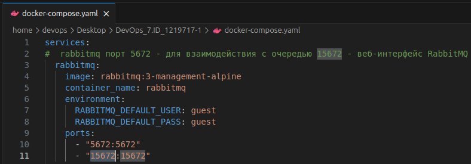
*Описание сервиса RabbitMQ*


*Контейнер запущен*

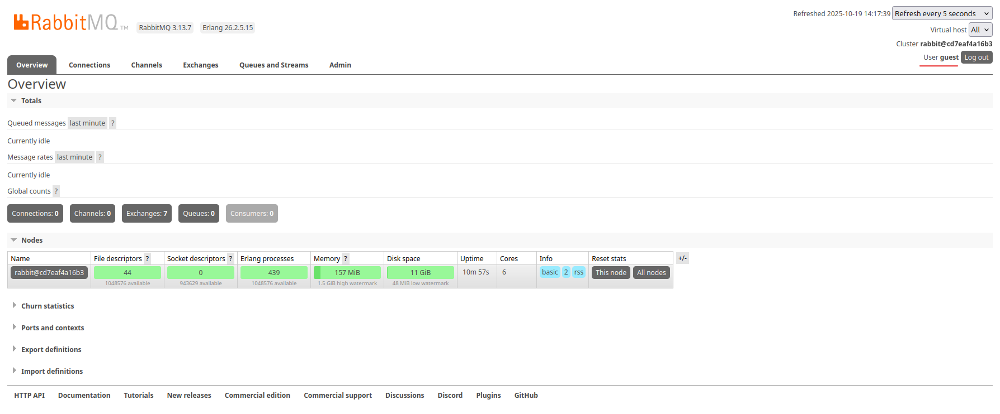
*Панель управления брокером доступна*

Далее PostgreSQL:

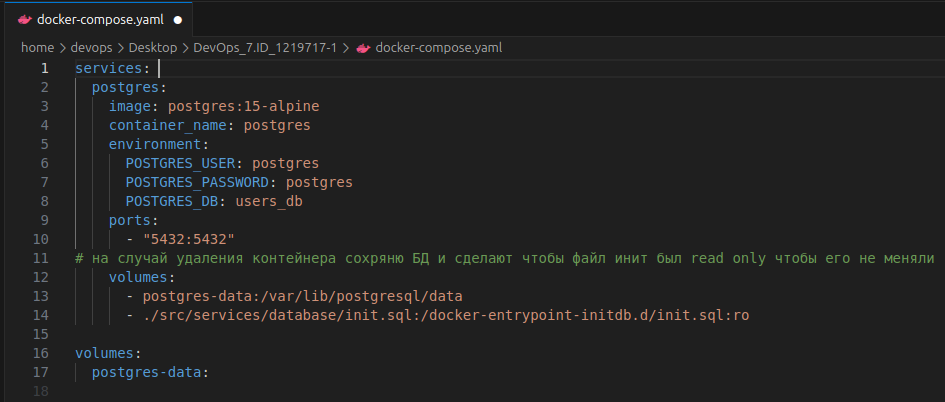
*Описание сервиса базы данных*

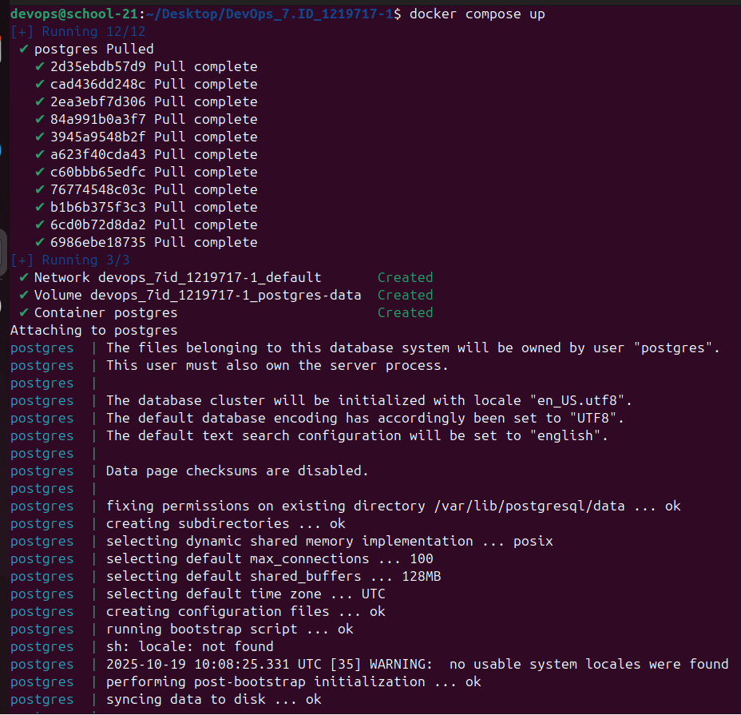
*Запуск контейнера с базой*

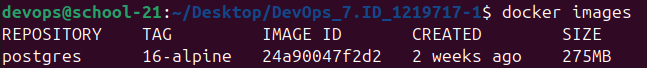
*Образ базы загружен*

Подключение к базе изнутри контейнера — командой из [postgres.sh](./postgres.sh):

```bash
docker exec -it postgres psql -h localhost -p 5432 -U postgres -d postgres
```

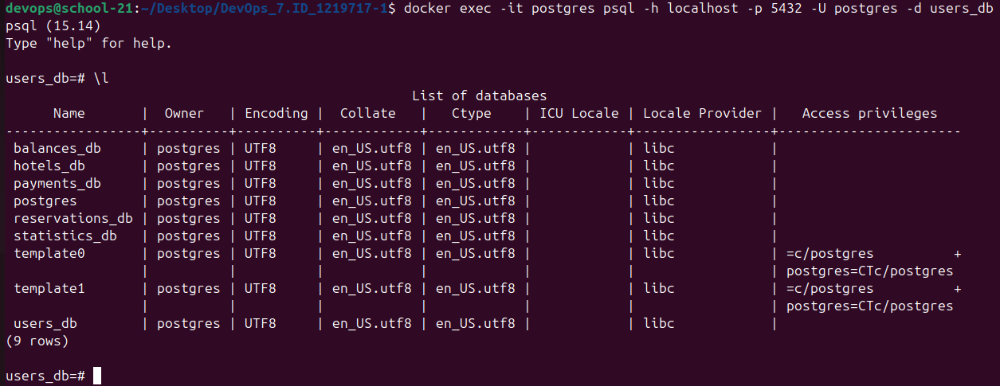
*Подключение выполнено, база отвечает*

### Образы микросервисов

Для каждого микросервиса пишется свой Dockerfile, после чего сервис добавляется в общее описание и проверяется по своему порту.

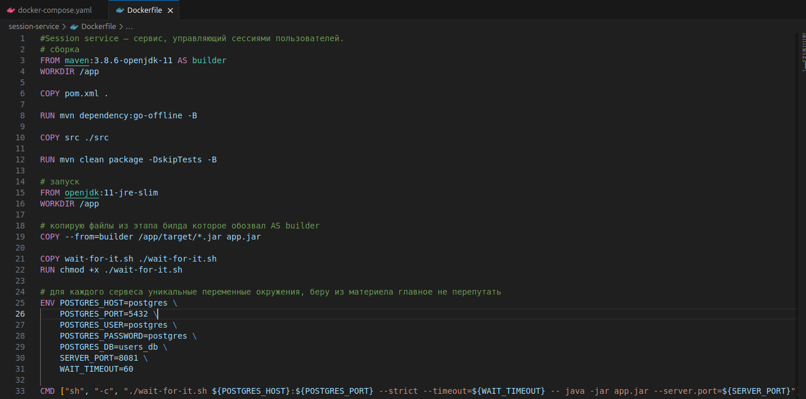
*Dockerfile для session-service*

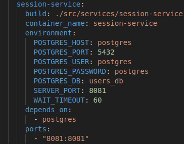
*Сервис добавлен в docker-compose.yml*

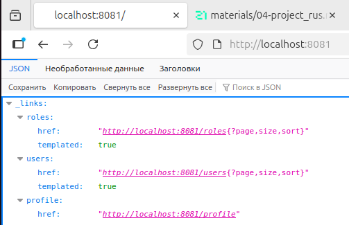
*session-service отвечает на 8081*

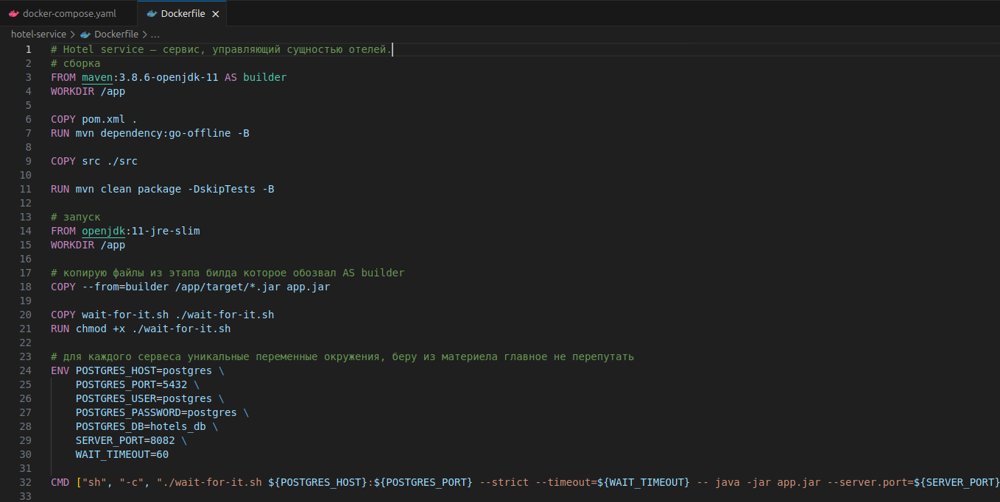
*Dockerfile для hotel-service*

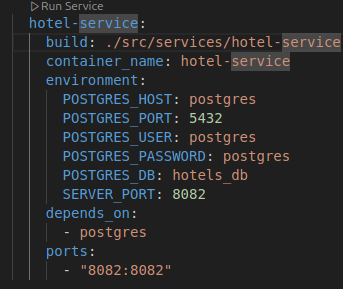
*Сервис добавлен в описание*

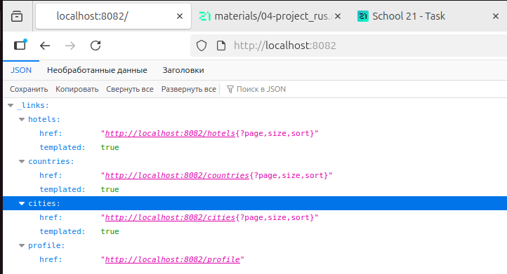
*hotel-service отвечает на 8082*

Остальные сервисы собираются по тому же образцу и проверяются так же — по своему порту.

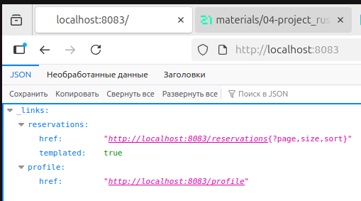
*booking-service отвечает на 8083*


*payment-service отвечает на 8084*


*loyalty-service отвечает на 8085*

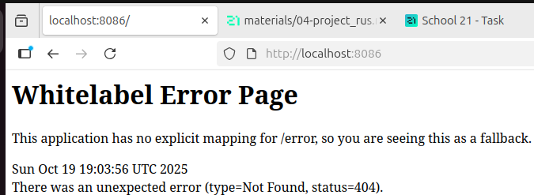
*report-service отвечает на 8086*

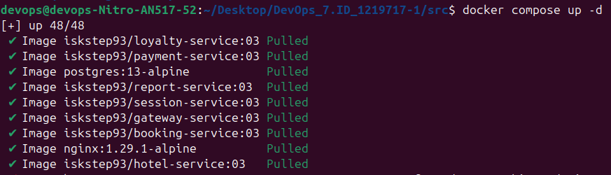
*Сборка образа*

### Обратный прокси

Публиковать порты всех девяти контейнеров наружу не требуется: снаружи нужны только две точки входа — авторизация и шлюз. Их закрывает nginx, описанный в [nginx/nginx.conf](./nginx/nginx.conf).

Существенная деталь конфигурации — директива `resolver`:

```nginx
resolver 127.0.0.11 valid=10s;
```

Без неё nginx разрешает имена сервисов один раз при старте и запоминает полученные адреса навсегда. В Docker адрес контейнера меняется при каждом пересоздании, поэтому после перезапуска любого сервиса прокси продолжал бы обращаться по адресу, которого уже нет. Значение `127.0.0.11` — встроенный DNS-сервер Docker, `valid=10s` ограничивает время жизни записи в кеше.

Функциональные тесты приложения проходят через прокси:

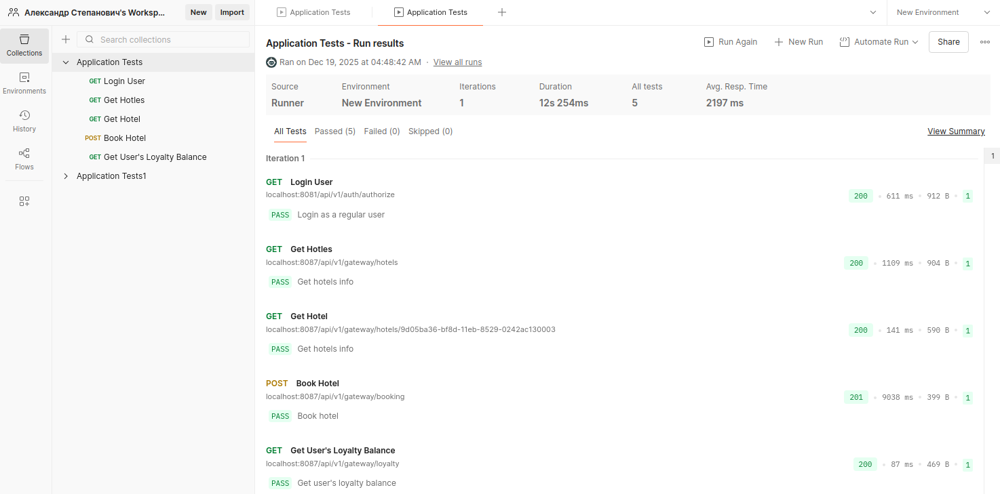
*Прогон тестов: авторизация, список отелей, бронирование, баланс бонусов*

---

## Часть 2. Виртуальная машина

Задача части — перенести исходный код в виртуальную машину и убедиться, что он там оказался. Стенд описывается в [part2/Vagrantfile-p2](./part2/Vagrantfile-p2): одна машина Ubuntu 22.04, 2 ядра, 3 ГБ памяти.

### Конфликт гипервизоров

Перед первым запуском на Linux требуется разрешить конфликт виртуализации. VirtualBox и KVM — два разных гипервизора, и оба требуют эксклюзивного доступа к аппаратной виртуализации процессора (Intel VT-x или AMD-V). Одновременно они не работают.

Проверка и выгрузка модулей собраны в [vagrant.sh](./vagrant.sh):

```bash
lsmod | grep kvm
sudo modprobe -r kvm_intel kvm
```

После этого VirtualBox запускается, но машины KVM перестают работать до перезагрузки модулей.

### Перенос кода

Каталог с исходниками монтируется в машину директивой `synced_folder`, провижининг ставит `tree` и выводит структуру каталогов.

```bash
vagrant up
vagrant ssh
tree -L 3 -C
```

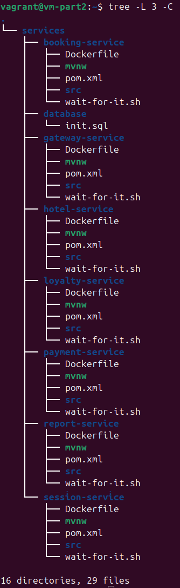
*Семь сервисов с Dockerfile и pom.xml на месте — перенос выполнен*

```bash
vagrant halt
vagrant destroy
```

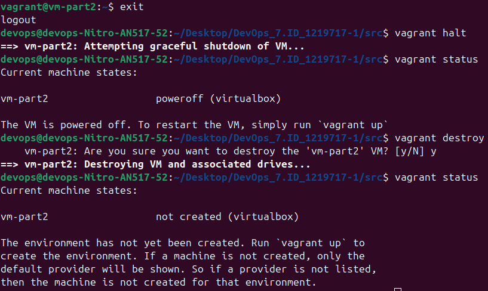
*Остановка и удаление машины*

### Замечание о пути

Относительные пути в `synced_folder` Vagrant разрешает от каталога, где лежит сам Vagrantfile, а не от текущего рабочего каталога. В сданной работе файл находился в корне проекта рядом с каталогом исходников, и путь `./services/` был верным — что и подтверждает скриншот выше.

При переносе файла в отдельный каталог `part2/` путь остался прежним и стал указывать на несуществующий `part2/services/`. Ошибка при этом не появилась бы: ключ `create: true` заставляет Vagrant создать отсутствующий каталог и смонтировать его пустым. Машина поднимется, `tree` отработает, переносить будет нечего — и всё это без единого предупреждения.

В опубликованной версии путь приведён в соответствие с новым расположением файла: `../services/`.

---

## Часть 3. Docker Swarm

### Стенд

Кластер из трёх машин описан в [Vagrantfile](./Vagrantfile): менеджер `192.168.56.10` и два рабочих узла `.11` и `.12`, по одному ядру и гигабайту памяти на каждый.

Провижининг разложен по четырём скриптам в [scripts/](./scripts):

| Скрипт | Что делает |
|---|---|
| `installdocker.sh` | ставит Docker Engine, выполняется на всех трёх машинах |
| `manager.sh` | инициализирует Swarm и сохраняет токен для рабочих узлов |
| `join.sh` | вводит рабочий узел в кластер |
| `check-swarm.sh` | выводит сводку: узлы, сервисы, сети |

Три решения в этих скриптах заслуживают пояснения.

**Проверка перед инициализацией.** Провижининг запускается заново при каждом `vagrant up` остановленной машины, а `docker swarm init` на уже собранном кластере завершается ошибкой. С `set -e` это уронило бы весь подъём стенда, поэтому состояние проверяется заранее:

```bash
if docker info | grep -q "Swarm: active"; then
  echo "[INFO] Swarm уже активен"
else
  docker swarm init --advertise-addr 192.168.56.10
fi
```

**Явное указание адреса.** У машины Vagrant два сетевых интерфейса — NAT и приватная сеть стенда. Без `--advertise-addr` Swarm выбирает адрес сам и нередко берёт NAT-овский, по которому соседние узлы до менеджера не достучатся.

**Передача токена через общую папку.** Порядок подъёма машин Vagrant не гарантирует, поэтому рабочий узел не ходит на менеджер по SSH, а ждёт появления файла с токеном в смонтированном каталоге — до 60 секунд. Проверяется и существование файла, и его непустота:

```bash
if [ -f "$TOKEN_PATH" ] && [ -s "$TOKEN_PATH" ]; then
```

Вторая проверка не лишняя: менеджер создаёт файл перенаправлением вывода, и пустой файл появляется раньше, чем в него попадает токен. Без `-s` узел прочитал бы пустую строку и попытался войти в кластер с ней.

Сам файл токена в репозиторий не выкладывается — он создаётся заново при каждом подъёме стенда.

### Образы в реестре

Узлы кластера образы не собирают, а тянут готовые. Собранные образы загружаются в публичный реестр, после чего в описании приложения блоки `build:` заменяются на `image:`.

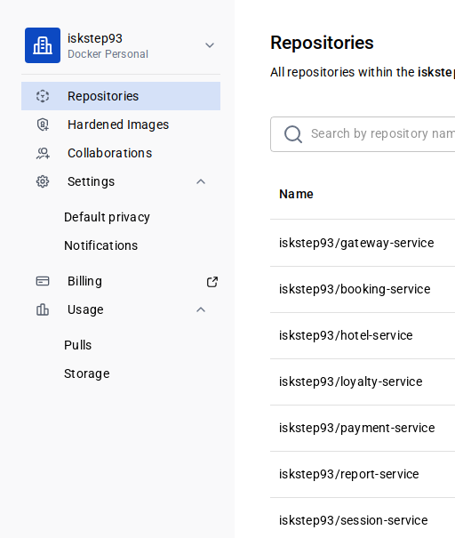
*Образы микросервисов загружены*

Тег `:03` закреплён за этим заданием. У соседних заданий сквозной линии свои теги, и приводить их к одному значению нельзя: отчёты описывают поведение именно зафиксированной версии.

### Сборка кластера

```bash
vagrant up
```

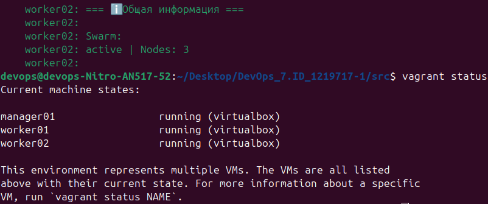
*Все три машины подняты*

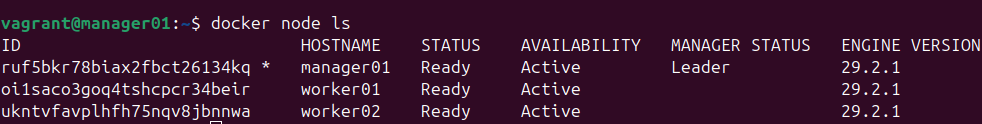
*Кластер собран, три узла в строю*

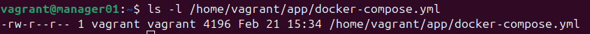
*Описание приложения проверено*

```bash
docker stack deploy -c docker-compose.yml hotel-app
```

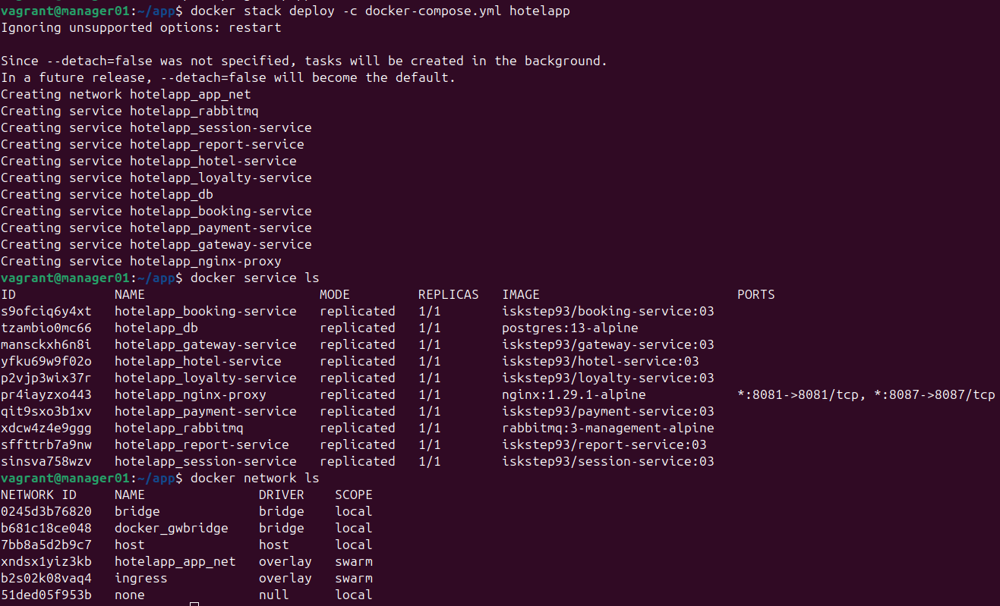
*Сервисы запущены в кластере*

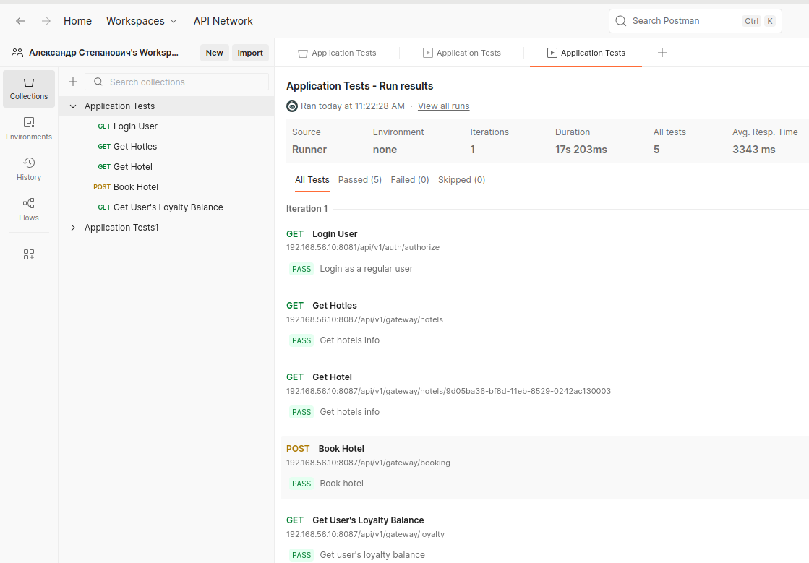
*Тесты проходят на кластере*

### Распределение по узлам

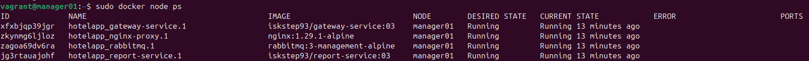
*Раскладка сервисов по узлам*


*Продолжение*


*Продолжение*

### Portainer

Веб-интерфейс к кластеру разворачивается отдельным стеком из [portainer.yml](./portainer.yml):

```bash
docker stack deploy -c portainer.yml portainer
docker service update --force portainer_portainer
```

Обращение к агентам идёт по адресу `tasks.agent`, а не `agent`, и это разные вещи. Обычное имя сервиса Swarm разрешает в один виртуальный адрес и балансирует между репликами — интерфейс видел бы каждый раз случайный узел. Префикс `tasks.` возвращает адреса всех экземпляров сразу, что и требуется для сбора картины по кластеру целиком.

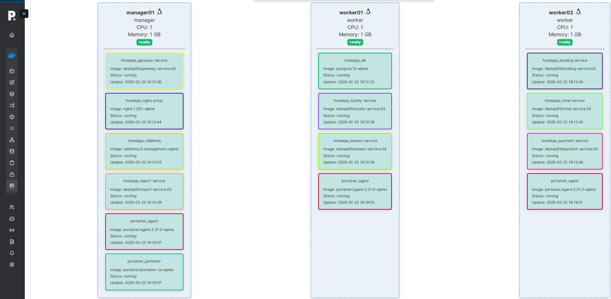
*Распределение задач по узлам в Portainer*

Учётные данные интерфейса задаются при первом входе. Значения локального стенда в отчёт не выносятся.

---

## Итоги

Приложение запускается тремя способами: через Docker Compose на одной машине, в отдельной виртуальной машине и стеком в кластере из трёх узлов. Функциональные тесты проходят во всех трёх случаях.

Основное наблюдение — переход от одной машины к кластеру почти не меняет описание самого приложения. Файл остаётся тем же; добавляется секция `deploy` с правилами размещения, а `build:` уступает место `image:`, потому что узлы кластера образы не собирают. Всё остальное оказывается свойством среды, а не приложения.

Второе — в такой среде имена важнее адресов. Сервисы находят друг друга по именам, прокси разрешает их через встроенный DNS, агенты Portainer собираются через префикс `tasks.`, а адрес контейнера живёт ровно до его пересоздания. Любая конфигурация, где адрес записан явно, ломается на первом же перезапуске — и `resolver` в конфигурации nginx нужен ровно по этой причине.

Третье относится к тихим ошибкам. Ключ `create: true` у `synced_folder` удобен ровно до тех пор, пока путь верен: стоит ему разойтись с расположением файла, и Vagrant вместо отказа молча смонтирует пустой каталог. Признак такой ошибки — не сообщение на экране, а отсутствие ожидаемого результата, и заметить её можно только проверкой того, что действительно перенеслось.
